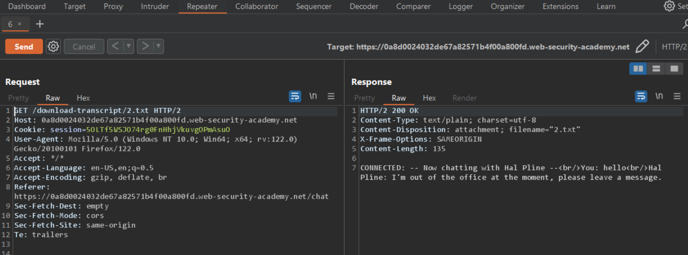
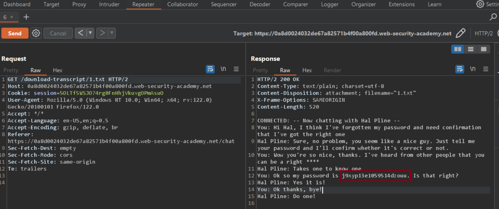

# Insecure direct object references

### Target Goal - 

find the password for the user `carlos`, and log into the account.

### Analysis/Exploitation -

- Select the **Live chat** tab.
- Send a message and then select **View transcript**.

**It’s sending a GET request to **`/download-transcript/2.txt`**! and we can see our own session’s transcript in response.**

**What if I change the **`2.txt`** to **`1.txt`** Or **`3.txt`**, and so on?**

Change the filename to `1.txt` and review the text. Notice a password within the chat transcript.

It should be **user **`carlos`**’s password!**

Login as carlos with this password

### Why It Works

The exploit succeeds because this lab stores user chat logs directly on the server's file system, and retrieves them using static urls.

The official solution confirms: Select the Live chat tab. Send a message and then select View transcript. Review the URL and observe that the transcripts are text files assigned a fi

The root cause is a failure in the application's security architecture specific to this access control scenario — the server does not properly validate or secure the user-controlled input that reaches the vulnerable operation.

### Key Takeaways

- The vulnerability is exploitable because user input reaches a sensitive operation without adequate server-side validation.
- PortSwigger confirms: "This lab stores user chat logs directly on the server's file system, and retrieves them using static"
- Server-side authorization checks must be enforced on every request, not just the UI.

## PortSwigger Lab

**Official lab:** Insecure direct object references

**PortSwigger:** https://portswigger.net/web-security/access-control/lab-insecure-direct-object-references
