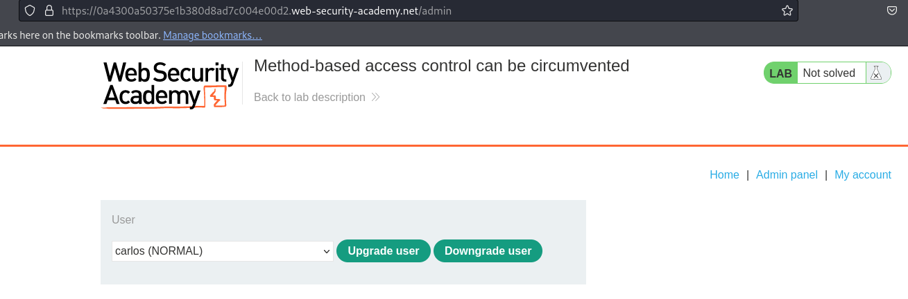
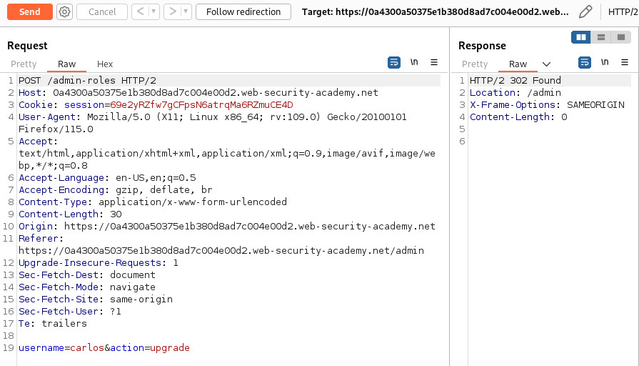
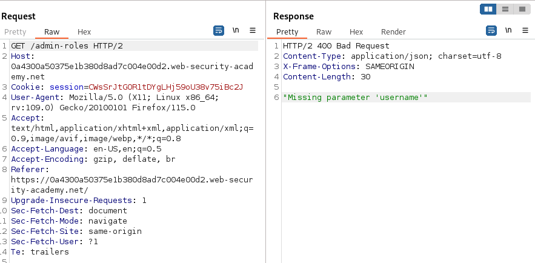
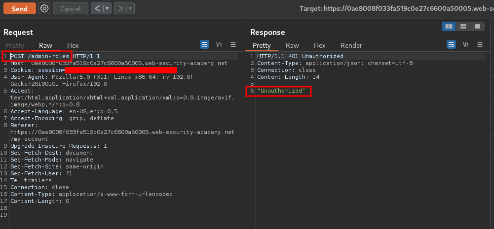
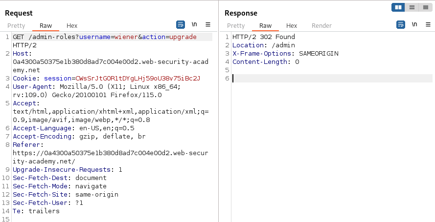

# Method-based access control can be circumvented

### Target Goal - 

Log in using the credentials `wiener:peter` and exploit the flawed access controls to promote yourself to become an administrator

### Analysis/Exploitation -

<details><summary>Summary</summary>

We can see this request with administrator user.

```text
POST /admin-roles HTTP/1.1
...
username=carlos&action=upgrade

```

```text

POST /admin-roles - HTTP/1.1   -->401 Unauthorized
GET /admin - HTTP/1.1   -->400 Missing parameter'username'
```

With non privileged user, we  get 401 Unauthorized error.

But we can bypass the error with another type of request instead of using POST.

```text
GET /admin-roles?username=wiener&action=upgrade HTTP/1.1 --> 302 Found
GET /admin --> 200 OK
```

</details>

familiarize yourself with the admin panel by logging in using the credentials `administrator:admin` 



Here, administrator can upgrade or downgrade a user.

When we try to upgrade a user:



**It’s sending a POST request to **`/admin-roles`**, and with the **`username`** and **`action`**.**

Now, let’s log out and login as user `wiener` to do vertical privilege escalation!

After login send any GET request to repeater and change the ** **location to** **`/admin-roles`



As you can see, looks like we can access `/admin-roles` when we’re sending a GET request to `/admin-roles` without any parameters.

If we change it to POST method we  get 401 Unauthorized . **So we’re allowed to send a GET request to **`/admin-roles`



**send a GET request to **`/admin-roles`**, with parameters: **`username=wiener&action=upgrade`**:**



### Why It Works

The exploit succeeds because this lab implements access controls based partly on the http method of requests. you can familiarize yourself with the admin panel by logging in using the credentials administrator:admin.

The official solution confirms: Log in using the admin credentials. Browse to the admin panel, promote carlos, and send the HTTP request to Burp Repeater. Open a private/incognito br

The root cause is a failure in the application's security architecture specific to this access control scenario — the server does not properly validate or secure the user-controlled input that reaches the vulnerable operation.

### Key Takeaways

- The vulnerability is exploitable because user input reaches a sensitive operation without adequate server-side validation.
- PortSwigger confirms: "This lab implements access controls based partly on the HTTP method of requests. You can familiarize"
- Server-side authorization checks must be enforced on every request, not just the UI.

## PortSwigger Lab

**Official lab:** Method-based access control can be circumvented

**PortSwigger:** https://portswigger.net/web-security/access-control/lab-method-based-access-control-can-be-circumvented
