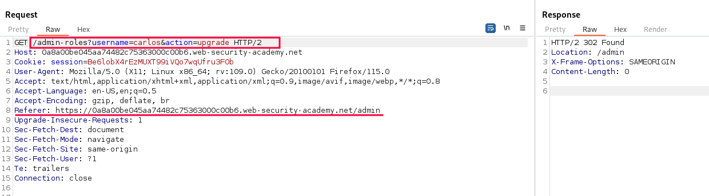
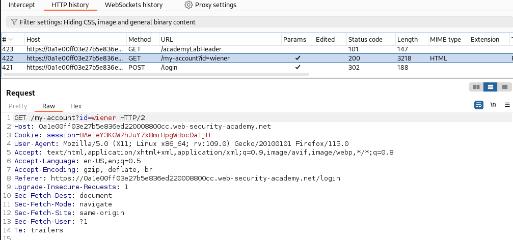
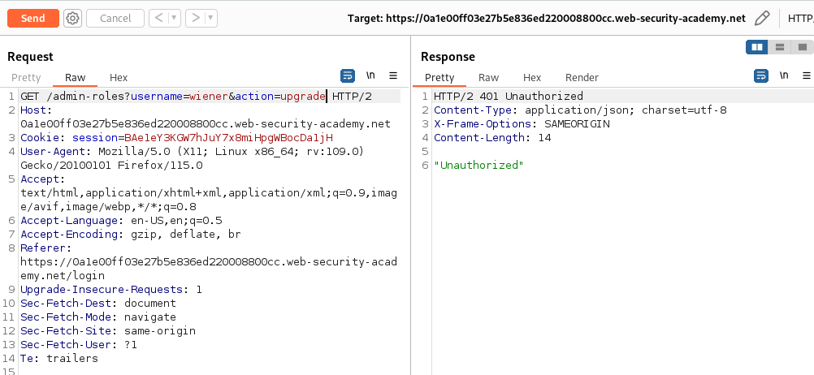
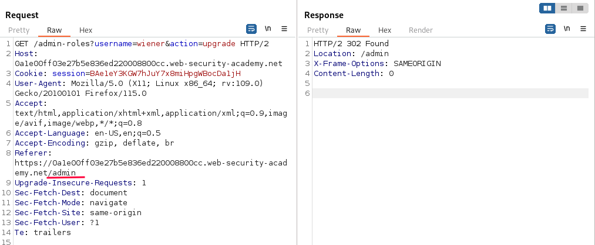

# Referer-based access control

### Target Goal - 

Log in using the credentials `wiener:peter` and exploit the flawed access controls to promote yourself to become an administrator

### Analysis/Exploitation -

**Let’s login as **`administrator`

**Browse to the admin panel and promote **`carlos`

When an administrator try to upgrade a user, it send a GET request to `/admin-roles`, with the parameter: `username` and `action` (`upgrade`/`downgrade`).

Also, it includes a `Referer` HTTP header!

**login as user **`wiener`**, and try to escalate privilege to administrator:**

send it to repeater and change GET request to `/admin-roles`, with the parameter: `username=wiener&action=upgrade` 

we get `Unauthorized` error.

In the above GET request, we can see that it includes a `Referer` HTTP header , change that to `/admin` Which is the admin panel location

**Let’s refresh the page and we’re administrator now**

### Why It Works

The exploit succeeds because this lab controls access to certain admin functionality based on the referer header. you can familiarize yourself with the admin panel by logging in using the credentials administrator:admin.

The official solution confirms: Log in using the admin credentials. Browse to the admin panel, promote carlos, and send the HTTP request to Burp Repeater. Open a private/incognito br

The root cause is a failure in the application's security architecture specific to this access control scenario — the server does not properly validate or secure the user-controlled input that reaches the vulnerable operation.

### Key Takeaways

- The vulnerability is exploitable because user input reaches a sensitive operation without adequate server-side validation.
- PortSwigger confirms: "This lab controls access to certain admin functionality based on the Referer header. You can familia"
- Server-side authorization checks must be enforced on every request, not just the UI.

## PortSwigger Lab

**Official lab:** Referer-based access control

**PortSwigger:** https://portswigger.net/web-security/access-control/lab-referer-based-access-control
