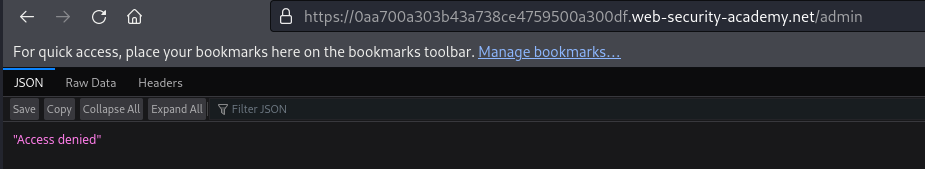
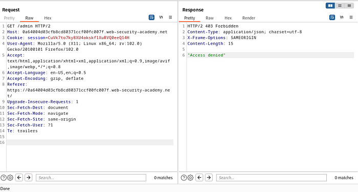
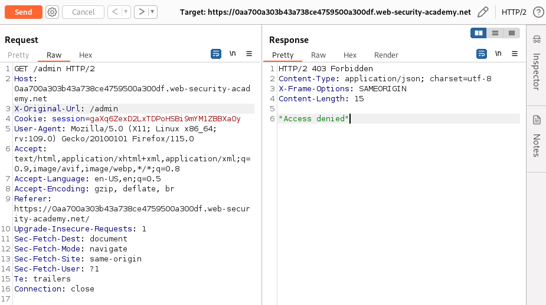
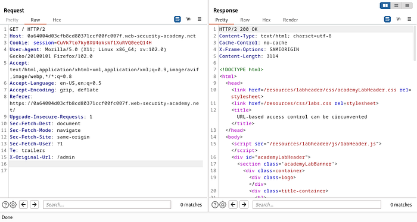
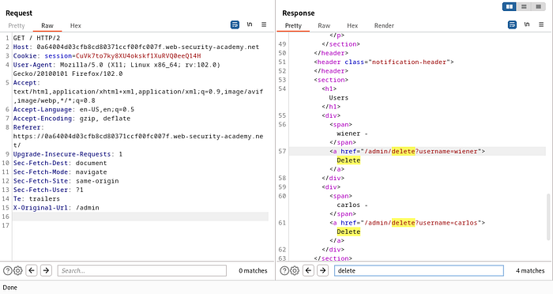
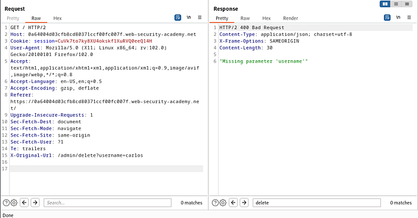
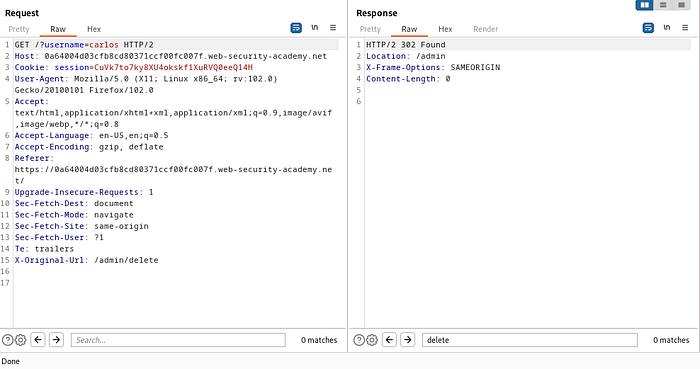
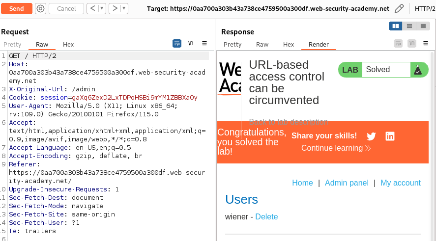

# URL-based access control can be circumvented

### Target Goal - 

Access the admin panel and delete the user `carlos`.

### Vulnerability / Concept

Access control vulnerabilities occur when an application does not properly enforce restrictions on what authenticated users are allowed to do. These include: horizontal privilege escalation (accessing another user's data), vertical privilege escalation (accessing admin functionality as a regular user), and insecure direct object references (IDOR).

Common flaws include: unprotected admin interfaces, user roles controlled by client-side parameters, user IDs in URLs without authorization checks, and multi-step processes that skip access control on certain steps.

The root cause is always the same: the server trusts client-supplied data (URLs, parameters, cookies, headers) to determine authorization without server-side validation.

### Recon / Initial Analysis

1. Map all functionality available to different user roles (regular user vs admin)
2. Check if admin interfaces are discoverable (robots.txt, JavaScript files, predictable URLs)
3. Test if user roles can be changed via request parameters (role=admin, isAdmin=true)
4. Identify user IDs in URLs and test if they can be changed to access other users' data
5. Test multi-step processes for missing access control on individual steps
6. Check if the Referer header is used for access control (easily spoofed)
7. Compare authenticated vs unauthenticated access to endpoints

### Analysis/Exploitation -

there are navbar contents consisting of Home, Admin Panel, and My Account.When trying to access the Admin Panel, the web display the text “access denied”.

Let’s try to intercept when we want to access the admin panel using the burp suite. Here’s how it looks.

Based on the intercept results, the HTTP request method “Get” points to the /admin directory.

Let’s try to use non-standard HTTP headers that can replace the URL in the original request such as X-Original-URL to bypass admin access.

It still doesn’t work :(

According to the lab description, “the front-end system has been configured to block external access to that path”. Let’s try to remove “admin” in the HTTP request method “get” so that it only leaves “/”.

The response displays 200 OK, which means the admin access was successfully bypassed. Next, find out how to delete the user Carlos to complete this lab.

Search “delete” or scroll down a bit in the response. We will find the path “/admin/delete” with the query string “?username=carlos” which leads to the user data deletion function with the parameter “username” which is “Carlos”.

Let’s try adding it to the X-Original-Url and run it.

The response will show “HTTP/2 400 Bad Request” with the message “Missing parameter ‘username’”. This indicates that the server did not read the query string “?username=carlos” in the X-Original-Url. So for the query string, we can try moving it to Get /?username=carlos.

The response displays 302 Found with the directory location /admin, which means the URL function has successfully deleted the user with the username Carlos.

If we check back to the /admin directory, the Carlos user no longer exists.

### Why It Works

The application fails to enforce server-side authorization checks. Instead of verifying that the current user has permission to perform the requested action, it either: (1) doesn't check at all, (2) relies on client-side parameters that can be modified, (3) checks authorization on some steps but not others, or (4) uses insecure mechanisms like Referer headers.

The broken trust boundary is between the authentication system and the authorization system: the application knows who the user is but doesn't verify what they're allowed to do.

### Real-World Impact

An attacker could:
- Access other users' personal data, orders, messages, and payment information
- Gain administrative access to the entire application
- Delete or modify other users' data
- Perform actions reserved for privileged users (account deletion, system configuration)
- Bypass paywalls or subscription requirements

### Remediation

- Implement server-side authorization checks on every request, not just the initial page load
- Never trust client-side parameters for role or privilege determination
- Use indirect object references (map user-supplied IDs to session-scoped references)
- Verify authorization on every step of multi-step processes
- Do not use Referer headers for access control
- Implement role-based access control (RBAC) with server-side enforcement
- Deny by default — require explicit permission grants

### Key Takeaways

- Access control must be enforced server-side on every request — client-side controls are bypassable.
- User IDs in URLs (IDOR) require server-side verification that the user owns the resource.
- Multi-step processes must enforce access control on every step, not just the first.
- Admin interfaces must not be discoverable by regular users — use server-side role checks.
- Never use the Referer header for authorization — it's client-controlled and spoofable.
