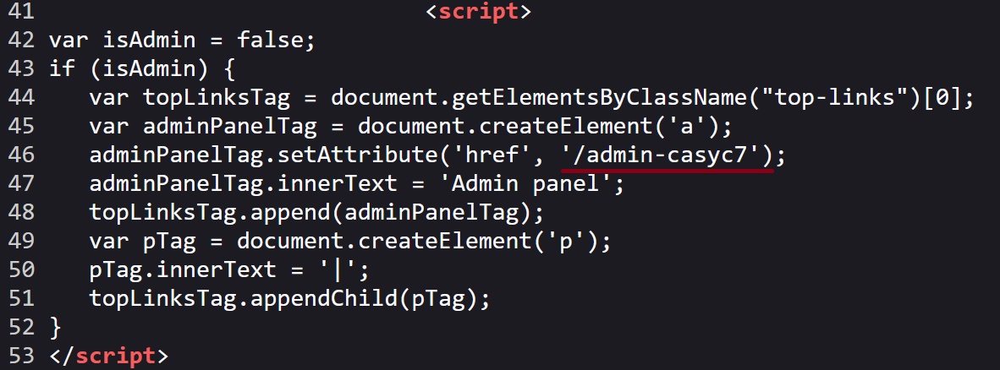
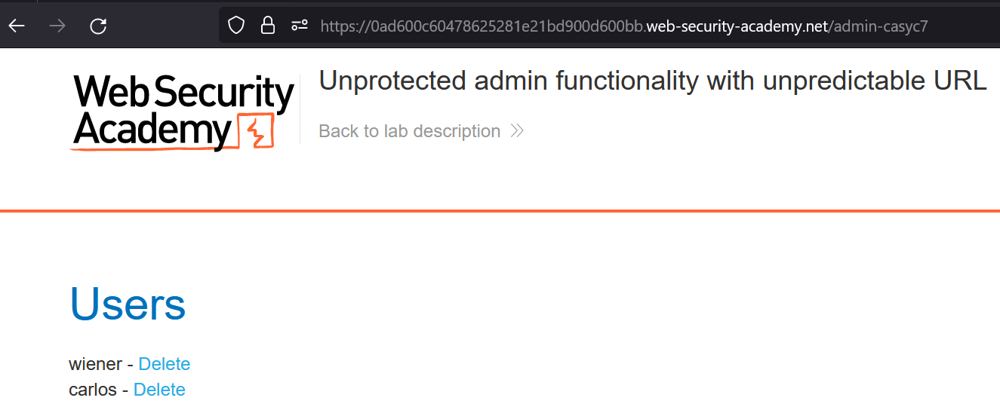

# Unprotected admin functionality with unpredictable URL

### Target Goal - 

access the admin panel, and using it to delete the user `carlos`

### Analysis/Exploitation -

**On inspecting source code it is found that contains some JavaScript that discloses the URL of the admin panel.**

Go to admin panel and delete carlos

### Why It Works

The exploit succeeds because this lab has an unprotected admin panel. it's located at an unpredictable location, but the location is disclosed somewhere in the application.

The official solution confirms: Review the lab home page's source using Burp Suite or your web browser's developer tools. Observe that it contains some JavaScript that discloses the 

The root cause is a failure in the application's security architecture specific to this access control scenario — the server does not properly validate or secure the user-controlled input that reaches the vulnerable operation.

### Key Takeaways

- The vulnerability is exploitable because user input reaches a sensitive operation without adequate server-side validation.
- PortSwigger confirms: "This lab has an unprotected admin panel. It's located at an unpredictable location, but the location"
- Server-side authorization checks must be enforced on every request, not just the UI.

## PortSwigger Lab

**Official lab:** Unprotected admin functionality with unpredictable URL

**PortSwigger:** https://portswigger.net/web-security/access-control/lab-unprotected-admin-functionality-with-unpredictable-url
