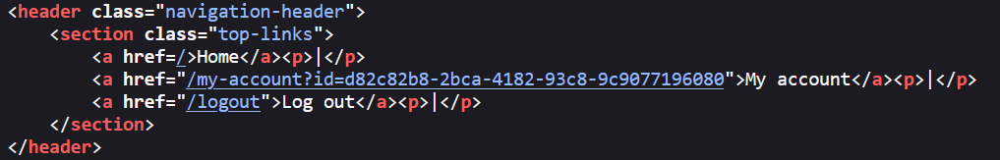
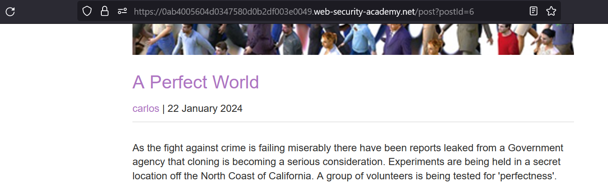
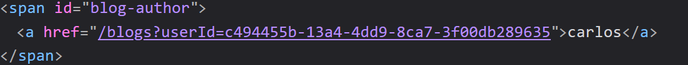

# User ID controlled by request parameter, with unpredictable user IDs

### Target Goal - 

Obtain the API key for the user `carlos` and submit it as the solution


### Vulnerability / Concept

This lab demonstrates a vulnerability in the access control category.

This lab has user account page that contains the current user's existing password, prefilled in a masked input.

The vulnerability exists because the application fails to properly validate, sanitize, or secure the user-controlled input that reaches a sensitive operation. The specific attack surface and exploitation technique depend on the exact vulnerability type demonstrated in this lab.

### Recon / Initial Analysis

Based on the lab's objective and the PortSwigger solution:

1. Analyze the application's functionality to identify the attack surface
2. Log in using the supplied credentials and access the user account page.
                    
                    
                        Change the &quot;id&quot; parameter in the URL to administrato
3. Use Burp Suite Proxy to intercept and analyze requests
4. Identify the specific vulnerability type by testing user-controlled input
5. Determine the appropriate exploitation technique for this lab

### Analysis/Exploitation -

**Login as user **`wiener`**:**



**it’s using an GUID(Globally Unique Identifier) so we can’t guess other users id**

**In the home page, we can view other people’s posts:**



inspect the code and we get carlos GUID



or we can Click on `carlos` and observe that the URL contains his user ID

copy it and go to my account

change your GUID with Carlos in url and we got the carlos api key

submit the carlos API key

### Why It Works

The vulnerability exists because the application processes user-controlled input without adequate security validation. In this specific lab, the attack succeeds because:

- The application trusts the user input without proper server-side validation
- The input reaches a sensitive operation (database query, HTML rendering, system command, etc.) without sanitization
- The security boundary that should protect the operation is missing or incorrectly implemented
- The specific payload used exploits the exact weakness in the application's input handling

The PortSwigger lab description confirms this: "This lab has user account page that contains the current user's existing password, prefilled in a masked input."

### Attack Flow

**Attack Flow:**

```
Attacker Input (payload in request)
        ↓
Application Functionality (processes user input)
        ↓
Server Processing (no validation/sanitization)
        ↓
Injection Point (input reaches sensitive operation)
        ↓
Exploitation (payload executes as intended)
        ↓
Lab Objective Achieved
```

### Real-World Impact

An attacker could access other users' personal data, gain administrative access, delete or modify other users' data, bypass paywalls or subscription requirements, or perform actions reserved for privileged users.

### Detection / Testing Methodology

1. Map all functionality available to different user roles
2. Check if admin interfaces are discoverable (robots.txt, JS files, predictable URLs)
3. Test if user roles can be changed via request parameters
4. Identify user IDs in URLs and test if they can be changed (IDOR)
5. Test multi-step processes for missing access control on individual steps
6. Compare authenticated vs unauthenticated access

### Remediation

- Implement server-side authorization checks on every request
- Never trust client-side parameters for role/privilege determination
- Use indirect object references (map user-supplied IDs to session-scoped references)
- Verify authorization on every step of multi-step processes
- Do not use Referer headers for access control
- Implement deny-by-default authorization

### Key Takeaways

- This lab demonstrates a access control vulnerability in a real-world scenario.
- The vulnerability occurs because user input reaches a sensitive operation without proper validation.
- The PortSwigger lab confirms: "This lab has user account page that contains the current user's existing password, prefilled in a ma"
- Burp Suite is essential for identifying and exploiting this vulnerability.
- The remediation for this specific vulnerability involves: - Implement server-side authorization checks on every request
