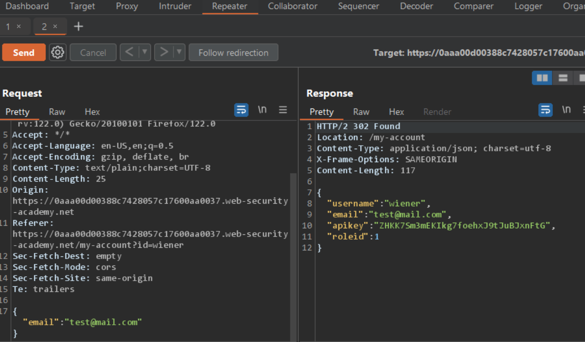
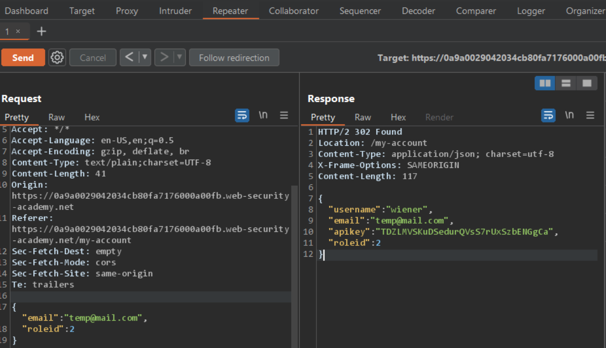

# User role can be modified in user profile

### Target Goal - 

Access the admin panel and use it to delete the user `carlos`

### Analysis/Exploitation -

**Login as user **`wiener`**:**

**In here, we can **`Update email`**. Let’s intercept that POST request /my-account/change-email and sent it to Repeater!**

**set the **`roleid`** to 2 in request, Which is  user **`administrator`** as in lab description **

**go to the admin panel (**`/admin`**) and **delete user `carlos`!

### Why It Works

The exploit succeeds because this lab has an admin panel at /admin. it's only accessible to logged-in users with a roleid of 2.

The official solution confirms: Log in using the supplied credentials and access your account page. Use the provided feature to update the email address associated with your account.

The root cause is a failure in the application's security architecture specific to this access control scenario — the server does not properly validate or secure the user-controlled input that reaches the vulnerable operation.

### Key Takeaways

- The vulnerability is exploitable because user input reaches a sensitive operation without adequate server-side validation.
- PortSwigger confirms: "This lab has an admin panel at /admin. It's only accessible to logged-in users with a roleid of 2."
- Server-side authorization checks must be enforced on every request, not just the UI.

## PortSwigger Lab

**Official lab:** User role can be modified in user profile

**PortSwigger:** https://portswigger.net/web-security/access-control/lab-user-role-can-be-modified-in-user-profile
