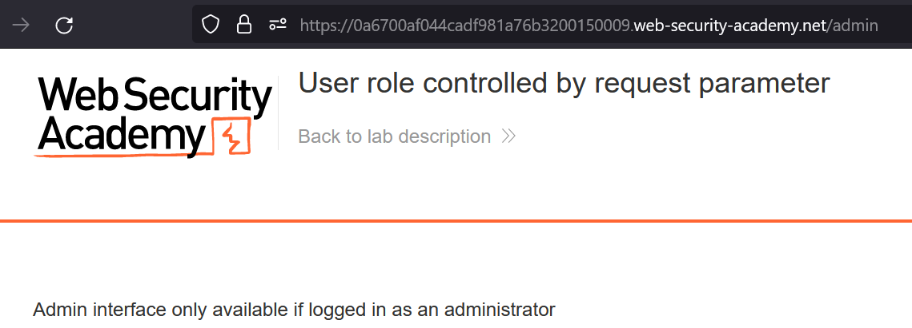
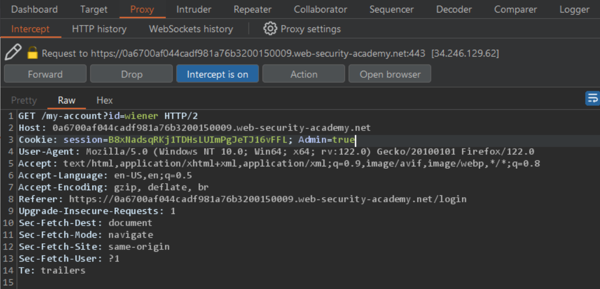
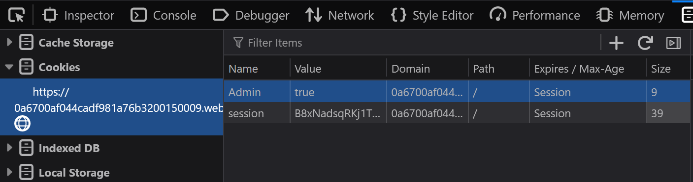
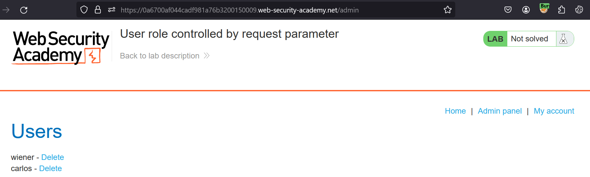

# User role controlled by request parameter

### Target Goal - 

Access the admin panel and use it to delete the user `carlos`

### Analysis/Exploitation -

Browse to `/admin` and observe that you can't access the admin panel.

Turn on inercept and **Login as user **`wiener`**:**

Observe that the response sets the cookie `Admin=false`. Change it to `Admin=true`

There is a cookie called `Admin`, and it’s value is `false`**change the value to **`true`

Load the admin panel and delete `carlos`.

### Why It Works

The exploit succeeds because this lab has an admin panel at /admin, which identifies administrators using a forgeable cookie.

The official solution confirms: Browse to /admin and observe that you can't access the admin panel. Browse to the login page. In Burp Proxy, turn interception on and enable response 

The root cause is a failure in the application's security architecture specific to this access control scenario — the server does not properly validate or secure the user-controlled input that reaches the vulnerable operation.

### Key Takeaways

- The vulnerability is exploitable because user input reaches a sensitive operation without adequate server-side validation.
- PortSwigger confirms: "This lab has an admin panel at /admin, which identifies administrators using a forgeable cookie."
- Server-side authorization checks must be enforced on every request, not just the UI.
