# Authentication bypass via encryption oracle

### Goal - 

Exploit logic flaw to access the admin panel and delete Carlos


### Vulnerability / Concept

This lab demonstrates a web security vulnerability that can be exploited to compromise the application's security. The vulnerability allows an attacker to bypass security controls and perform unauthorized actions.

The core issue is a failure in the application's security architecture — either insufficient input validation, broken access controls, improper trust boundaries, or insecure handling of user-supplied data. Understanding the root cause is essential for both exploitation and remediation.

### Recon / Initial Analysis

1. Identify the attack surface — what user-controlled inputs exist (URL parameters, form fields, headers, cookies)
2. Analyze the application's behavior with unexpected input
3. Map the request flow and identify trust boundaries
4. Test for error messages that reveal implementation details
5. Compare authenticated vs unauthenticated behavior
6. Use Burp Suite Proxy to capture and analyze all requests
7. Check for hidden parameters using Burp Intruder or Param Miner

### Analysis/Exploitation 

**Login as user **`wiener`**:**

The login form provides the option to stay logged in. If the option is set a `stay-logged-in` then After logged in, **a new cookie called **`stay-logged-in`** has been set.**

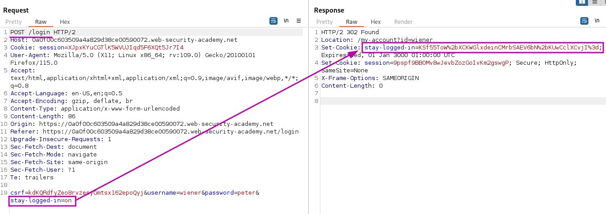

The does not show anything else that appears interesting so After poking around the web site, I found something interesting:In all posts, users can leave comments.

### Posting a comment

**Let’s take a look at the HTML form:**

```html
<form action="/post/comment" method="POST" enctype="application/x-www-form-urlencoded">
	<input required type="hidden" name="csrf" value="xMBJcQT8l3tlo2jTAMnr78eLKCi1p7tG">
	<input required type="hidden" name="postId" value="3">
	<label>Comment:</label>
	<textarea required rows="12" cols="300" name="comment"></textarea>
		<label>Name:</label>
		<input required type="text" name="name">
		<label>Email:</label>
		<input required name="email">
		<label>Website:</label>
		<input pattern="(http:|https:).+" type="text" name="website">
	<button class="button" type="submit">Post Comment</button>
</form>
```

As you can see, only the website field is not required.

I play with some of the parameters and mix valid and invalid content for email and website.

The website parameter gets checked via client-side javascript which can be circumvented but does not lead to anything interesting.

It is a different story for the email parameter:

When we send a valid request, it’ll redirect user to `/post/comment/confirmation`.

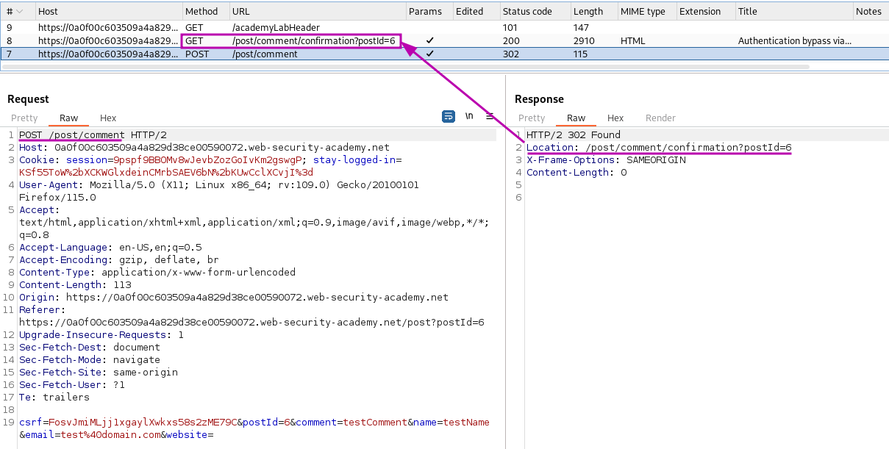

**When I send an invalid email address, **It sets a new cookie called `notification` with the value `5mDWKkbL2t7ui%2fRxrDKeHRx3bRdxaPBsjqHIfyT34sGQMxg8tmY8Q6fKLlhJTc4Z`.

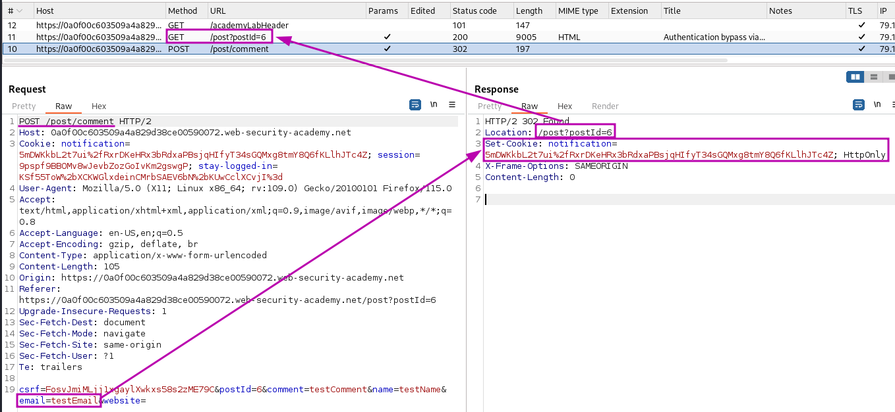

the error is not displayed in the immediate response to the `POST` request.I guessed that the `notification` cookie contains the error information that is converted to the error message in the subsequent `GET /post?postId=x` request. 

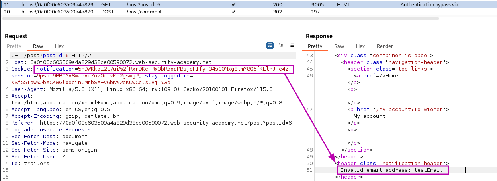

The content of the cookie does not appear to be simply encoded as no decoding variant results in anything legible.One detail that jumps to attention about this cookie is that its content is very similar to the `stay-logged-in` cookie from above. Both appear to URL- and base64 encoded.

Send both requests `POST /post/comment` and the subsequent `GET /post?postId=x` to repeater  and for simplicity rename the tabs `encrypt` and `decrypt` respectively.

Replace the content of the `notification` cookie with the content of my `stay-logged-in` cookie:

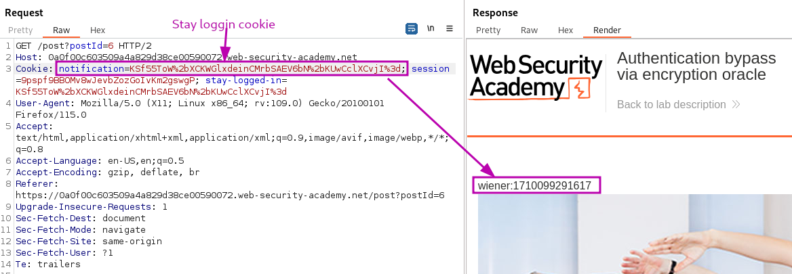

We successfully decrypted the `stay-logged-in` cookie value: `wiener:1671605400893`. (Format = username:timestamp).

To impersonate the administrator I need to obtain the encrypted string `administrator:1710099291617` to forge a `stay-logged-in` cookie for the administrative user.

Whatever content I put in the email field will get encrypted the same way as the `stay-logged-in` cookie. Go to the encrypt request and change the email parameter to `administrator:your-timestamp`.Send the request and then copy the new `notification` cookie from the response then decrypt it.                  

Unfortunately, the server adds a descriptive error message in front of it, in this case, `Invalid email address`

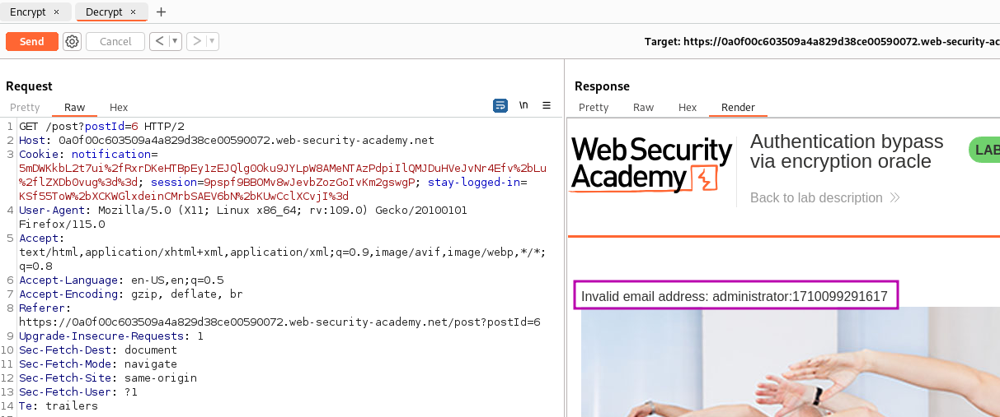

First, let’s find how long is that string:It’s the 23-character "`Invalid email address: `"

In Decoder, URL-decode and Base64-decode the cookie. Then, we can remove those 23 characters.

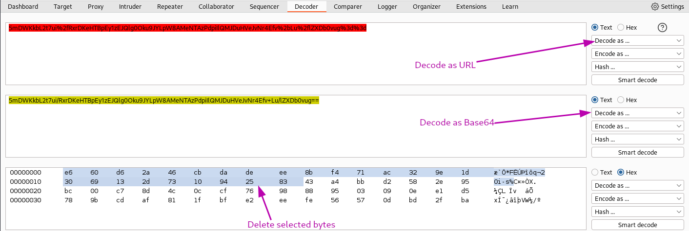

After Deleting 23 bytes Encode that.

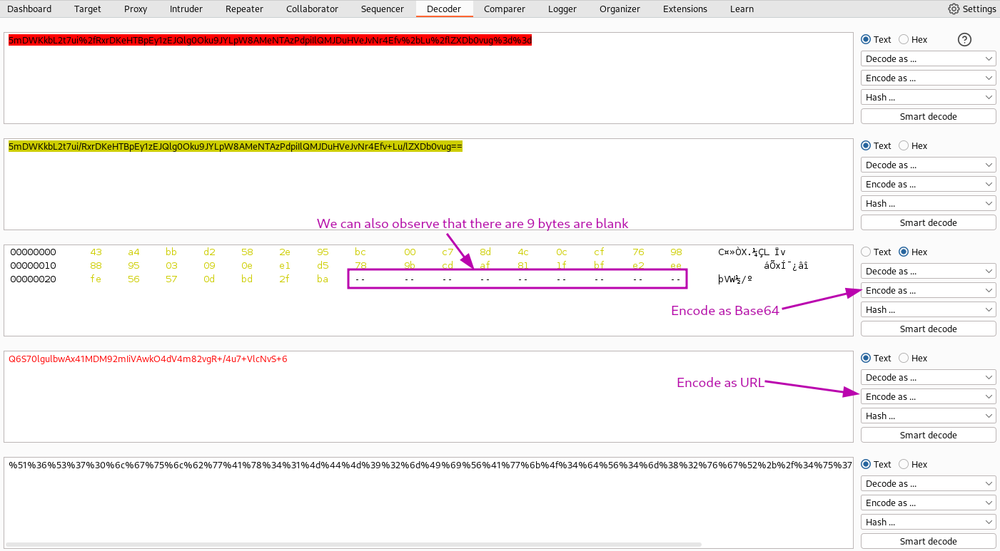

**Let’s copy that encoded output and paste it to the **`notification`** cookie!**

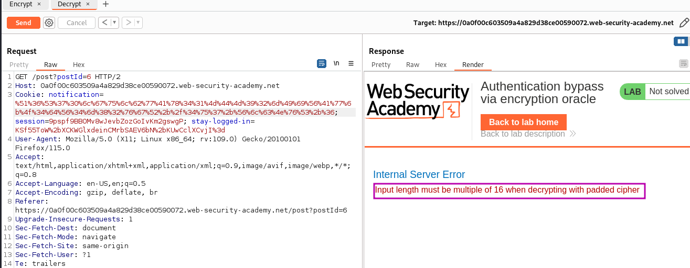

an error message indicates that a block-based encryption algorithm is used and that the input length must be a multiple of 16. You need to pad the "`Invalid email address: `" prefix with enough bytes so that the number of bytes you will remove is a multiple of 16.

By now I know that I can remove a full block of the ciphertext without negatively affecting the following blocks. There are 7 bytes of the error message that are within the second block: `dress:` I cannot simply remove these 7 bytes from the second block as this violates the block integrity:
However, If I add another 9 bytes in front of my desired plaintext, then it will fill the second 16 bytes block completely and my plaintext starts at the beginning of the third block.                    

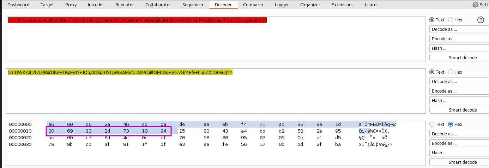

Send `123456789administrator:1710099291617` as the email to encrypting method in Burp Repeater:

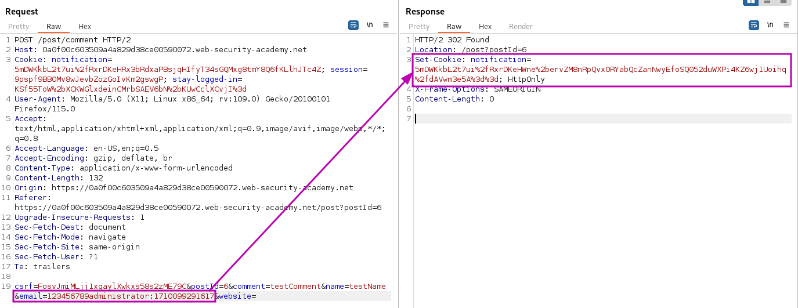

send the cookie value to Decoder, URL- and base64-decode it and remove the first two blocks of the hex representation (32 bytes) then encode it.

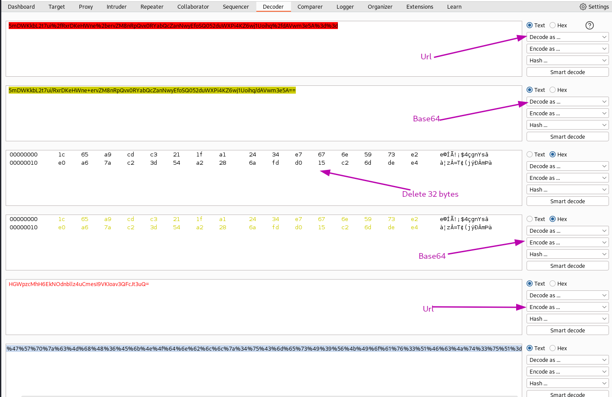

### Logging in

I use the cookie editor to change the `stay-logged-in` cookie in my browser:

It appears that the session also contains user information and takes precedence over the `stay-logged-in` cookie. I remove the session cookie completely and refresh the page:

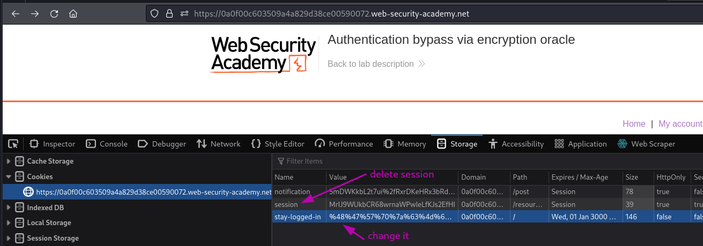

Now to the `Admin panel` to remove user `carlos`

### Why It Works

The vulnerability exists because the application fails to properly validate, sanitize, or authorize user input. The broken trust boundary allows an attacker to manipulate the application's behavior by injecting unexpected data that the server processes without adequate security checks.

### Real-World Impact

An attacker could exploit this vulnerability to:
- Access sensitive data belonging to other users
- Bypass authentication or authorization controls
- Perform unauthorized actions on behalf of legitimate users
- Potentially achieve remote code execution on the server
- Compromise the integrity or availability of the application

### Remediation

- Implement proper server-side input validation for all user-controlled data
- Use parameterized queries and prepared statements
- Enforce server-side authorization checks on every request
- Follow the principle of least privilege
- Implement security headers (CSP, X-Frame-Options, X-Content-Type-Options)
- Use a Web Application Firewall (WAF) as defense-in-depth
- Regularly test for vulnerabilities using automated scanners and manual testing

### Key Takeaways

- Never trust user-controlled input — validate and sanitize everything server-side.
- Security controls must be enforced server-side, not client-side.
- Understanding the vulnerability's root cause is essential for proper remediation.
- Burp Suite is essential for identifying and exploiting web vulnerabilities.
- Defense in depth — use multiple layers of protection, not just one.
