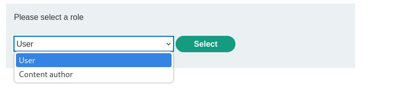
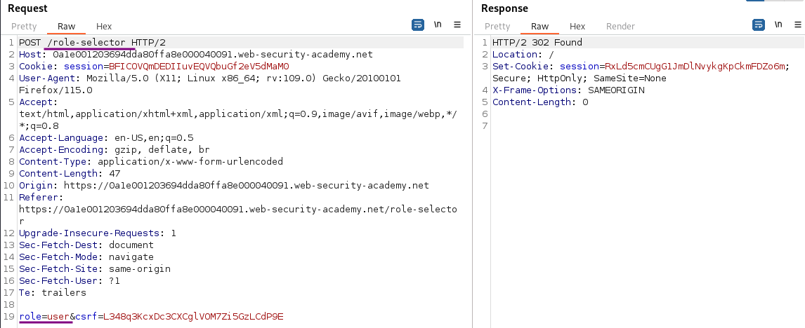
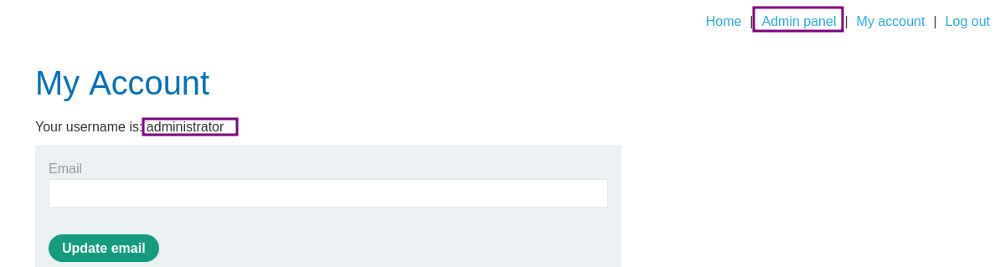

# Authentication bypass via flawed state machine

### Goal - 

Exploit logic flaw to access the admin panel and delete Carlos

### Vulnerability / Concept

This lab demonstrates a web security vulnerability that can be exploited to compromise the application's security. The vulnerability allows an attacker to bypass security controls and perform unauthorized actions.

The core issue is a failure in the application's security architecture — either insufficient input validation, broken access controls, improper trust boundaries, or insecure handling of user-supplied data. Understanding the root cause is essential for both exploitation and remediation.

### Recon / Initial Analysis

1. Identify the attack surface — what user-controlled inputs exist (URL parameters, form fields, headers, cookies)
2. Analyze the application's behavior with unexpected input
3. Map the request flow and identify trust boundaries
4. Test for error messages that reveal implementation details
5. Compare authenticated vs unauthenticated behavior
6. Use Burp Suite Proxy to capture and analyze all requests
7. Check for hidden parameters using Burp Intruder or Param Miner

### Analysis/Exploitation 

**Login as user **`wiener`**:**

What immediately jumps to attention is that the login is a two-stage process. After providing the username and the password, I can select the role I want to login as:

Such an option does make sense. It allows users with higher privileges to restrict their permissions when they don't need them. This reduces both the attack surface during everyday activities as well as the risk of stupid and expensive mistakes. At least, if done properly. Having two dedicated accounts for this is both easier and less error-prone.

I select `user` and have a look at the `/role-selector` request in Burp Proxy:

### Attempt 1: Adjust role

The second login stage contains the user role. The roles available to me are listed on the page. I don't know whether another check is done during the POST of this form.

What happens if I change the role to 'admin' or 'administrator'? Of course, I don't know the role names, but it is worth a try.

Unfortunately, this does not lead to anything, neither error nor more privileges. This indicates that on processing that POST, it validates against allowed roles and defaults to something that is not admin.

### Attempt 2: Drop request

Speaking about defaulting, what happens if the full second request is dropped? Common sense would indicate that the session is dropped if any request is made before the second stage is finished. Easy to find out.

Using Burp proxy I log in with `wiener:peter` but drop the `GET` request to `/role-selector` completely. Afterwards, then manually browse to `/my-account`. Observe that role has defaulted to the `administrator` role and have access to the admin panel.           

Now simply go to the Admin panel and use the link to delete user `carlos`.

### Why It Works

The vulnerability exists because the application fails to properly validate, sanitize, or authorize user input. The broken trust boundary allows an attacker to manipulate the application's behavior by injecting unexpected data that the server processes without adequate security checks.

### Real-World Impact

An attacker could exploit this vulnerability to:
- Access sensitive data belonging to other users
- Bypass authentication or authorization controls
- Perform unauthorized actions on behalf of legitimate users
- Potentially achieve remote code execution on the server
- Compromise the integrity or availability of the application

### Remediation

- Implement proper server-side input validation for all user-controlled data
- Use parameterized queries and prepared statements
- Enforce server-side authorization checks on every request
- Follow the principle of least privilege
- Implement security headers (CSP, X-Frame-Options, X-Content-Type-Options)
- Use a Web Application Firewall (WAF) as defense-in-depth
- Regularly test for vulnerabilities using automated scanners and manual testing

### Key Takeaways

- Never trust user-controlled input — validate and sanitize everything server-side.
- Security controls must be enforced server-side, not client-side.
- Understanding the vulnerability's root cause is essential for proper remediation.
- Burp Suite is essential for identifying and exploiting web vulnerabilities.
- Defense in depth — use multiple layers of protection, not just one.
