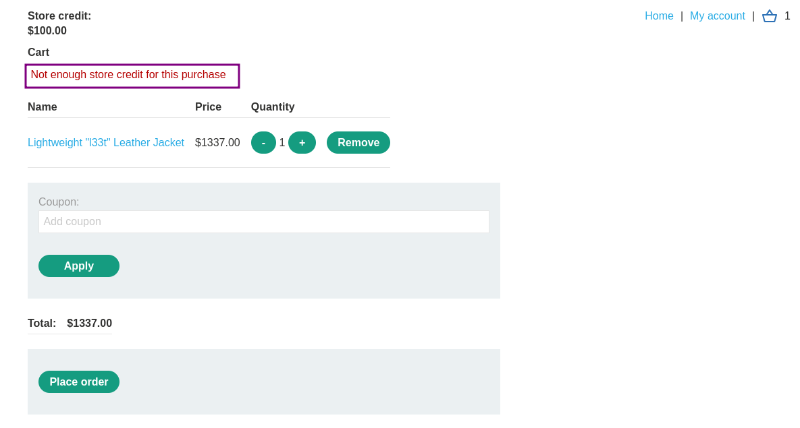
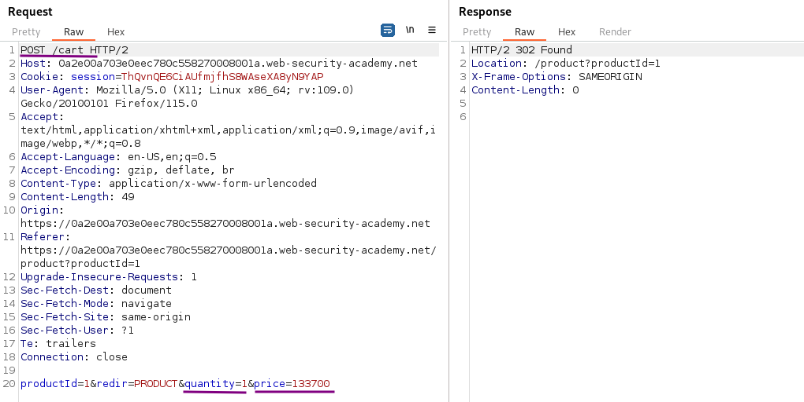
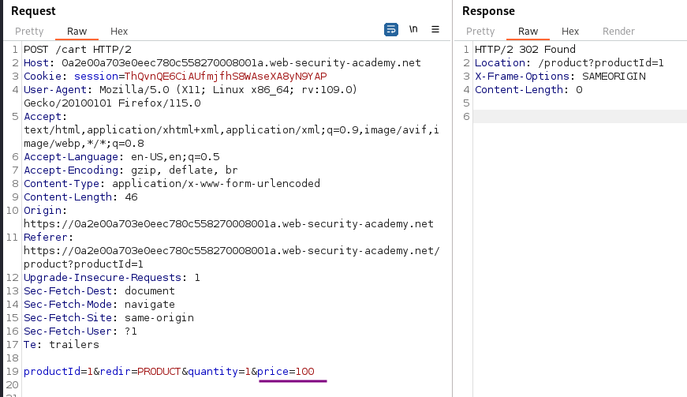
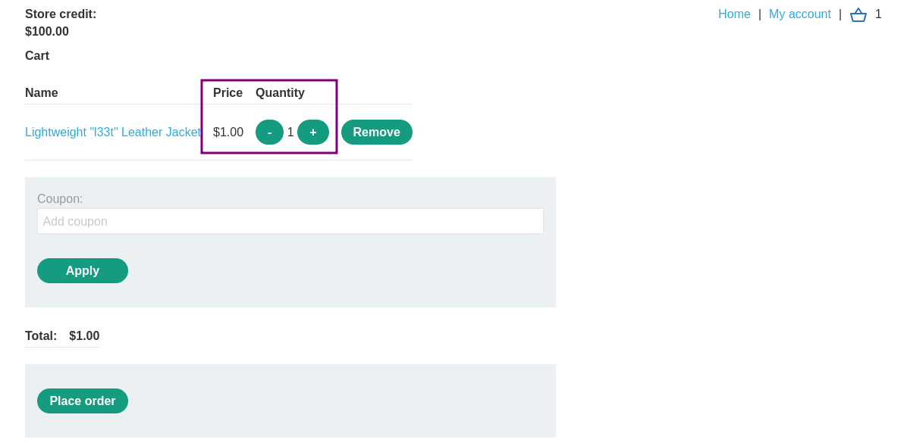

# Excessive trust in client-side controls

### Goal - 

Exploit logic flaw to buy the Lightweight l33t leather jacket.


### Vulnerability / Concept

This lab demonstrates a vulnerability in the logic flaws category.

This lab doesn't adequately validate user input. You can exploit a logic flaw in its purchasing workflow to buy items for an unintended price. To solve the lab, buy a &quot;Lightweight l33t leather jacket&quot;.

The vulnerability exists because the application fails to properly validate, sanitize, or secure the user-controlled input that reaches a sensitive operation. The specific attack surface and exploitation technique depend on the exact vulnerability type demonstrated in this lab.

### Recon / Initial Analysis

Based on the lab's objective and the PortSwigger solution:

1. Analyze the application's functionality to identify the attack surface
2. With Burp running, log in and attempt to buy the leather jacket. The order is rejected because you don't have enough store credit.
                    
                    
                        In 
3. Use Burp Suite Proxy to intercept and analyze requests
4. Identify the specific vulnerability type by testing user-controlled input
5. Determine the appropriate exploitation technique for this lab

### Analysis/Exploitation 

**Login as user **`wiener`**:**

Attempt to buy the leather jacket. We only have `$100` store credit**,** The order get rejected because of not having enough store credit.



**analyze the request in burp proxy that have been sent so far**

Trying to modify the price on the cart page is not useful, as this information has already been sent from the server and we are not affecting any back-end information.

We also don’t have control over how much store credit we have. The only interaction that we were able to make happen, prior to the cart page, is the “add product to cart” step.

The request to add product to the cart looks rather promising, as it contains the price as a parameter.If  cannot find this request, go to browser and re-add the item to cart.

Remove any existing cart items. Then, go to Burp Suite’s `Proxy > HTTP history` page and find the add-product request. This is a `POST` request to `/cart`.



When we clicked add to cart button, **it send a POST request to **`/cart`** with parameter: **`productId=1`**, **`redir=PRODUCT`**, **`quantity=1`**, and **`price=133700`**.**

We’re transmitting price information from the client to the server. This is the “excessive trust”. We, as a client, are telling the server how much the product costs.

Now if the input is not sanitized by the server. An attacker can change the quantity of the product or change the price.

Modify the price value to something less than the $100.00 that we have in store credit: notice there are two more zeros in price parameter so **set the price to 100 i.e.($1.00)**



Now go back to your browser, and in cart section click `Place Order`.



### Why It Works

The vulnerability exists because the application processes user-controlled input without adequate security validation. In this specific lab, the attack succeeds because:

- The application trusts the user input without proper server-side validation
- The input reaches a sensitive operation (database query, HTML rendering, system command, etc.) without sanitization
- The security boundary that should protect the operation is missing or incorrectly implemented
- The specific payload used exploits the exact weakness in the application's input handling

The PortSwigger lab description confirms this: "This lab doesn't adequately validate user input. You can exploit a logic flaw in its purchasing workflow to buy items for an unintended price. To solve the lab, buy a &quot;Lightweight l33t leather ja"

### Attack Flow

**Attack Flow:**

```
Attacker Input (payload in request)
        ↓
Application Functionality (processes user input)
        ↓
Server Processing (no validation/sanitization)
        ↓
Injection Point (input reaches sensitive operation)
        ↓
Exploitation (payload executes as intended)
        ↓
Lab Objective Achieved
```

### Real-World Impact

An attacker could purchase items at reduced prices, bypass multi-step workflows, access functionality outside their privilege level, manipulate application state for financial gain, bypass rate limits, or cause data corruption.

### Detection / Testing Methodology

1. Identify business-critical parameters (prices, quantities, discount codes, roles)
2. Test if client-side values can be modified to affect server-side logic
3. Test multi-step workflows for sequence bypass (skip steps, replay, out-of-order)
4. Check for inconsistent handling of exceptional input (very large, negative, unexpected values)
5. Test rate limits and brute-force protections
6. Look for encryption oracles and state machine flaws

### Remediation

- Implement server-side validation for all business-critical parameters (prices, quantities, roles)
- Never trust client-side values for pricing, permissions, or workflow state
- Enforce workflow sequence integrity server-side
- Use server-side state machines for multi-step processes
- Implement consistency checks for financial transactions
- Rate-limit based on business logic, not just request volume

### Key Takeaways

- This lab demonstrates a logic flaws vulnerability in a real-world scenario.
- The vulnerability occurs because user input reaches a sensitive operation without proper validation.
- The PortSwigger lab confirms: "This lab doesn't adequately validate user input. You can exploit a logic flaw in its purchasing work"
- Burp Suite is essential for identifying and exploiting this vulnerability.
- The remediation for this specific vulnerability involves: - Implement server-side validation for all business-critical parameters (prices, quantities, roles)
