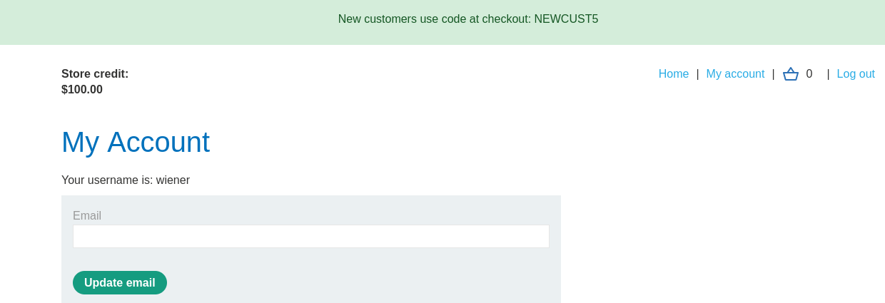
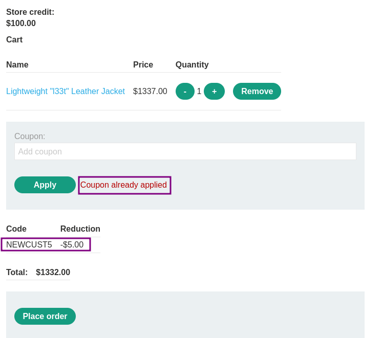
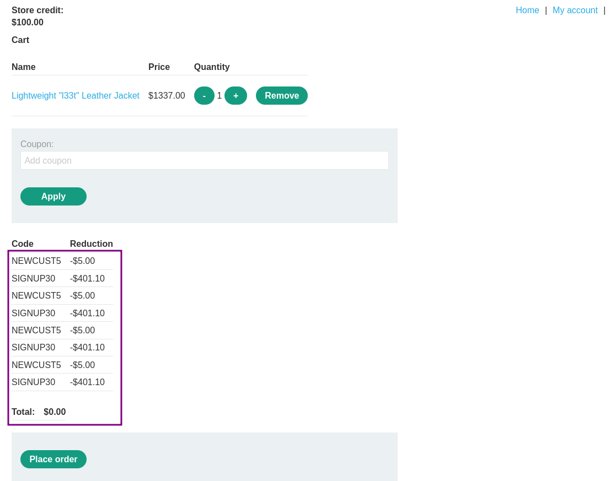

# Flawed enforcement of business rules

### Goal - 

Exploit logic flaw to buy the Lightweight l33t leather jacket.

### Vulnerability / Concept

This lab demonstrates a web security vulnerability that can be exploited to compromise the application's security. The vulnerability allows an attacker to bypass security controls and perform unauthorized actions.

The core issue is a failure in the application's security architecture — either insufficient input validation, broken access controls, improper trust boundaries, or insecure handling of user-supplied data. Understanding the root cause is essential for both exploitation and remediation.

### Recon / Initial Analysis

1. Identify the attack surface — what user-controlled inputs exist (URL parameters, form fields, headers, cookies)
2. Analyze the application's behavior with unexpected input
3. Map the request flow and identify trust boundaries
4. Test for error messages that reveal implementation details
5. Compare authenticated vs unauthenticated behavior
6. Use Burp Suite Proxy to capture and analyze all requests
7. Check for hidden parameters using Burp Intruder or Param Miner

### Analysis/Exploitation 

**Login as user **`wiener`**:**

In here, we can see that **there is a code: **`NEWCUST5`** to get a legit discount for new customer:**

Let’s try to buy the leather jacket and apply the `NEWCUST5` coupon:

Now the total price is reduced by 5 dollars! Unfortunately, even with the discount, the jacket is still above  my store credit

Try to apply the coupon again but this does not work:

After poking around the web site, I found that there is a newsletter subscription at the very bottom of the page, sign up for a newsletter since subscriptions often contain nice offers.

When signing up for it, a Javascript popup appears with coupon, now we have 1 more coupon! `SIGNUP30`

After I apply it, the total price looks better than before. But still not affordable with the store credit available:

Try applying the code`SIGNUP30`, it is rejected because the coupon has already been applied but if we apply `NEWCUST5` it get acceped.

So if you enter the same code twice in a row, it is rejected However, if you alternate between the two codes, you can bypass this control. It looks like the 'is-the-discount-code-alread-used' check is only done with the latest discount code applied. So try to alternate the discounts until the price is** **below** **`$100.00`

Now `Place order`

### Why It Works

The vulnerability exists because the application fails to properly validate, sanitize, or authorize user input. The broken trust boundary allows an attacker to manipulate the application's behavior by injecting unexpected data that the server processes without adequate security checks.

### Real-World Impact

An attacker could exploit this vulnerability to:
- Access sensitive data belonging to other users
- Bypass authentication or authorization controls
- Perform unauthorized actions on behalf of legitimate users
- Potentially achieve remote code execution on the server
- Compromise the integrity or availability of the application

### Remediation

- Implement proper server-side input validation for all user-controlled data
- Use parameterized queries and prepared statements
- Enforce server-side authorization checks on every request
- Follow the principle of least privilege
- Implement security headers (CSP, X-Frame-Options, X-Content-Type-Options)
- Use a Web Application Firewall (WAF) as defense-in-depth
- Regularly test for vulnerabilities using automated scanners and manual testing

### Key Takeaways

- Never trust user-controlled input — validate and sanitize everything server-side.
- Security controls must be enforced server-side, not client-side.
- Understanding the vulnerability's root cause is essential for proper remediation.
- Burp Suite is essential for identifying and exploiting web vulnerabilities.
- Defense in depth — use multiple layers of protection, not just one.
