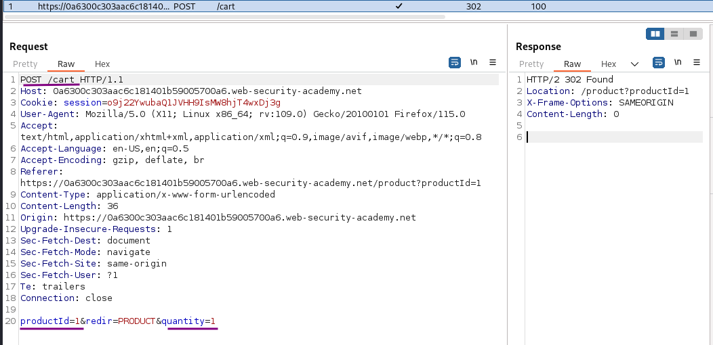
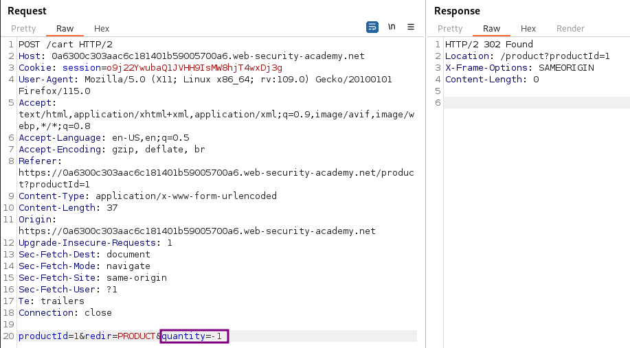
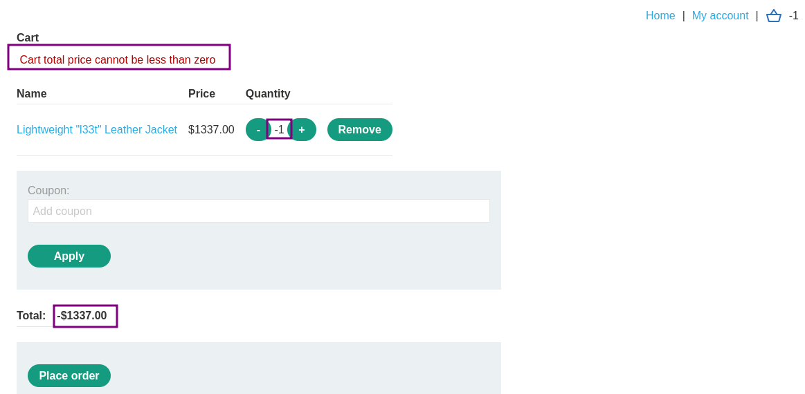
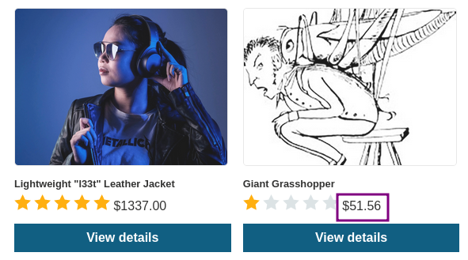
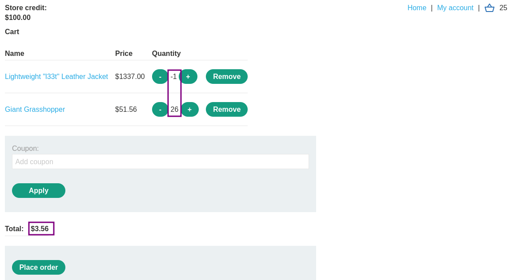
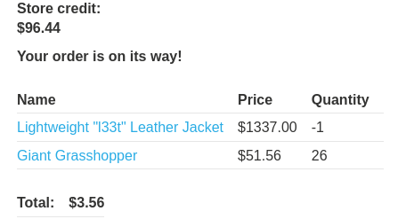
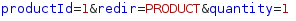
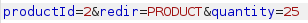
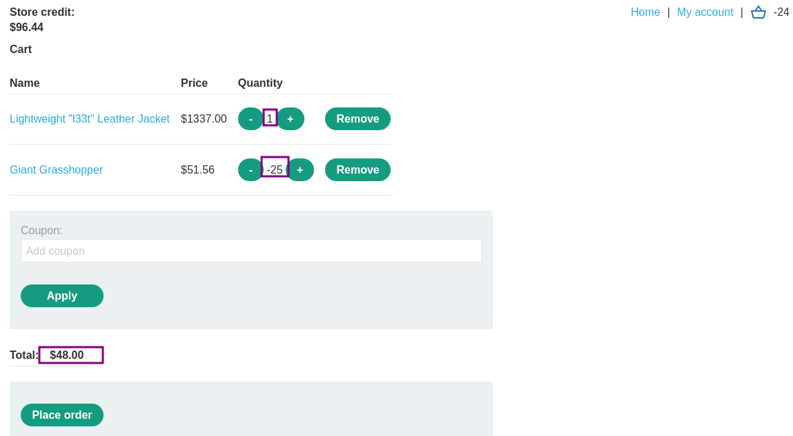
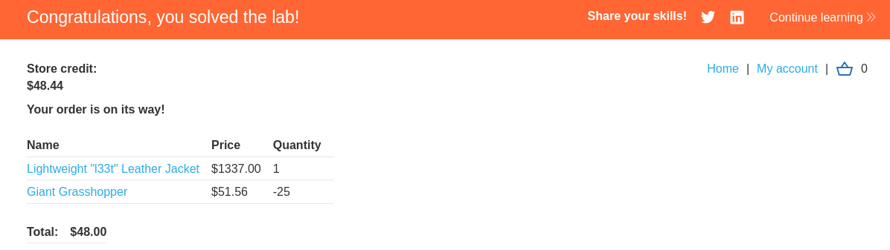

# High-level logic vulnerability

### Goal - 

Exploit logic flaw to buy the Lightweight l33t leather jacket.

### Vulnerability / Concept

This lab demonstrates a web security vulnerability that can be exploited to compromise the application's security. The vulnerability allows an attacker to bypass security controls and perform unauthorized actions.

The core issue is a failure in the application's security architecture — either insufficient input validation, broken access controls, improper trust boundaries, or insecure handling of user-supplied data. Understanding the root cause is essential for both exploitation and remediation.

### Recon / Initial Analysis

1. Identify the attack surface — what user-controlled inputs exist (URL parameters, form fields, headers, cookies)
2. Analyze the application's behavior with unexpected input
3. Map the request flow and identify trust boundaries
4. Test for error messages that reveal implementation details
5. Compare authenticated vs unauthenticated behavior
6. Use Burp Suite Proxy to capture and analyze all requests
7. Check for hidden parameters using Burp Intruder or Param Miner

### Analysis/Exploitation 

The first step, as usual, is the analysis of the website and the existing workflow for buying items. Log in with the given credentials and see that, the available money is not enough to purchase the desired item.

This time, the request to add items to the cart does not contain the price, but just the productId and the quantity.

Clicking on the `+` and `-` buttons results in requests similar to the one shown above, just with positive or negative quantities.

Now, what if I change the `quantity` value to a negative value? Like `-1,-2,..`: This will Remove the product from cart if any present and if that product is not in cart then it will add a negative quantity for that product.Remove all product and add a negative quantity.

go to `/cart` page: see, the product’s quantity is `-1`, and the price is `-$1337.00`!

Now, what if I click the `Place order` button?

**We see an error that says **`Cart total price cannot be less than zero`**.**

**To bypass that, we can buy a **`-1`** quantity of the leather jacket, and buy other products. By doing that, the total price should be positive, not negative.**

Let’s purchase 27 quantity of product `Giant Grasshopper`: (`51.56 * 26 = 1340.56`)

Total will be 1340.56 - 1337= 3.56

The total price became a positive number!

Click the `Place order` button! and the order get placed now $96.44 store credit left.

Let’s do that in the opposite way to buy leather jacket as it is our goal to solve lab

**Now, we need to buy **`1`** leather jacket, and buy negative quantity of any products. That way, we can reduce the total price, and make it positive.**

**click the **`Place order`** button!**

### Why It Works

The vulnerability exists because the application fails to properly validate, sanitize, or authorize user input. The broken trust boundary allows an attacker to manipulate the application's behavior by injecting unexpected data that the server processes without adequate security checks.

### Real-World Impact

An attacker could exploit this vulnerability to:
- Access sensitive data belonging to other users
- Bypass authentication or authorization controls
- Perform unauthorized actions on behalf of legitimate users
- Potentially achieve remote code execution on the server
- Compromise the integrity or availability of the application

### Remediation

- Implement proper server-side input validation for all user-controlled data
- Use parameterized queries and prepared statements
- Enforce server-side authorization checks on every request
- Follow the principle of least privilege
- Implement security headers (CSP, X-Frame-Options, X-Content-Type-Options)
- Use a Web Application Firewall (WAF) as defense-in-depth
- Regularly test for vulnerabilities using automated scanners and manual testing

### Key Takeaways

- Never trust user-controlled input — validate and sanitize everything server-side.
- Security controls must be enforced server-side, not client-side.
- Understanding the vulnerability's root cause is essential for proper remediation.
- Burp Suite is essential for identifying and exploiting web vulnerabilities.
- Defense in depth — use multiple layers of protection, not just one.
