# Inconsistent handling of exceptional input

### Goal - 

Exploit logic flaw to access the admin panel and delete Carlos

### Analysis/Exploitation 

I can register a new account and see that employees of DontWannaCry should use their company email. As I do not have one I register a new account with my email address from the email client:

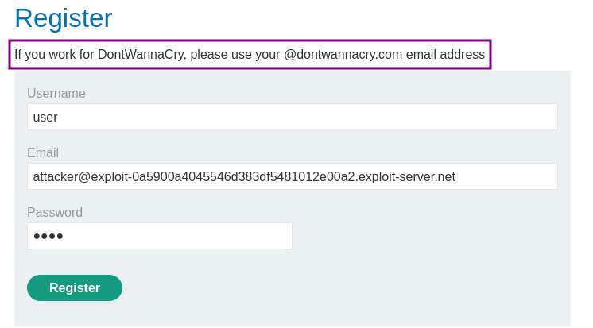

Once I register, I receive an email with a confirmation link to complete the registration In my email client.

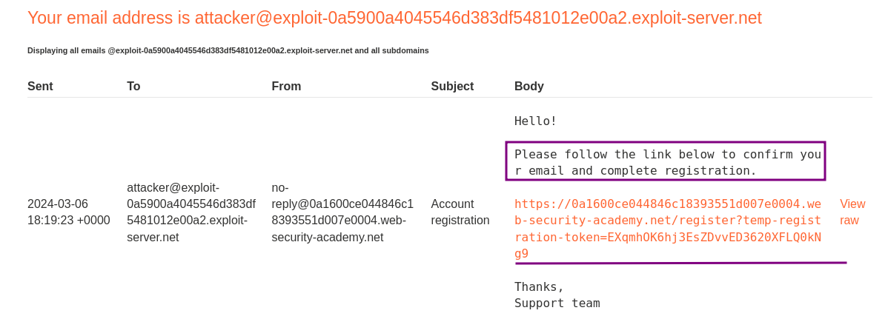

After confirming the email, I can log into my account.

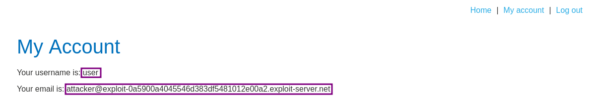

I have a look in Burp at how the communication went, but nothing interesting showed up.

After doing site-mapping/content-dicovery , discovered the path `/admin`.

```bash
ffuf -k -u https://0a7a001204c9f98c80c5a3b900f900f1.web-security-academy.net/FUZZ -w /usr/share/wordlists/wfuzz/general/common.txt -c
```

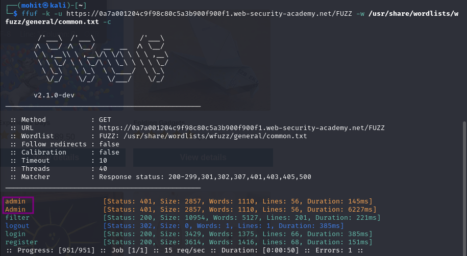

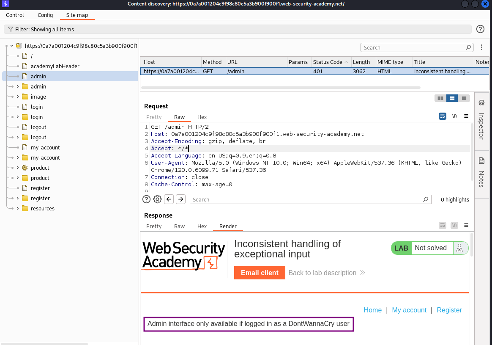

**the admin panel is in **`/admin`**,But it’s only available to DontWannaCry user.**

Unfortunately, I don't have access to that domain, so can not use it directly. But perhaps I can inject this in a way that the registration link is sent to me, but the application thinks I'm a dontwannacry user.

## **Attempt 1: Inject a null byte**

There are numerous ways of trying to inject strings that systems may interpret differently. The easiest to check is by injecting a null byte which is used in several environments as 'end-of-string' indicator. 
If the registration system takes the full string, it may register me as a dontwannacry user. 
If the email system on the other hand terminates the string at a null byte, I'll receive the email.

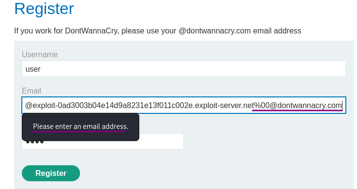

On the first attempt, I got a `Please enter an email address` error message. However the message was generated by Javascript, so can be avoided easily by intercepting a valid request in Burp and changing it manually.

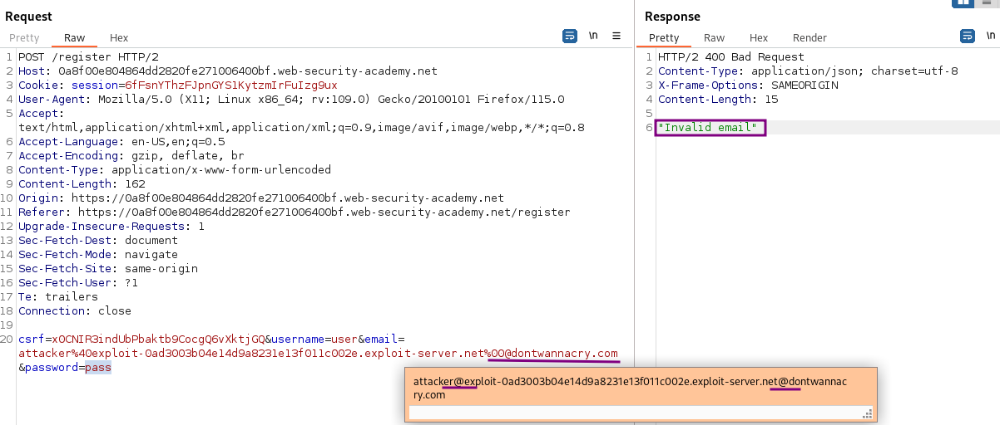

Tried to insert before @ using + because it will still send the mail to email client but there are two @ so  it  don’t treat it as mail format and url encoding-decoding also not working

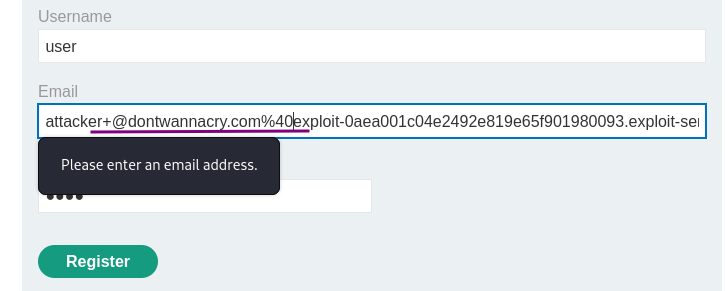

the application does not allow this too:

## **Attempt 2: Use a long string**

Another common issue is different systems using different lengths for the same string. If I can use a string that the web application considers as dontwannacry email while the mail server at the same time uses the full string then I'll get the confirmation email.

But first I need to find out if there might be a truncation anywhere. So I generate a long string of unique patterns (so in case there is a noticeable mismatch I'll be able to find the position). The easiest way to do so is with msf-pattern_create from the Metasploit Framework:

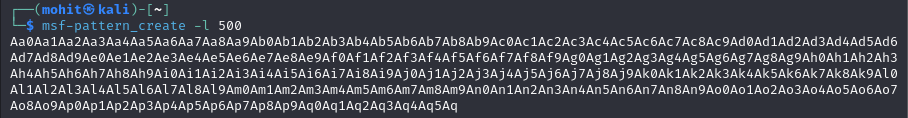

```text
Aa0Aa1Aa2Aa3Aa4Aa5Aa6Aa7Aa8Aa9Ab0Ab1Ab2Ab3Ab4Ab5Ab6Ab7Ab8Ab9Ac0Ac1Ac2Ac3Ac4Ac5Ac6Ac7Ac8Ac9Ad0Ad1Ad2Ad3Ad4Ad5Ad6Ad7Ad8Ad9Ae0Ae1Ae2Ae3Ae4Ae5Ae6Ae7Ae8Ae9Af0Af1Af2Af3Af4Af5Af6Af7Af8Af9Ag0Ag1Ag2Ag3Ag4Ag5Ag6Ag7Ag8Ag9Ah0Ah1Ah2Ah3Ah4Ah5Ah6Ah7Ah8Ah9Ai0Ai1Ai2Ai3Ai4Ai5Ai6Ai7Ai8Ai9Aj0Aj1Aj2Aj3Aj4Aj5Aj6Aj7Aj8Aj9Ak0Ak1Ak2Ak3Ak4Ak5Ak6Ak7Ak8Ak9Al0Al1Al2Al3Al4Al5Al6Al7Al8Al9Am0Am1Am2Am3Am4Am5Am6Am7Am8Am9An0An1An2An3An4An5An6An7An8An9Ao0Ao1Ao2Ao3Ao4Ao5Ao6Ao7Ao8Ao9Ap0Ap1Ap2Ap3Ap4Ap5Ap6Ap7Ap8Ap9Aq0Aq1Aq2Aq3Aq4Aq5Aq
```

Using this string as email-address by adding @exploit-ac431f7a1f9f0ce9804075ea01a6006b.web-security-academy.net, I receive a registration confirmation notification and email. 

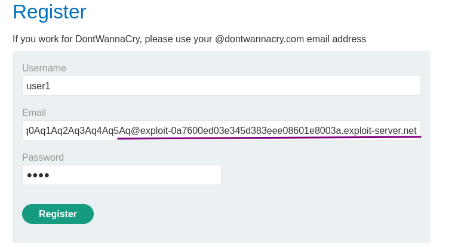

After confirming the registration and logging into the account, the account page shows my email as:

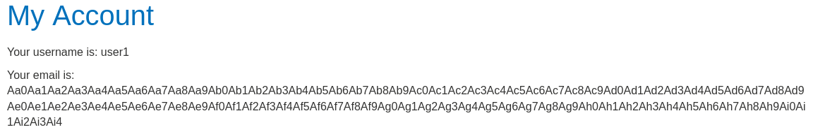

This proves that the two systems consider the email value differently.

It is easy to find at which character the truncation happened with the script msf-pattern_offset provided my the Metasploit framework:

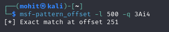

This 4-character pattern starts at position 251, therefore the first 255 characters are recognized by the application to see as account email.

or we can simply use python to find length of string

```python
python3 -c 'l=len("Aa0Aa1Aa2Aa3Aa4Aa5Aa6Aa7Aa8Aa9Ab0Ab1Ab2Ab3Ab4Ab5Ab6Ab7Ab8Ab9Ac0Ac1Ac2Ac3Ac4Ac5Ac6Ac7Ac8Ac9Ad0Ad1Ad2Ad3Ad4Ad5Ad6Ad7Ad8Ad9Ae0Ae1Ae2Ae3Ae4Ae5Ae6Ae7Ae8Ae9Af0Af1Af2Af3Af4Af5Af6Af7Af8Af9Ag0Ag1Ag2Ag3Ag4Ag5Ag6Ag7Ag8Ag9Ah0Ah1Ah2Ah3Ah4Ah5Ah6Ah7Ah8Ah9Ai0Ai1Ai2Ai3Ai4");print(l)'
```

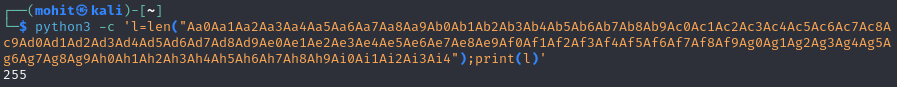

## **The exploit**

The string `@dontwannacry.com` is 17 characters long. So I need a 238-character long prefix, followed by that domain, followed by my attacker server.

```python
python3 -c 'print("x"*238+"@dontwannacry.com.exploit-0a2200da044458a784d7919501b8003e.exploit-server.net")'
```

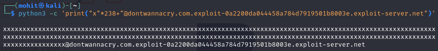

This ensures that the email shop application reads my email as a `@dontwannacry.com` user, whereas the email system sends the registration email to my real account.

Sure enough, using this string as the email address, I receive the confirmation email. After logging in and going to the account website, it shows an additional link in the page header - an admin panel.

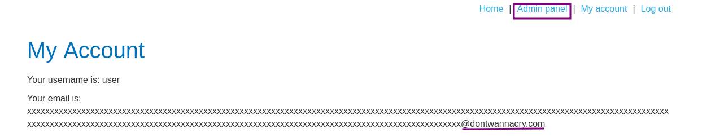

**Go to admin panel and delete user **`carlos`**:**

### Why It Works

The exploit succeeds because this lab doesn't adequately validate user input. you can exploit a logic flaw in its account registration process to gain access to administrative functionality. to solve the lab, access the admin pan

The official solution confirms: While proxying traffic through Burp, open the lab and go to the &quot;Target&quot; &gt; &quot;Site map&quot; tab. Right-click on the lab domain and se

The root cause is a failure in the application's security architecture specific to this logic flaws scenario — the server does not properly validate or secure the user-controlled input that reaches the vulnerable operation.

### Key Takeaways

- The vulnerability is exploitable because user input reaches a sensitive operation without adequate server-side validation.
- PortSwigger confirms: "This lab doesn't adequately validate user input. You can exploit a logic flaw in its account registr"
- Validate business-critical parameters server-side — never trust client-supplied values.

## PortSwigger Lab

**Official lab:** Inconsistent handling of exceptional input

**PortSwigger:** https://portswigger.net/web-security/logic-flaws/examples/lab-logic-flaws-inconsistent-handling-of-exceptional-input
