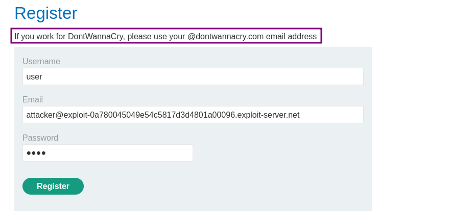
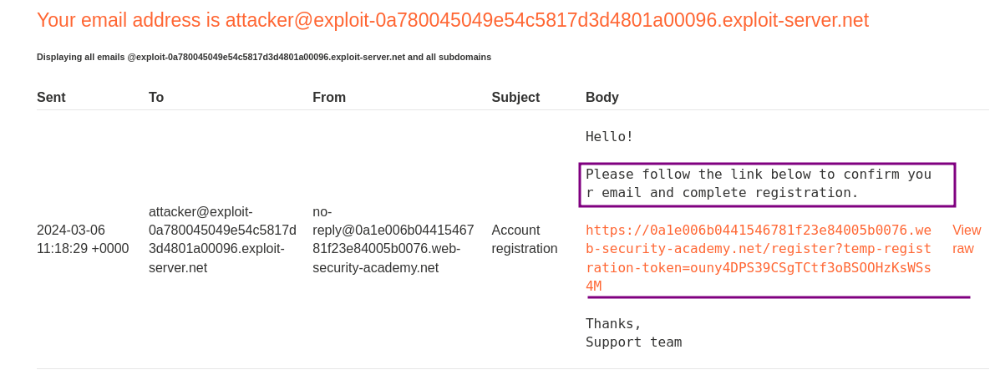
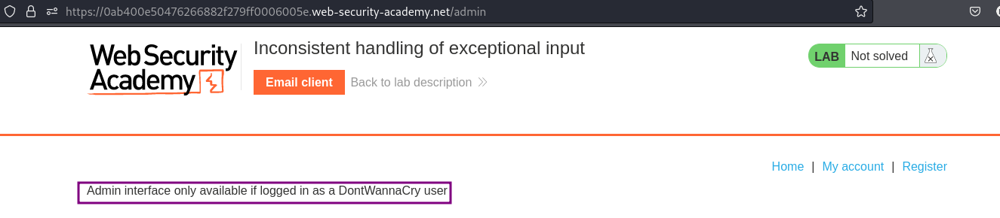
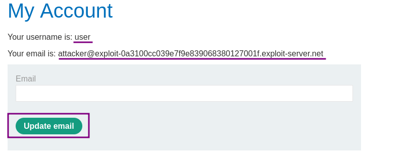
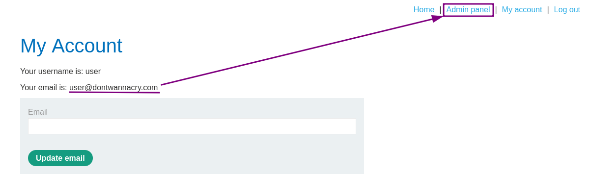

# Inconsistent security controls

### Goal - 

Exploit logic flaw to access the admin panel and delete Carlos

### Vulnerability / Concept

This lab demonstrates a web security vulnerability that can be exploited to compromise the application's security. The vulnerability allows an attacker to bypass security controls and perform unauthorized actions.

The core issue is a failure in the application's security architecture — either insufficient input validation, broken access controls, improper trust boundaries, or insecure handling of user-supplied data. Understanding the root cause is essential for both exploitation and remediation.

### Recon / Initial Analysis

1. Identify the attack surface — what user-controlled inputs exist (URL parameters, form fields, headers, cookies)
2. Analyze the application's behavior with unexpected input
3. Map the request flow and identify trust boundaries
4. Test for error messages that reveal implementation details
5. Compare authenticated vs unauthenticated behavior
6. Use Burp Suite Proxy to capture and analyze all requests
7. Check for hidden parameters using Burp Intruder or Param Miner

### Analysis/Exploitation 

I can register a new account and see that employees of DontWannaCry should use their company email. As I do not have one I register a new account with my email address from the email client:

Once I register, I receive an email with a confirmation link to complete the registration In my email client.

After confirming the email, I can log into my account.

On doing site-mapping/content-dicovery , discovered the path `/admin`.

**the admin panel is in **`/admin`**,But it’s only available to DontWannaCry user.**

On the `my account` page, there is update email option. What happens if I simply change it to a `@dontwannacry.com` one? 

After clicking on the `Update email` button, two things become obvious:

1. My email address is changed straight away
1. An `Admin panel` link appeared

This shows two things:

1. There is no validation on changing the email
1. The existence of an `@dontwannacry.com` email entry is the sole condition for access to the admin panel

So now go to admin panel and **Let’s delete user **`carlos`**:**

### Why It Works

The vulnerability exists because the application fails to properly validate, sanitize, or authorize user input. The broken trust boundary allows an attacker to manipulate the application's behavior by injecting unexpected data that the server processes without adequate security checks.

### Real-World Impact

An attacker could exploit this vulnerability to:
- Access sensitive data belonging to other users
- Bypass authentication or authorization controls
- Perform unauthorized actions on behalf of legitimate users
- Potentially achieve remote code execution on the server
- Compromise the integrity or availability of the application

### Remediation

- Implement proper server-side input validation for all user-controlled data
- Use parameterized queries and prepared statements
- Enforce server-side authorization checks on every request
- Follow the principle of least privilege
- Implement security headers (CSP, X-Frame-Options, X-Content-Type-Options)
- Use a Web Application Firewall (WAF) as defense-in-depth
- Regularly test for vulnerabilities using automated scanners and manual testing

### Key Takeaways

- Never trust user-controlled input — validate and sanitize everything server-side.
- Security controls must be enforced server-side, not client-side.
- Understanding the vulnerability's root cause is essential for proper remediation.
- Burp Suite is essential for identifying and exploiting web vulnerabilities.
- Defense in depth — use multiple layers of protection, not just one.
