# Infinite money logic flaw

### Goal - 

Exploit logic flaw to buy a “Lightweight l33t leather jacket”

### Vulnerability / Concept

This lab demonstrates a web security vulnerability that can be exploited to compromise the application's security. The vulnerability allows an attacker to bypass security controls and perform unauthorized actions.

The core issue is a failure in the application's security architecture — either insufficient input validation, broken access controls, improper trust boundaries, or insecure handling of user-supplied data. Understanding the root cause is essential for both exploitation and remediation.

### Recon / Initial Analysis

1. Identify the attack surface — what user-controlled inputs exist (URL parameters, form fields, headers, cookies)
2. Analyze the application's behavior with unexpected input
3. Map the request flow and identify trust boundaries
4. Test for error messages that reveal implementation details
5. Compare authenticated vs unauthenticated behavior
6. Use Burp Suite Proxy to capture and analyze all requests
7. Check for hidden parameters using Burp Intruder or Param Miner

### Analysis/Exploitation 

**Login as user **`wiener`**:**

The shop itself looks very familiar, but my account page has a new feature - I can use gift cards. Additionally, the lab provides access to my emails.

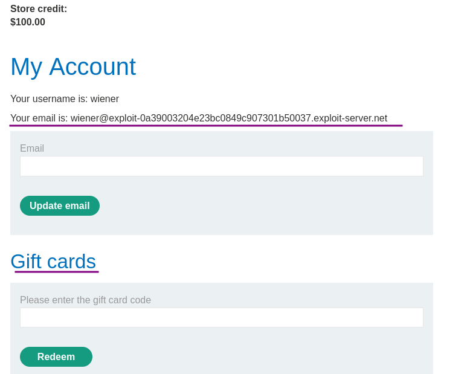

The gift cards can be purchased for $10.

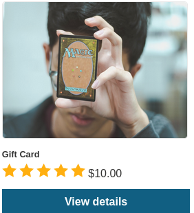

To find out how this works, simply buy one:

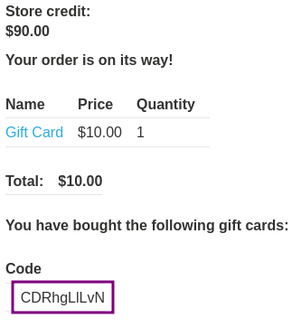

We get gift card code at bottom and At the same time, I received an email, also containing the gift card code:

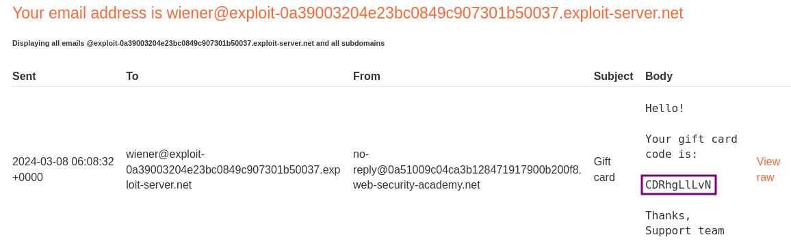

On the 'My account' website I can apply the gift card to bring my store credit back up to $100. Unfortunately, I can not apply the gift card a second time. 

The gift card code can also not be used as a coupon on the checkout page.

Nothing obviously fishy comes up upon checking the requests in Burp.

### Subscribing to newsletter

There is newsletter subscription at the bottom of the home page, we can sign up to their newsletter.

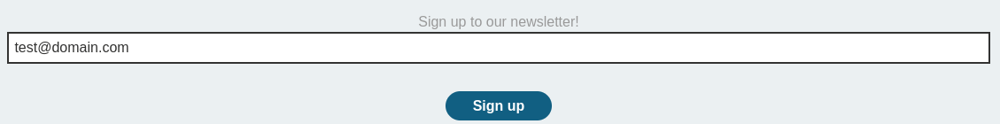

Subscribe to find out if there is any interesting reward for it:

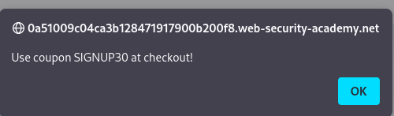

It is a 30% discount. This makes me think... The gift card states $10 flat rate value, can I apply the 30% on this? (after all, all shops I know in real life exclude gift cards explicitly from discounts)

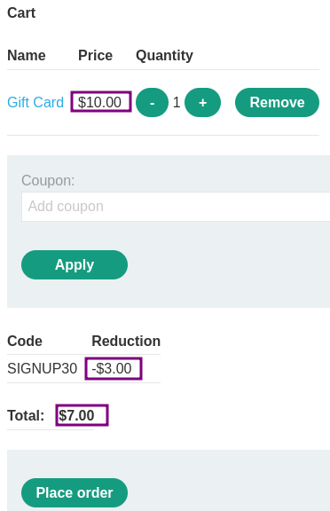

So for $7 I can purchase a $10 gift card that redeems for face value.

After the code is generated and applied to my account, the store credit total shows $3 higher than before:

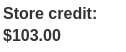

### Purchasing gift cards

For the $98 store credit, I can purchase 14 gift cards, generating a $3 profit each and a total of $42

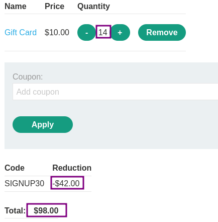

To obtain the $1337 required to purchase the leather jacket, I need to redeem more than 400 gift cards. This is nothing I want to do manually, even though it could be a little less (<300) if I apply the 30% coupon for the jacket itself as well.

### Create a macro

In settings go to "Project" > "Sessions". In the "Session handling rules" panel, click "Add". The "Session handling rule editor" dialog opens. In the dialog, go to the "Scope" tab. Under "URL Scope", select "Include all URLs".  

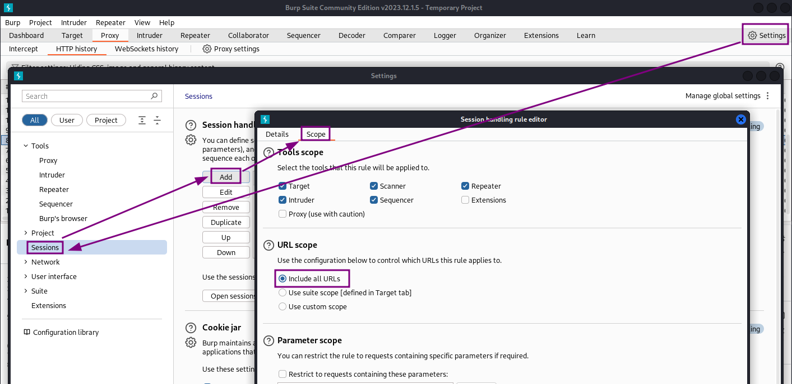

Go back to the "Details" tab. Under "Rule actions", click "Add" > "Run a macro". Under "Select macro", click "Add" again to open the Macro Recorder. 

The first thing is selecting the proper requests for a macro.

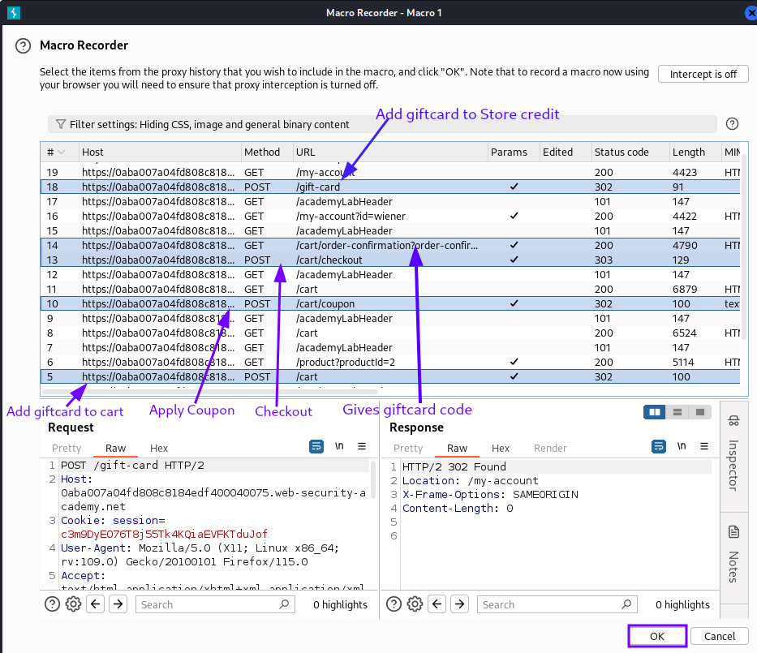

Then, click "OK". The Macro Editor opens. 

In the list of requests, select `GET /cart/order-confirmation?order-confirmed=true`. Click "Configure item". In the dialog that opens, click "Add" to create a custom parameter. Name the parameter `gift-card` and highlight the gift card code at the bottom of the response. Click "OK" twice to go back to the Macro Editor.

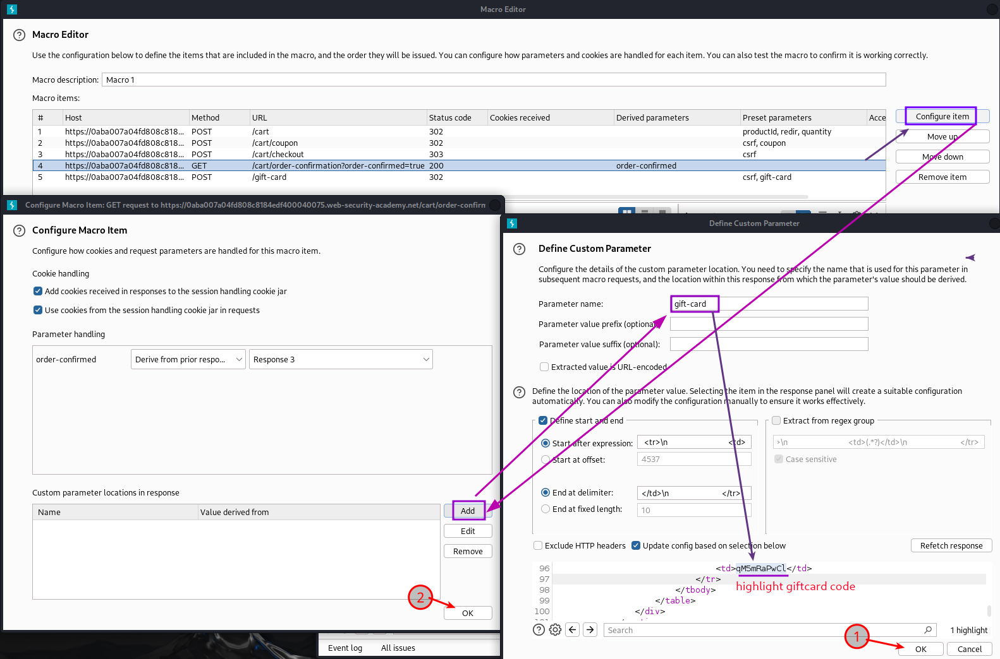

Select the `POST /gift-card` request and click "Configure item" again. In the "Parameter handling" section, use the drop-down menus to specify that the `gift-card` parameter should be derived from the prior response (response 4). Click "OK".                   

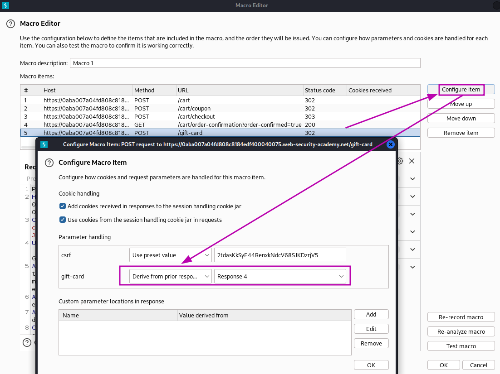

In the Macro Editor, click "Test macro". Look at the response to `GET /cart/order-confirmation?order-confirmation=true` and note the gift card code that was generated. Look at the `POST /gift-card` request. Make sure that the `gift-card` parameter matches and confirm that it received a `302` response. Keep clicking "OK" until you get back to the main Burp window.

### Automate it

Now the macro test is successful, the parameter is obtained automatically and the gift card is applied. So I create a session rule that runs this macro for every request:

Send the `GET /my-account` request to Burp Intruder and use:

- Attack type: **Sniper**
- Payload: Null payloads, continue indefinitely
- Resource Pool: 1 concurrent request
the requests must be made in order, so I use a resource pool with "Maximum concurrent requests" set to `1`.

While the attack is running, refreshing of the account page in the browser shows a steady increase in store credit. So let it run for a while...

After around 400 request the credit score get enough to buy the jacket then stop intruder

Now place the order

### Why It Works

The vulnerability exists because the application fails to properly validate, sanitize, or authorize user input. The broken trust boundary allows an attacker to manipulate the application's behavior by injecting unexpected data that the server processes without adequate security checks.

### Real-World Impact

An attacker could exploit this vulnerability to:
- Access sensitive data belonging to other users
- Bypass authentication or authorization controls
- Perform unauthorized actions on behalf of legitimate users
- Potentially achieve remote code execution on the server
- Compromise the integrity or availability of the application

### Remediation

- Implement proper server-side input validation for all user-controlled data
- Use parameterized queries and prepared statements
- Enforce server-side authorization checks on every request
- Follow the principle of least privilege
- Implement security headers (CSP, X-Frame-Options, X-Content-Type-Options)
- Use a Web Application Firewall (WAF) as defense-in-depth
- Regularly test for vulnerabilities using automated scanners and manual testing

### Key Takeaways

- Never trust user-controlled input — validate and sanitize everything server-side.
- Security controls must be enforced server-side, not client-side.
- Understanding the vulnerability's root cause is essential for proper remediation.
- Burp Suite is essential for identifying and exploiting web vulnerabilities.
- Defense in depth — use multiple layers of protection, not just one.
