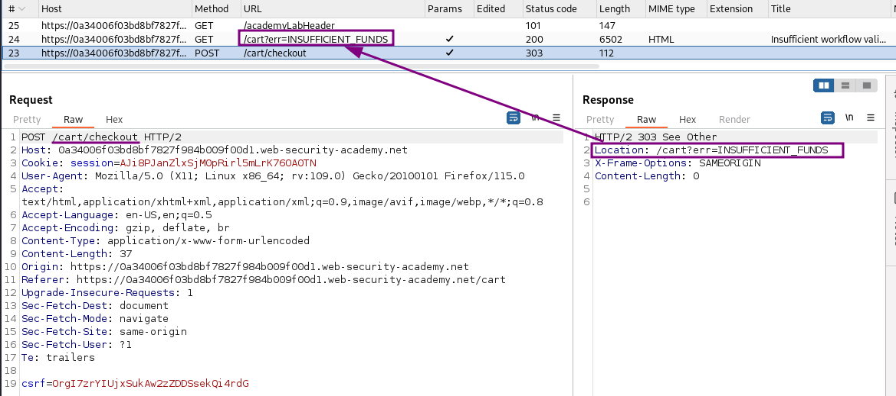
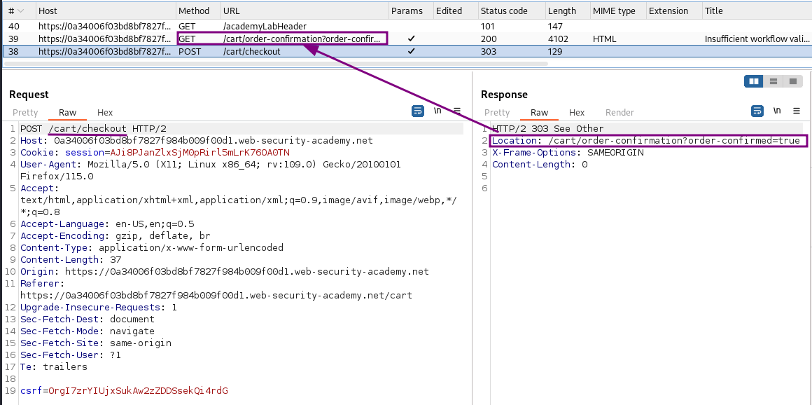
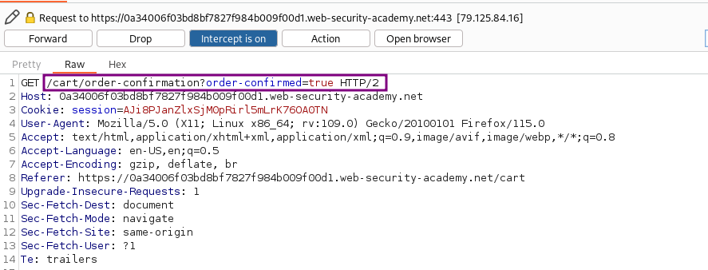

# Insufficient workflow validation

### Goal - 

Exploit logic flaw to buy a “Lightweight l33t leather jacket”

### Analysis/Exploitation 

**Login as user **`wiener`**:**

From the description this lab uses the already well known web shop application again. First to have a quick look around for new features, than I login to my account. As usual, I have a $100 store credit and need to purchase an article for much more than that.

When trying to purchase it, I get an expected `Not enough store credit for this purchase` error. Looking into the requests in Burp, I notice something odd though:

The checkout generates a `303 See Other` response, which instructs my browser to follow up with a GET to the indicated page. The interesting part here is, that the location includes a logical workflow status - the fact that I have not enough funds. I wonder what happens if I purchase something that I can afford:

Here, the redirect goes to another page with an order confirmation.When we have enough store credits, **it’ll send a GET request to **`/cart/order-confirmation`**, with parameter **`order-confirmed=true`**.**

Let's try to purchase the jacket again, but intercept the calls and change the redirect destination.** send a GET request to **`/cart/order-confirmation`** with parameter **`order-confirmed=true`

After all the requests went through, the lab shows success

### Why It Works

The exploit succeeds because this lab makes flawed assumptions about the sequence of events in the purchasing workflow. to solve the lab, exploit this flaw to buy a &quot;lightweight l33t leather jacket&quot;.

The official solution confirms: With Burp running, log in and buy any item that you can afford with your store credit. Study the proxy history. Observe that when you place an order, 

The root cause is a failure in the application's security architecture specific to this logic flaws scenario — the server does not properly validate or secure the user-controlled input that reaches the vulnerable operation.

### Key Takeaways

- The vulnerability is exploitable because user input reaches a sensitive operation without adequate server-side validation.
- PortSwigger confirms: "This lab makes flawed assumptions about the sequence of events in the purchasing workflow. To solve "
- Validate business-critical parameters server-side — never trust client-supplied values.
