# Low-level logic flaw

### Goal - 

Exploit logic flaw to buy the Lightweight l33t leather jacket.


### Vulnerability / Concept

This lab demonstrates a vulnerability in the logic flaws category.

This lab doesn't adequately validate user input. You can exploit a logic flaw in its purchasing workflow to buy items for an unintended price. To solve the lab, buy a &quot;Lightweight l33t leather jacket&quot;.

The vulnerability exists because the application fails to properly validate, sanitize, or secure the user-controlled input that reaches a sensitive operation. The specific attack surface and exploitation technique depend on the exact vulnerability type demonstrated in this lab.

### Recon / Initial Analysis

Based on the lab's objective and the PortSwigger solution:

1. Analyze the application's functionality to identify the attack surface
2. With Burp running, log in and attempt to buy the leather jacket. The order is rejected because you don't have enough store credit. In the proxy history, study the order process. Send the POST /cart re
3. Use Burp Suite Proxy to intercept and analyze requests
4. Identify the specific vulnerability type by testing user-controlled input
5. Determine the appropriate exploitation technique for this lab

### Analysis/Exploitation 

**Login as user **`wiener`**:**

Let’s try to buy the leather jacket!

When we clicked the `Add to cart` button, **it’ll send a POST request to **`/cart`**, with parameter **`productId=1`**, **`redir=PRODUCT`** and **`quantity=1`**.**

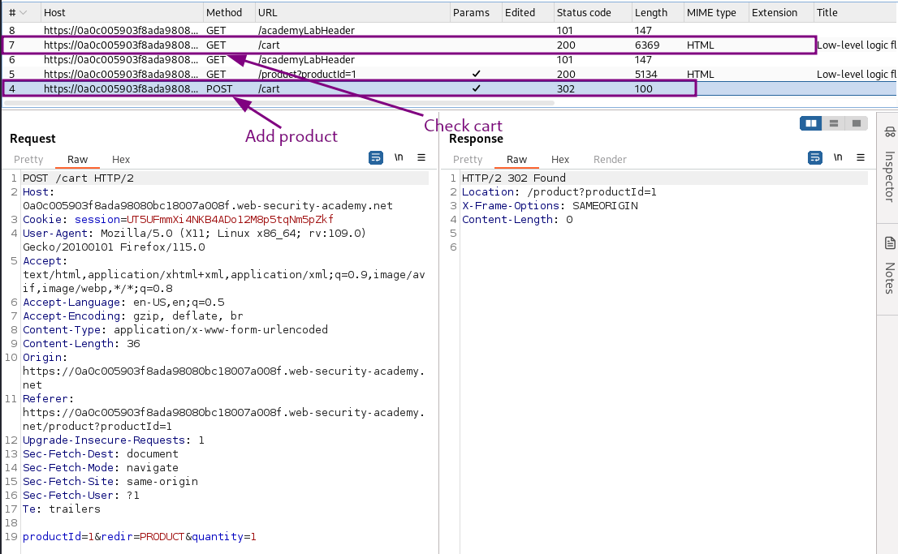

send them to repeater to use them later

On sending the `quantity` to a negative value? Like `-2`, It doesn’t add negative quantity of products. So it dont’t work

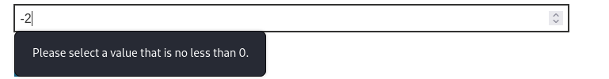

We neither can’t add more than 99 quantiy

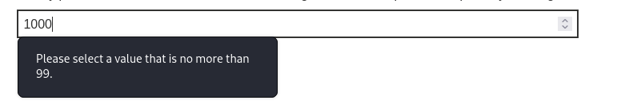

In the `Add to cart` button’s HTML form, we can see that the `quantity` has a limit, the minimum number is `0`, and the maximum is `99`.

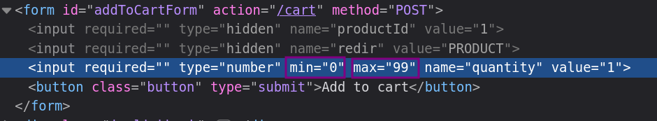

**Note:**The maximum number of items that can be added to the cart is 99 and it is a limit on adding product in single time not on max quantity we can buy, So we can add as many product as we want but max-99 in each request.


💡 Another thing worth trying is attempting to create an overflow with the price. The price is stored in some type of numeric variable. Once it exceeds the maximum value, it usually overflows to the lowest possible value and continues to count up from there:

|  |  |
|---|---|
| **current value** | **new value after calculating +1** |
| 1 | 2 |
| 2 | 3 |
| max_value | min_value |
| min_value | min_value + 1 |

Of course, the exact values for `min_value` and `max_value` depend on the data types used and could range into very, very high numbers.




**Now, what if the total price is greater than a maximum value of an integer?** (Integer overflow)

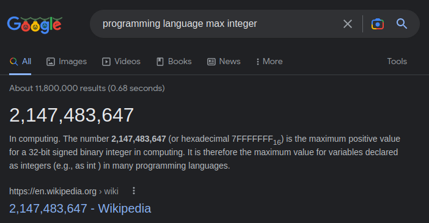

**If the total price is greater than **`2147483647`**, will the price went to **`0`**?**

Send the add to cart request which is **POST request to **`/cart` into intruder

In Burp Intruder, set the quantity of the request to 99, add a Null payload and continue indefinitely. To be able to observe the website, I also only allow a single concurrent request in the resource 
pool.

- Attack type: **Sniper**
- Payload: Null payloads, continue indefinitely
- Resource Pool: 1 concurrent request

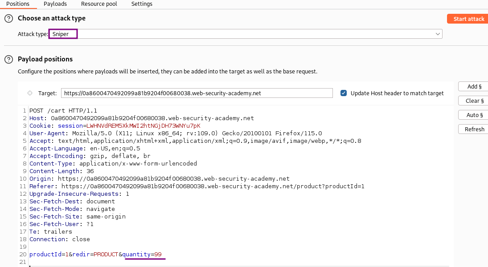

After a couple of refreshes while Burp Intruder sends its request, the page shows a negative number: 

Try to order when total price is negative but Unfortunately, it is prevented by the application:

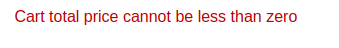


💡 The price has exceeded the maximum value permitted for an integer in the back-end programming language (2,147,483,647). As a result, the value has looped back around to the minimum possible value (-2,147,483,648) and starts counting up towards 0 then turn positive again.

**when the total price reached greater than **`2147483647`**, the value will become negative, then it’ll go back to positive again!**




### **Adjusting the total value**

Note that the price of the jacket is stored in cents (133700). 

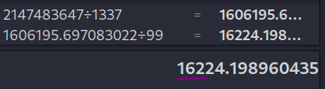

so after around 162 requests of 99 quantity each, the price will turn into negative and after sending another 162 request price will comes near to 0.

Adding 32123 jackets brings the price to $-1221

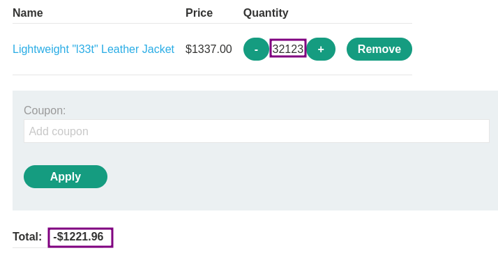

Adding another 1 jacket increases total to $115 which is above our store credit

So find some other product to bring the total price in the range between zero and $100.

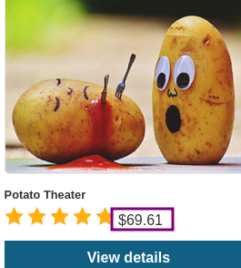

My total cart value negative $1221 So add (1221/69.61=17.54) 18 quantiy of potato theater

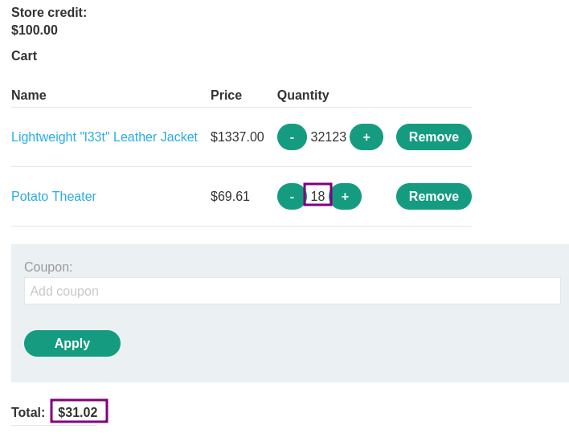

Now Place order

### Why It Works

The vulnerability exists because the application processes user-controlled input without adequate security validation. In this specific lab, the attack succeeds because:

- The application trusts the user input without proper server-side validation
- The input reaches a sensitive operation (database query, HTML rendering, system command, etc.) without sanitization
- The security boundary that should protect the operation is missing or incorrectly implemented
- The specific payload used exploits the exact weakness in the application's input handling

The PortSwigger lab description confirms this: "This lab doesn't adequately validate user input. You can exploit a logic flaw in its purchasing workflow to buy items for an unintended price. To solve the lab, buy a &quot;Lightweight l33t leather ja"

### Attack Flow

**Attack Flow:**

```
Attacker Input (payload in request)
        ↓
Application Functionality (processes user input)
        ↓
Server Processing (no validation/sanitization)
        ↓
Injection Point (input reaches sensitive operation)
        ↓
Exploitation (payload executes as intended)
        ↓
Lab Objective Achieved
```

### Real-World Impact

An attacker could purchase items at reduced prices, bypass multi-step workflows, access functionality outside their privilege level, manipulate application state for financial gain, bypass rate limits, or cause data corruption.

### Detection / Testing Methodology

1. Identify business-critical parameters (prices, quantities, discount codes, roles)
2. Test if client-side values can be modified to affect server-side logic
3. Test multi-step workflows for sequence bypass (skip steps, replay, out-of-order)
4. Check for inconsistent handling of exceptional input (very large, negative, unexpected values)
5. Test rate limits and brute-force protections
6. Look for encryption oracles and state machine flaws

### Remediation

- Implement server-side validation for all business-critical parameters (prices, quantities, roles)
- Never trust client-side values for pricing, permissions, or workflow state
- Enforce workflow sequence integrity server-side
- Use server-side state machines for multi-step processes
- Implement consistency checks for financial transactions
- Rate-limit based on business logic, not just request volume

### Key Takeaways

- This lab demonstrates a logic flaws vulnerability in a real-world scenario.
- The vulnerability occurs because user input reaches a sensitive operation without proper validation.
- The PortSwigger lab confirms: "This lab doesn't adequately validate user input. You can exploit a logic flaw in its purchasing work"
- Burp Suite is essential for identifying and exploiting this vulnerability.
- The remediation for this specific vulnerability involves: - Implement server-side validation for all business-critical parameters (prices, quantities, roles)
