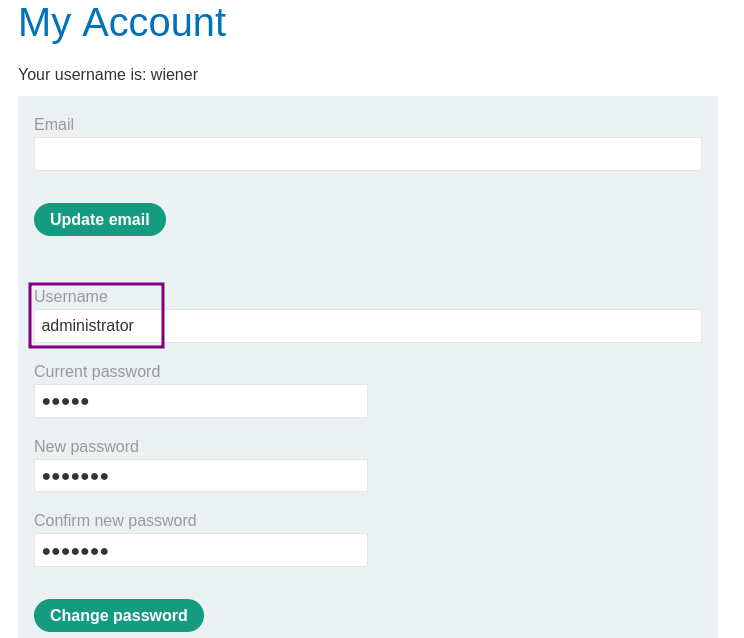
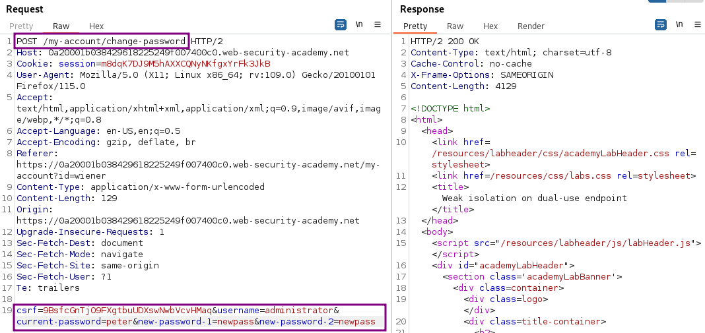
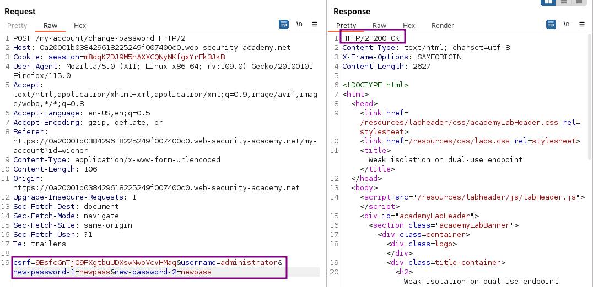

# Weak isolation on dual-use endpoint

### Goal - 

Exploit logic flaw to access the admin panel and delete Carlos


### Vulnerability / Concept

This lab demonstrates a vulnerability in the logic flaws category.

This lab makes a flawed assumption about the user's privilege level based on their input. As a result, you can exploit the logic of its account management features to gain access to arbitrary users' accounts. To solve the lab, access the administrator account and delete the user carlos.

The vulnerability exists because the application fails to properly validate, sanitize, or secure the user-controlled input that reaches a sensitive operation. The specific attack surface and exploitation technique depend on the exact vulnerability type demonstrated in this lab.

### Recon / Initial Analysis

Based on the lab's objective and the PortSwigger solution:

1. Analyze the application's functionality to identify the attack surface
2. With Burp running, log in and access your account page.
                    
                    
                        Change your password.
                    
                    
              
3. Use Burp Suite Proxy to intercept and analyze requests
4. Identify the specific vulnerability type by testing user-controlled input
5. Determine the appropriate exploitation technique for this lab

### Analysis/Exploitation 

**Login as user **`wiener`**:**

One thing that catches my eye is the password change functionality:

Why does it contain the username as an input field? I'd expect either the password to be changed for the logged-in user, `wiener`. In this case, the input field for the username would be unnecessary.

What happens if I use it and simply change the username to `administrator`?



We get error Current password is incorrect:


From this result I can derive a few pieces of information:

1. The password change failed due to a wrong current password.
1. The password comparison was not performed with the password account that is logged in but with the password of the account set in `Username`
1. At the point the 'Update password' form was generated, the application did use the logged-in user again.

But at some point during the generation of the response, the application assumed that my username is `administrator`. This points to some weird logic behind the scenes that warrant further investigation.

To verify that no password was changed despite the error message, I attempt to log in with both `wiener` and `administrator` using the newly set password. It fails as expected.

### Analyzing the traffic

When we clicked the `Change password` button, **it send a POST request to **`/my-account/change-password`**, with parameter **`csrf`**, **`username`**, **`current-password`**, **`new-password-1`**, and **`new-password-2`**.**



OK, so I have the csrf token, username and the three password parameters.

While the application generated the response, at the moment my username was embedded, I was the `administrator` user. I was also considered `administrator` while the current password was checked and the error message got inserted. As such, the password change failed as it was not the correct password for that user.

So what happens if I remove the current-password parameter from the form?

This depends on whether it always checks the current password on password change. If this is the case, then it will fail as well, as it should.

However, if the password check only occurs when the parameter is present, then it will be bad for the application but good for me.



We successfully changed `administrator`’s password!

Try to logout and login again, this time with the credentials `administrator:peter`:

And I appear to be inside the administrator account. The application states that my username is `administrator` and it provides me with a link to an `Admin panel`. I access it, delete `carlos` and receive a confirmation:

### Why It Works

The vulnerability exists because the application processes user-controlled input without adequate security validation. In this specific lab, the attack succeeds because:

- The application trusts the user input without proper server-side validation
- The input reaches a sensitive operation (database query, HTML rendering, system command, etc.) without sanitization
- The security boundary that should protect the operation is missing or incorrectly implemented
- The specific payload used exploits the exact weakness in the application's input handling

The PortSwigger lab description confirms this: "This lab makes a flawed assumption about the user's privilege level based on their input. As a result, you can exploit the logic of its account management features to gain access to arbitrary users' a"

### Attack Flow

**Attack Flow:**

```
Attacker Input (payload in request)
        ↓
Application Functionality (processes user input)
        ↓
Server Processing (no validation/sanitization)
        ↓
Injection Point (input reaches sensitive operation)
        ↓
Exploitation (payload executes as intended)
        ↓
Lab Objective Achieved
```

### Real-World Impact

An attacker could purchase items at reduced prices, bypass multi-step workflows, access functionality outside their privilege level, manipulate application state for financial gain, bypass rate limits, or cause data corruption.

### Detection / Testing Methodology

1. Identify business-critical parameters (prices, quantities, discount codes, roles)
2. Test if client-side values can be modified to affect server-side logic
3. Test multi-step workflows for sequence bypass (skip steps, replay, out-of-order)
4. Check for inconsistent handling of exceptional input (very large, negative, unexpected values)
5. Test rate limits and brute-force protections
6. Look for encryption oracles and state machine flaws

### Remediation

- Implement server-side validation for all business-critical parameters (prices, quantities, roles)
- Never trust client-side values for pricing, permissions, or workflow state
- Enforce workflow sequence integrity server-side
- Use server-side state machines for multi-step processes
- Implement consistency checks for financial transactions
- Rate-limit based on business logic, not just request volume

### Key Takeaways

- This lab demonstrates a logic flaws vulnerability in a real-world scenario.
- The vulnerability occurs because user input reaches a sensitive operation without proper validation.
- The PortSwigger lab confirms: "This lab makes a flawed assumption about the user's privilege level based on their input. As a resul"
- Burp Suite is essential for identifying and exploiting this vulnerability.
- The remediation for this specific vulnerability involves: - Implement server-side validation for all business-critical parameters (prices, quantities, roles)
