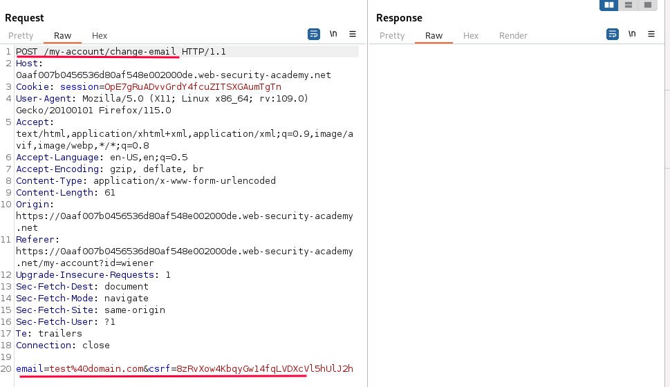
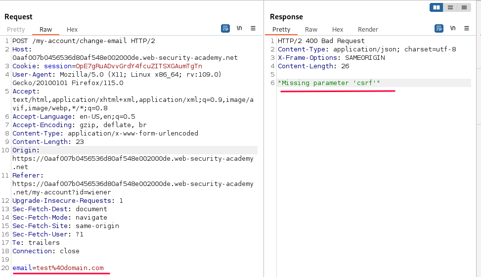
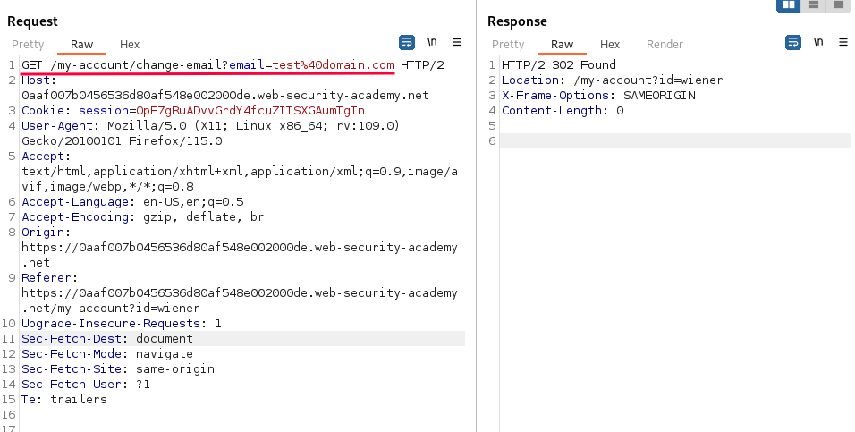
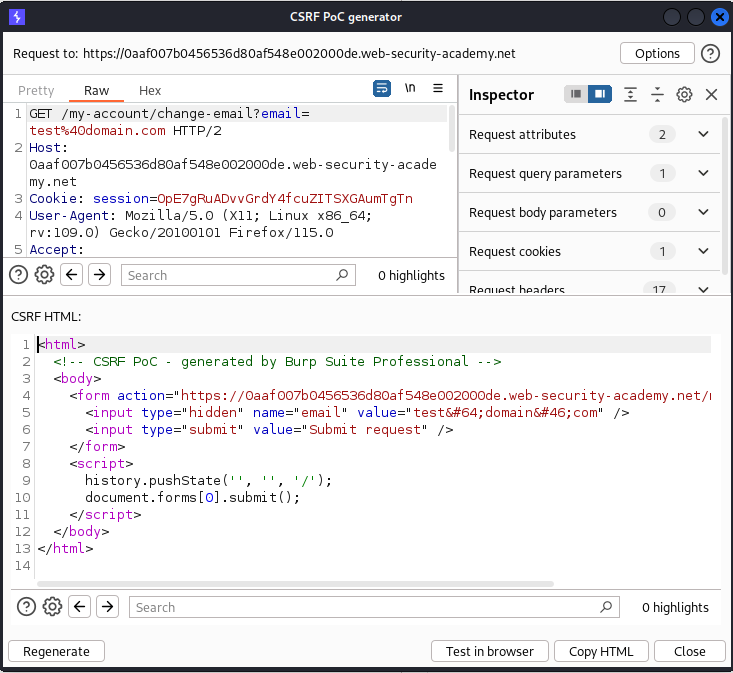
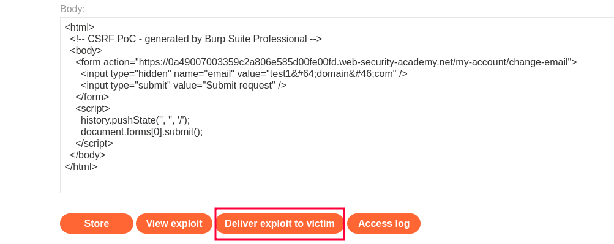

# CSRF where token validation depends on request method

### Goal - 

use your exploit server to host an HTML page that uses a CSRF attack to change the viewer’s email address.

### Analysis/Exploitation -

Login as user `wiener`:

Update the email 

When we click the `Update email` button, it’ll send a POST request to `/my-account/change-email` with the parameter `email & csrf  `

check what happens when I simply remove the CSRF-token from the request we get Missing parameter 'csrf'

The same happens if I try to use an empty token (`&csrf=`) or random token  (`&csrf=1234asdf`) 

we can’t modify our email address, as the form is missing the right CSRF token!

To bypass the CSRF token, we can try to change our method from POST to GET by selecting `Change request method` from the context menu.

Here we don’t get any error and We’ve successfully changed the email address to attacker’s controlled value


💡 In order for a CSRF attack to be possible:

  - A relevant action: change a users email
  - Cookie-based session handling: session cookie
  - No unpredictable request parameters: Request method can be changed to GET which does not require CSRF token


If you're using Burp Suite Professional, right-click on the request, and from the context menu select Engagement tools / Generate CSRF PoC. Enable the option to include an auto-submit script and click "Regenerate". 

In the community edition, simply get the the form from the HTML of the application and perform the required changes to it (specifically: change the method and action, remove the csrf token and add the auto-submit script)

- Go to the exploit server, paste your exploit HTML into the "Body" section, and click "Store".
- To verify if the exploit will work, try it on yourself by clicking "View exploit" and checking the resulting HTTP request and response.
- Change the email address in your exploit so that it doesn't match your own.
- Store the exploit, then click "Deliver to victim" to solve the lab.

### Why It Works

The exploit succeeds because this lab's email change functionality is vulnerable to csrf.

The official solution confirms: Open Burp's browser and log in to your account. Submit the "Update email" form, and find the resulting request in your Proxy history. Send the request

The root cause is a failure in the application's security architecture specific to this csrf scenario — the server does not properly validate or secure the user-controlled input that reaches the vulnerable operation.

### Key Takeaways

- The vulnerability is exploitable because user input reaches a sensitive operation without adequate server-side validation.
- PortSwigger confirms: "This lab's email change functionality is vulnerable to CSRF."
- CSRF tokens, SameSite cookies, and Referer validation together provide defense-in-depth.

## PortSwigger Lab

**Official lab:** CSRF where token validation depends on request method

**PortSwigger:** https://portswigger.net/web-security/csrf/bypassing-token-validation/lab-token-validation-depends-on-request-method
