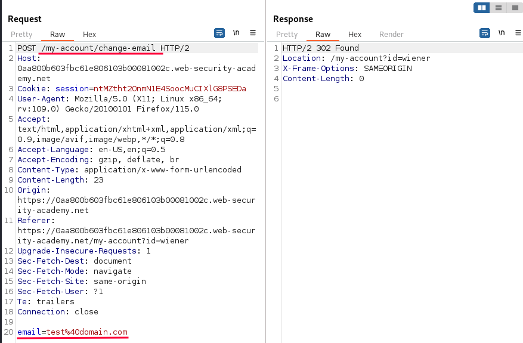
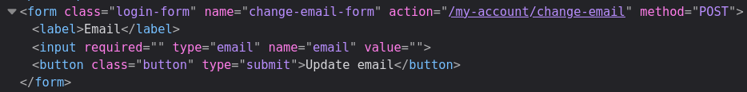
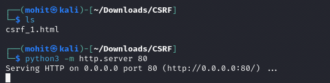
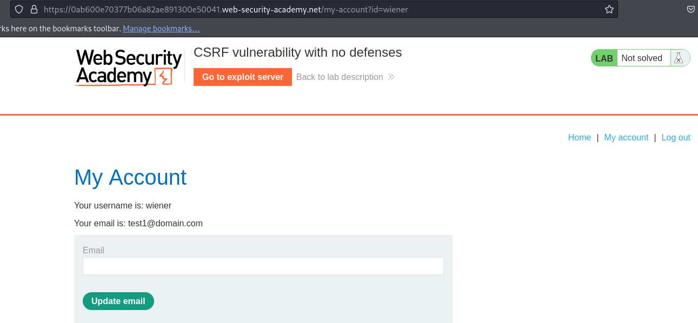

# CSRF vulnerability with no defenses

### Goal - 

Exploit the CSRF vulnerability and change the email address


### Vulnerability / Concept

This lab demonstrates a vulnerability in the csrf category.

This lab's email change functionality is vulnerable to CSRF.

The vulnerability exists because the application fails to properly validate, sanitize, or secure the user-controlled input that reaches a sensitive operation. The specific attack surface and exploitation technique depend on the exact vulnerability type demonstrated in this lab.

### Recon / Initial Analysis

Based on the lab's objective and the PortSwigger solution:

1. Analyze the application's functionality to identify the attack surface
2. Open Burp's browser and log in to your account. Submit the "Update email" form, and find the resulting request in your Proxy history.
                    
                    
                        
3. Use Burp Suite Proxy to intercept and analyze requests
4. Identify the specific vulnerability type by testing user-controlled input
5. Determine the appropriate exploitation technique for this lab

### Analysis/Exploitation -

**Login as user **`wiener`**:**

here, we can update our email address!



When we click the `Update email` button, it’ll send a POST request to `/my-account/change-email` with the parameter `email`.

In order for a CSRF attack to be possible:

- A relevant action - email change functionality
- Cookie based session handling - session cookie
- No unpredictable request parameters - satisfied

**To exploit this CSRF vulnerbility, we can craft a web page that automatically send the same request!**

Let’s inspect how this website construct the form:



Armed with above information, we can craft a form that perform the same request:

```javascript
<html>
	<head>
		<title>CSRF-1</title>
	</head>
	<body>
		<form action="https://0ab600e70377b06a82ae891300e50041.web-security-academy.net/my-account/change-email" method="POST">
		    <input type="hidden" name="email" value="test1@domain.com">
		</form>

		<script>
			document.forms[0].submit();
		</script>
	</body>
</html>
```

To host this page, we use python’s module `http.server`:



Now, we can test it locally.

**If we go to **`http://localhost/csrf_1.html`**, it’ll automatically send a POST request to **`https://0ab600e70377b06a82ae891300e50041.web-security-academy.net/my-account/change-email`** with the parameter **`email`**, and it’s value is **`test1@domain.com`**:**



It works, as it require session cookie and that endpoint doesn’t have any CSRF protections!!

**To change other users’ email, we can use PortSwigger Lab’s exploit server:**

**Copy and paste our payload to **`Body`** and click **`Store`**and click the **`Deliver exploit to victim`** button**

### Why It Works

The vulnerability exists because the application processes user-controlled input without adequate security validation. In this specific lab, the attack succeeds because:

- The application trusts the user input without proper server-side validation
- The input reaches a sensitive operation (database query, HTML rendering, system command, etc.) without sanitization
- The security boundary that should protect the operation is missing or incorrectly implemented
- The specific payload used exploits the exact weakness in the application's input handling

The PortSwigger lab description confirms this: "This lab's email change functionality is vulnerable to CSRF."

### Attack Flow

**Attack Flow:**

```
Attacker Input (payload in request)
        ↓
Application Functionality (processes user input)
        ↓
Server Processing (no validation/sanitization)
        ↓
Injection Point (input reaches sensitive operation)
        ↓
Exploitation (payload executes as intended)
        ↓
Lab Objective Achieved
```

### Real-World Impact

An attacker could change the victim's email address (account takeover via password reset), transfer funds, modify account settings (disable 2FA), delete data, or perform any action the victim is authorized to perform.

### Detection / Testing Methodology

1. Identify state-changing endpoints (POST/PUT/DELETE)
2. Check if the application uses CSRF tokens
3. Examine how tokens are validated (presence, session-binding, method-dependence)
4. Test if SameSite cookie attributes are set
5. Check if Referer/Origin header validation is performed
6. Attempt to submit a cross-origin form without the token

### Remediation

- Use CSRF tokens that are unique per session and validated server-side
- Implement SameSite=Strict or SameSite=Lax on session cookies
- Validate the Referer or Origin header on state-changing requests
- Require re-authentication for critical actions
- Never perform state-changing operations via GET requests

### Key Takeaways

- This lab demonstrates a csrf vulnerability in a real-world scenario.
- The vulnerability occurs because user input reaches a sensitive operation without proper validation.
- The PortSwigger lab confirms: "This lab's email change functionality is vulnerable to CSRF."
- Burp Suite is essential for identifying and exploiting this vulnerability.
- The remediation for this specific vulnerability involves: - Use CSRF tokens that are unique per session and validated server-side
