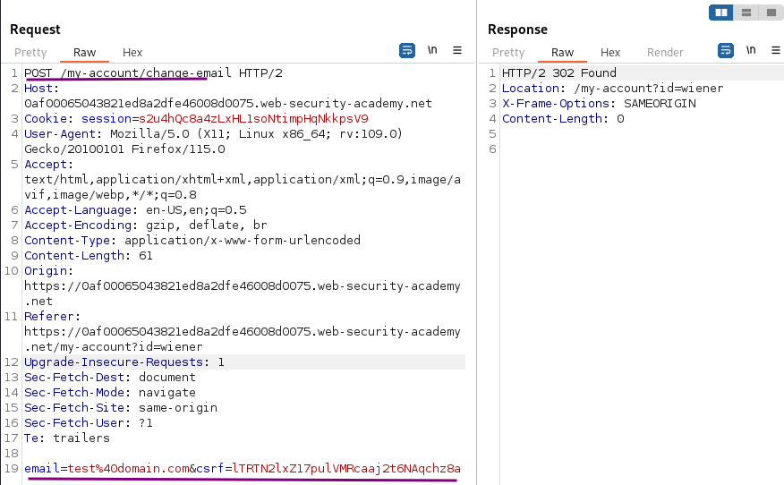
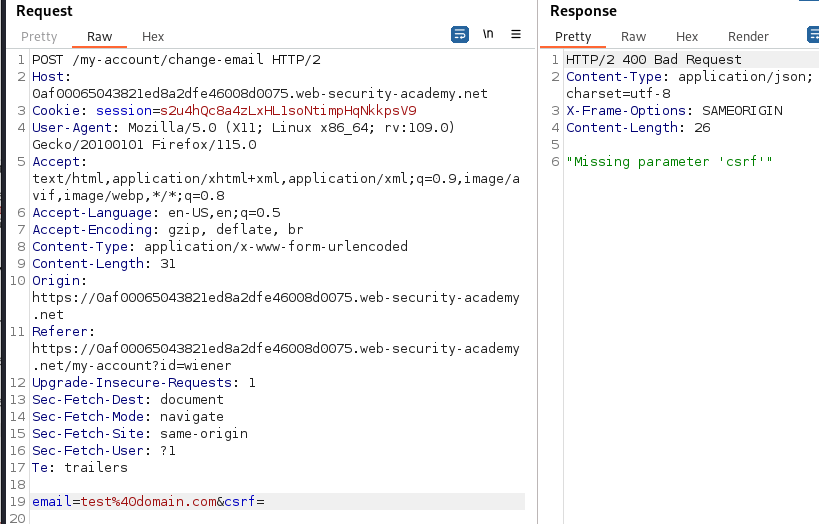
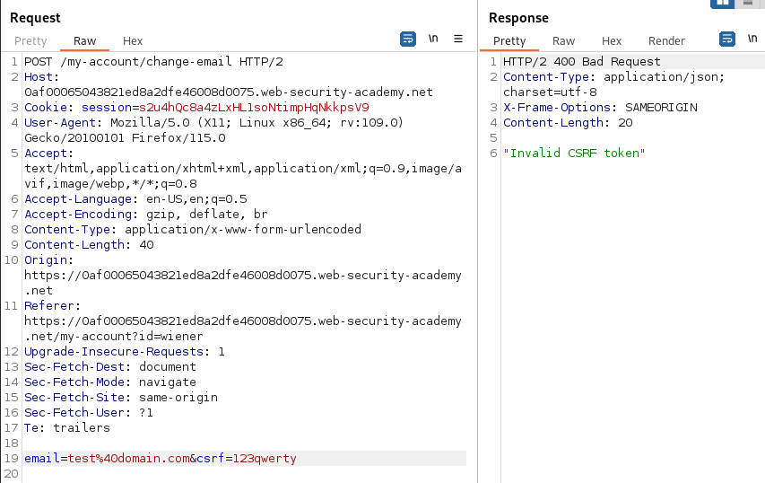
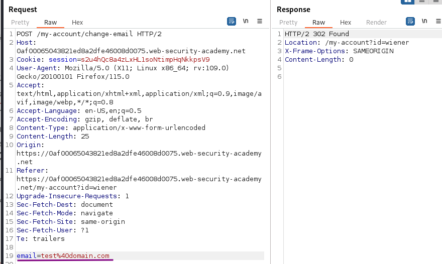
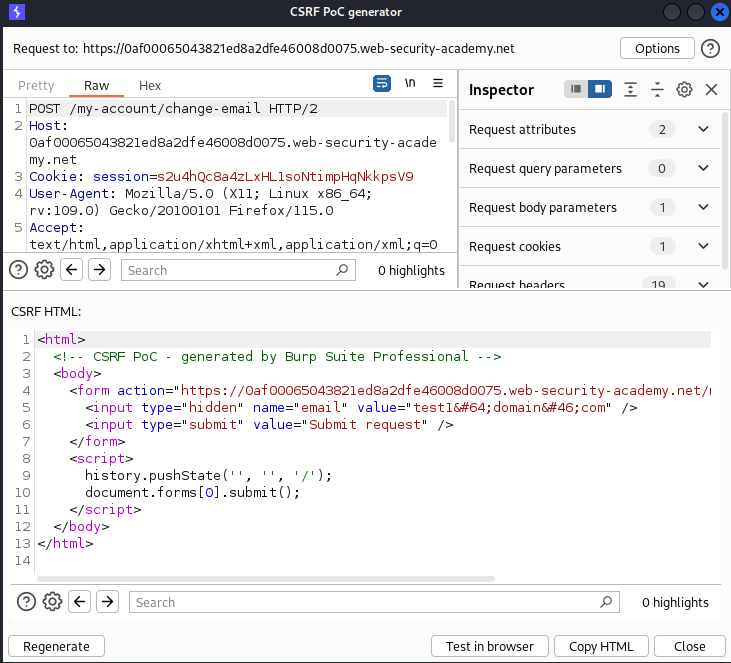

# CSRF where token validation depends on token being present

### Goal - 

use your exploit server to host an HTML page that uses a CSRF attack to change the viewer’s email address.

### Analysis/Exploitation -

Login as user `wiener`:

Update the email 

 if I try to use an empty token (`&csrf=`) or random token  (`&csrf=1234asdf`) 

Delete the `csrf` parameter entirely and observe that the request is now accepted. So it only validate CSRF token if it is present in request


💡 In order for a CSRF attack to be possible:


  - A relevant action: change a users email
  - Cookie-based session handling: session cookie
  - No unpredictable request parameters: csrf token is not mandatory

Testing CSRF Tokens:

  1. Change the request method from POST to GET
  1. Remove the CSRF token and see if application accepts request
In Burp Suite Professional, right-click on the request, and from the context menu select Engagement tools / Generate CSRF PoC. Enable the option to include an auto-submit script and click "Regenerate".

Go to the exploit server, paste your exploit HTML into the "Body" section, and click "Store".

We can test it locally via the `View exploit` button

- Change the email address in your exploit so that it doesn't match your own.
- Store the exploit, then click "Deliver to victim" to solve the lab.
