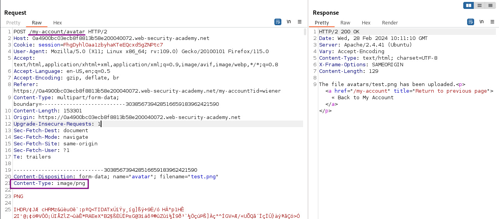
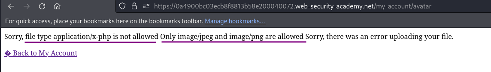
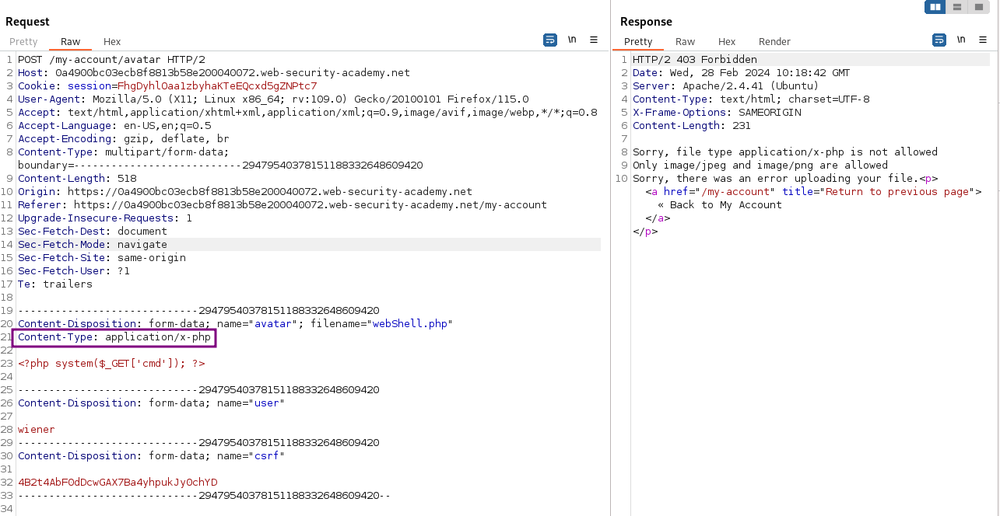
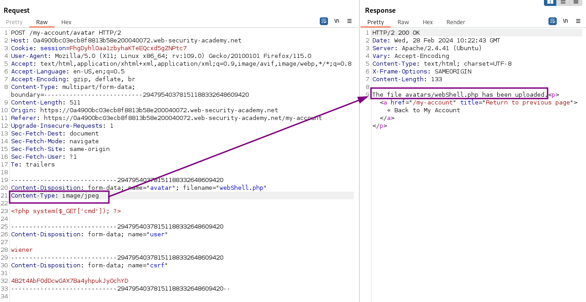
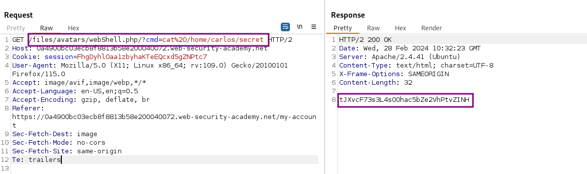
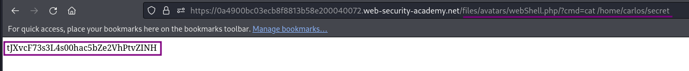
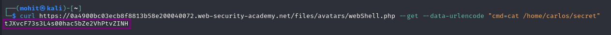

# Web shell upload via Content-Type restriction bypass

### Goal - 

To solve the lab, upload a basic PHP web shell and use it to exfiltrate the contents of the file `/home/carlos/secret`


### Vulnerability / Concept

This lab demonstrates a vulnerability in the file upload category.

This lab contains a vulnerable image upload function. It attempts to prevent users from uploading unexpected file types, but relies on checking user-controllable input to verify this.

The vulnerability exists because the application fails to properly validate, sanitize, or secure the user-controlled input that reaches a sensitive operation. The specific attack surface and exploitation technique depend on the exact vulnerability type demonstrated in this lab.

### Recon / Initial Analysis

Based on the lab's objective and the PortSwigger solution:

1. Analyze the application's functionality to identify the attack surface
2. Log in and upload an image as your avatar, then go back to your account page.
                    
                    
                        In Burp, go to Proxy &gt; HTTP history and notice that y
3. Use Burp Suite Proxy to intercept and analyze requests
4. Identify the specific vulnerability type by testing user-controlled input
5. Determine the appropriate exploitation technique for this lab

### Analysis/Exploitation -

Login as user `wiener`:

In the account settings, I can set both an email address and an avatar image for the user.

upload a normal image file



try to upload the PHP script  
`<?php system($_GET['cmd']); ?>`



It shows the values for Content-Type that are permitted.



the `Content-Type` is `application/x-php` and it can be fully-controlled by the attacker.

We can just simply change the `Content-Type` from `application/x-php` to `image/jpeg` or `image/png`



The file name remained as `webShell.php` so that the server can execute it. Calling the uploaded script with parameter shows the secret data:

the uploaded file stored in `/files/avatar/<filename>`. Let’s trigger the web shell and `cat` the `secret`

via BurpSuite



via Browser



via command Curl



### Why It Works

The vulnerability exists because the application processes user-controlled input without adequate security validation. In this specific lab, the attack succeeds because:

- The application trusts the user input without proper server-side validation
- The input reaches a sensitive operation (database query, HTML rendering, system command, etc.) without sanitization
- The security boundary that should protect the operation is missing or incorrectly implemented
- The specific payload used exploits the exact weakness in the application's input handling

The PortSwigger lab description confirms this: "This lab contains a vulnerable image upload function. It attempts to prevent users from uploading unexpected file types, but relies on checking user-controllable input to verify this."

### Attack Flow

**Attack Flow:**

```
Attacker Input (payload in request)
        ↓
Application Functionality (processes user input)
        ↓
Server Processing (no validation/sanitization)
        ↓
Injection Point (input reaches sensitive operation)
        ↓
Exploitation (payload executes as intended)
        ↓
Lab Objective Achieved
```

### Real-World Impact

An attacker could achieve remote code execution (RCE) by uploading a web shell, access files on the server, overwrite critical files, or cause denial of service by uploading large files.

### Detection / Testing Methodology

1. Identify file upload functionality (avatars, documents, attachments)
2. Test which file types are accepted (Content-Type, extension)
3. Check if file content is validated (magic bytes)
4. Determine where uploaded files are stored (web-accessible?)
5. Test for path traversal in the filename
6. Test for race conditions in the upload-verify-delete cycle
7. Check if double extensions or null bytes bypass filters

### Remediation

- Validate file content, not just headers (check magic bytes)
- Store uploaded files outside the web root
- Disable script execution in upload directories
- Use random filenames without preserving extensions
- Validate file type using server-side content analysis
- Implement size limits and rate limiting

### Key Takeaways

- This lab demonstrates a file upload vulnerability in a real-world scenario.
- The vulnerability occurs because user input reaches a sensitive operation without proper validation.
- The PortSwigger lab confirms: "This lab contains a vulnerable image upload function. It attempts to prevent users from uploading un"
- Burp Suite is essential for identifying and exploiting this vulnerability.
- The remediation for this specific vulnerability involves: - Validate file content, not just headers (check magic bytes)
