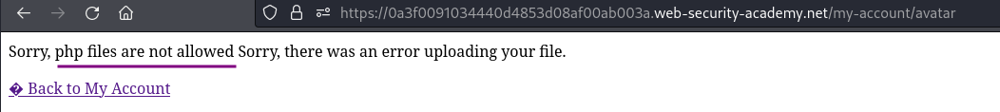
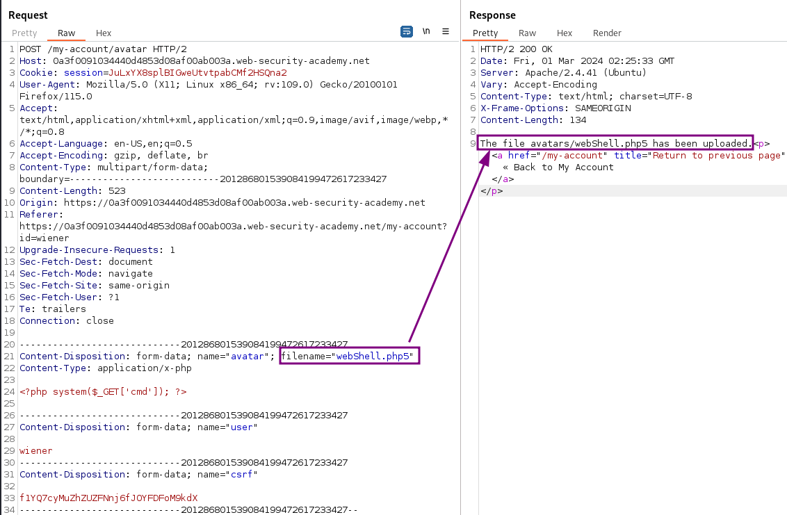
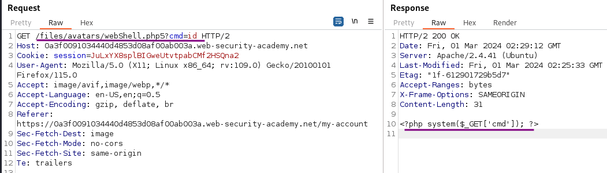
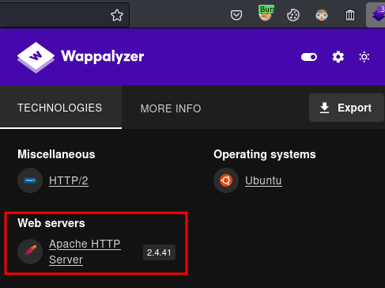
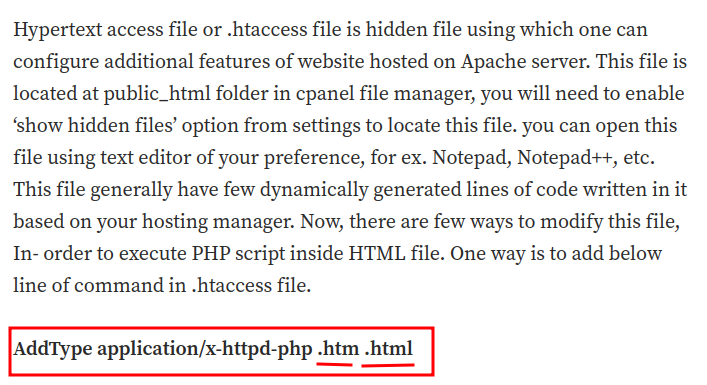
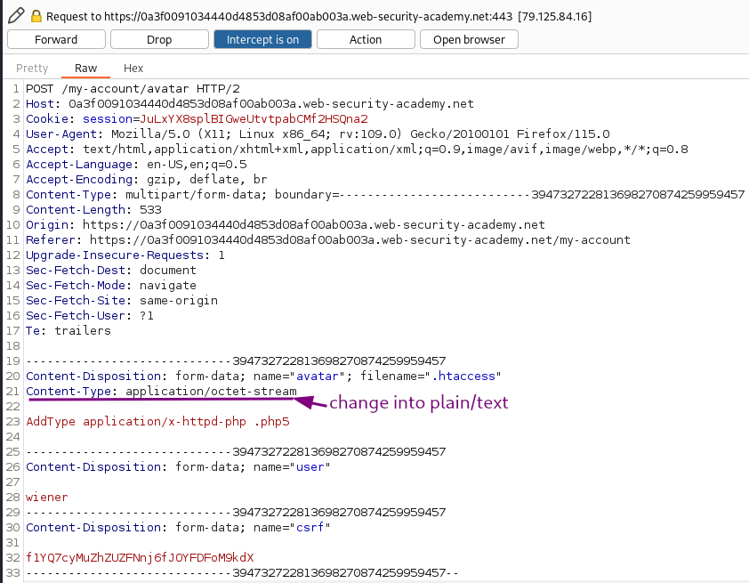
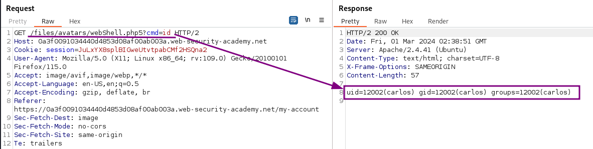
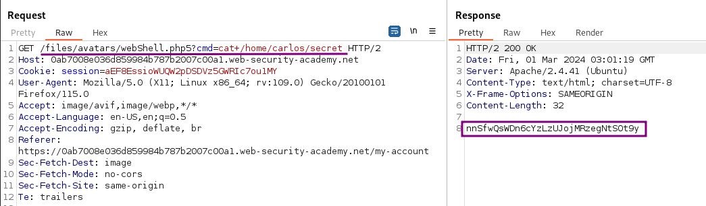
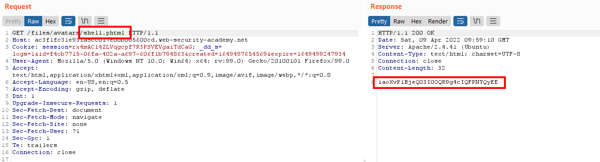

# Web shell upload via extension blacklist bypass

### Goal - 

To solve the lab, upload a basic PHP web shell and use it to exfiltrate the contents of the file `/home/carlos/secret`


### Vulnerability / Concept

This lab demonstrates a web security vulnerability that can be exploited to compromise the application's security. The vulnerability allows an attacker to bypass security controls and perform unauthorized actions.

The core issue is a failure in the application's security architecture — either insufficient input validation, broken access controls, improper trust boundaries, or insecure handling of user-supplied data. Understanding the root cause is essential for both exploitation and remediation.

### Recon / Initial Analysis

1. Identify the attack surface — what user-controlled inputs exist (URL parameters, form fields, headers, cookies)
2. Analyze the application's behavior with unexpected input
3. Map the request flow and identify trust boundaries
4. Test for error messages that reveal implementation details
5. Compare authenticated vs unauthenticated behavior
6. Use Burp Suite Proxy to capture and analyze all requests
7. Check for hidden parameters using Burp Intruder or Param Miner

### Analysis/Exploitation -

[Solution  (the easy and unintended way)](https://app.notion.com/p/8133e72ab08a41068a99f5712ad2385b#7008774cb9ca462e9cd076d4095ef174) 

Login as user `wiener`:

In the account settings, I can set both an email address and an avatar image for the user.

upload the PHP script  
`<?php system($_GET['cmd']); ?>`

Trying to upload the php script shows that PHP files are not allowed to upload:



No file with a PHP extension can be uploaded on the server. Attempts to circumvent this with different capitalization `shell.pHP` or null bytes in the filename `shell.php%00.png` showed no success.

The next step was to try some common alternative extensions for PHP files. The [hacktricks.xyz](https://book.hacktricks.xyz/pentesting-web/file-upload) list a couple of such alternatives for PHP: `phtml, .php, .php3, .php4, .php5`

To bypass this, we can rename the file extension to `.php5`. This extension tells the web server to use PHP version 5.



We’ve successfully uploaded the web shell!

**Check Can we execute any command?**



Nope we get plain text of webShell we uploaded.This might happen is because **servers typically won’t execute files unless they have been configured to do so.**

In FireFox extension `Wappalyzer`, it will tell us which web server is using:



In this case, **the web server is using **`Apache`**.**


💡 **In Apache server, before executing PHP files requested by a client, developers might have to add the following directives to their **`/etc/apache2/apache2.conf`** file:**

```text
LoadModule php_module /usr/lib/apache2/modules/libphp.so
AddType application/x-httpd-php .php
```

Many servers also allow developers to create special configuration files within individual directories in order to override or add to one or more of the global settings.

In Apache servers, it will load a directory-specific configuration from a file called `.htaccess` if one is present.

Now, what if I upload a file called `.htaccess` to override the server configuration?

**After poking around, I found this **[**Medium blog**](https://asreshashank.medium.com/execute-php-scripts-into-html-file-by-modifying-htaccess-file-8517ed1e2066)**:**






we can create our own `.htaccess` with the following configuration:


`AddType application/x-httpd-php .php5`

**By doing that, we can execute any file that has **`.php5`** extension!**

while uploading intercept the request and **Change the **`Content-Type`** to **`text/plain`**:**



Or it can be directly uploaded from Burp Repeater, by sending  `POST /my-account/avatar` request that was used to submit the file upload.Make the following changes:

- Change the value of the `filename` parameter to `.htaccess`.
- Change the value of the `Content-Type` header to `text/plain`.
- Replace the contents of the file (your PHP payload) with the following Apache directive: `AddType application/x-httpd-php .php5`



💡 I noticed that I was able to upload a number of different file extension, possibly even arbitrary ones like `.a2z, .abc` .

If reusing an upload request of `png` or `php` files for the Repeater it is important to set the Content-Type to `text/plain`. Otherwise, the server will return a `500 Internal Server error` when trying to load something later on.

The application is served by an apache server, so uploading a custom .htaccess file maps an arbitrary extension (`.a2z`) to the executable MIME type `application/x-httpd-php`. As the server uses the `mod_php` module, it knows how to handle this already.




now we can execute command                                             



Fetch the carlos secret



### **Solution  (the easy and unintended way)**

While the extensions with numbers at the end uploaded successful, they were not executed by the server. Uploading and accessing the file as `.phtml` is a different story and executes the script:



### Why It Works

The vulnerability exists because the application fails to properly validate, sanitize, or authorize user input. The broken trust boundary allows an attacker to manipulate the application's behavior by injecting unexpected data that the server processes without adequate security checks.

### Real-World Impact

An attacker could exploit this vulnerability to:
- Access sensitive data belonging to other users
- Bypass authentication or authorization controls
- Perform unauthorized actions on behalf of legitimate users
- Potentially achieve remote code execution on the server
- Compromise the integrity or availability of the application

### Remediation

- Implement proper server-side input validation for all user-controlled data
- Use parameterized queries and prepared statements
- Enforce server-side authorization checks on every request
- Follow the principle of least privilege
- Implement security headers (CSP, X-Frame-Options, X-Content-Type-Options)
- Use a Web Application Firewall (WAF) as defense-in-depth
- Regularly test for vulnerabilities using automated scanners and manual testing

### Key Takeaways

- Never trust user-controlled input — validate and sanitize everything server-side.
- Security controls must be enforced server-side, not client-side.
- Understanding the vulnerability's root cause is essential for proper remediation.
- Burp Suite is essential for identifying and exploiting web vulnerabilities.
- Defense in depth — use multiple layers of protection, not just one.
