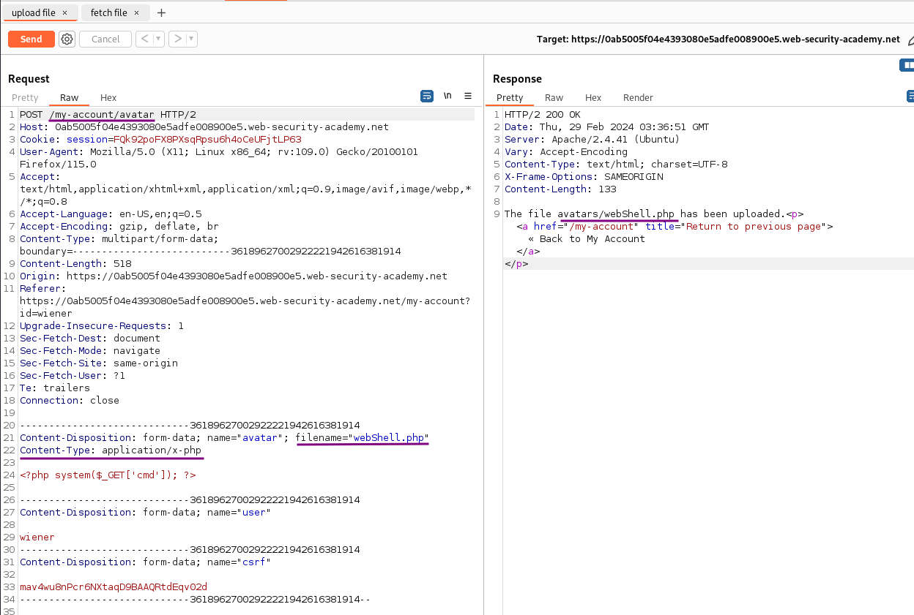
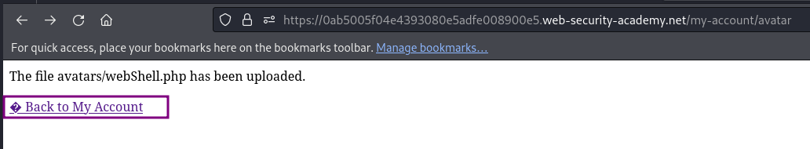
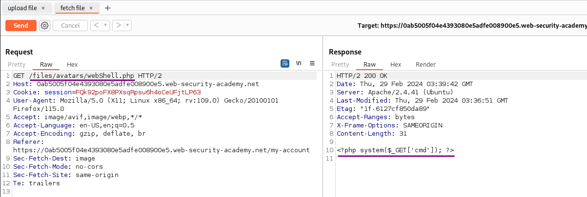
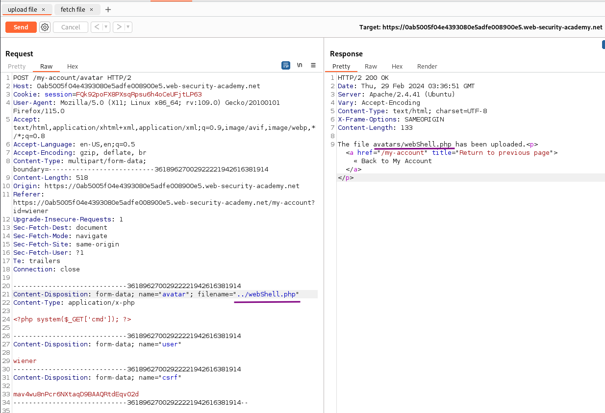
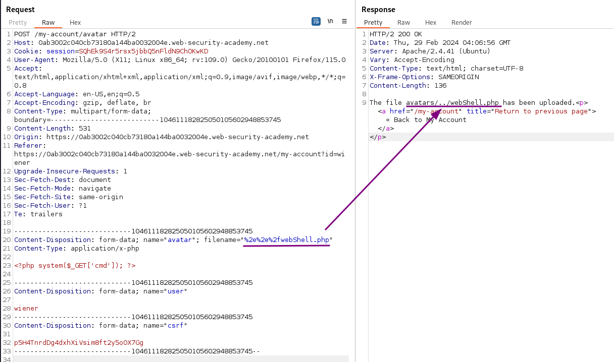
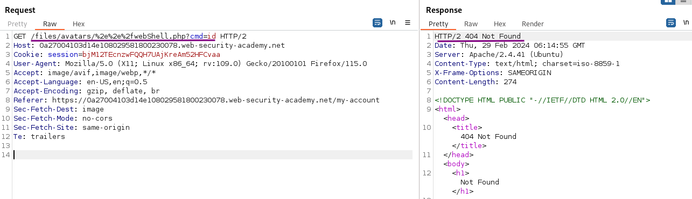
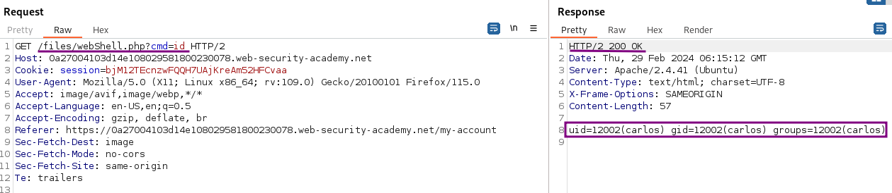
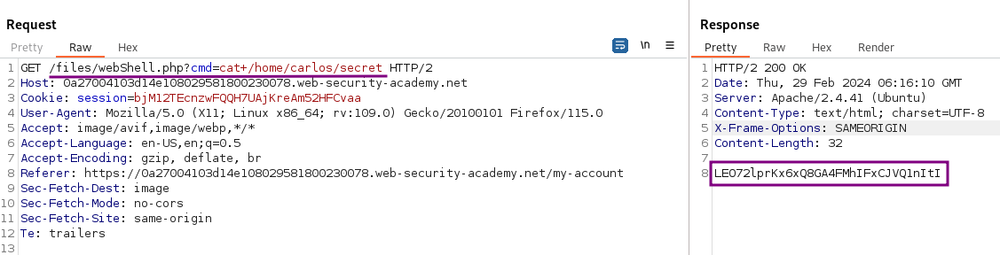

# Web shell upload via path traversal

### Goal - 

To solve the lab, upload a basic PHP web shell and use it to exfiltrate the contents of the file `/home/carlos/secret`

### Analysis/Exploitation -

Login as user `wiener`:

In the account settings, I can set both an email address and an avatar image for the user.

upload the PHP script  
`<?php system($_GET['cmd']); ?>`

When we clicked the `Upload` button, it’ll send a POST request to `/my-account/avatar`, with parameter `filename`, `user` and `csrf`. Also, the `Content-Type` is `application/x-php`.

when we click “Back to My Account”, notice that file was fetched using a `GET` request to `/files/avatars/<filename>`. So the uploaded file will located in `/files/avatars/<filename>`.

Uploading the php file is successful. However, accessing this file just shows the content of the file. The PHP code is not executed on the server side:


💡 This behavior is potentially interesting in its own right, as it may provide a way to leak source code, but it nullifies any attempt to create a web shell.

This kind of configuration often differs between directories. A directory to which user-supplied files are uploaded will likely have much stricter controls than other locations on the filesystem that are assumed to be out of reach for end users. If you can find a way to upload a script to a different directory that's not supposed to contain user-supplied files, the server may execute your script after all.



**Modify the file path**

The definition of what files are executed is often done per directory. The `/files/avatar/` path appears not to execute PHP scripts. The next step is to try and escape the path into a location that executes PHP.

Change the filename to `../shell.php` to try to store the file on dictionary up. The upload confirmation shows the same path `avatar/` as the previous upload, so the path traversal did not succeed:

Either some or all of the characters of the path traversal are stripped away, or the application is not vulnerable to this type of attack (but the lab name gives a hint that path traversal possible so find  a way for it).

My first attempt to circumvent the protection is to obfuscate the path traversal with URL-encoding the `../` part:

accessing file with directory traversal gives error

if we move up a directory and directly access the file then php get executed

The response indicates that the path traversal was successful. Accessing the path calls the file outside of the avatar directory and executes the PHP on the server, providing the secret string (calling `/files/webShell.php` shows the same)

