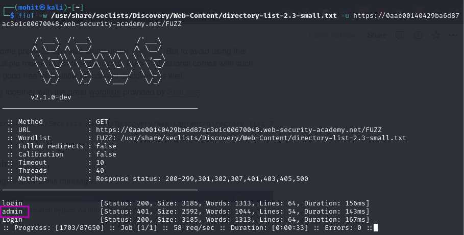
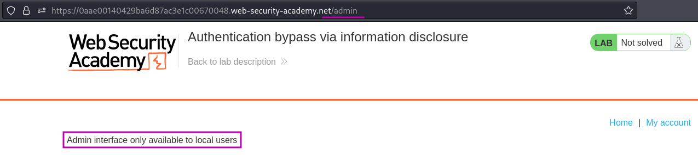
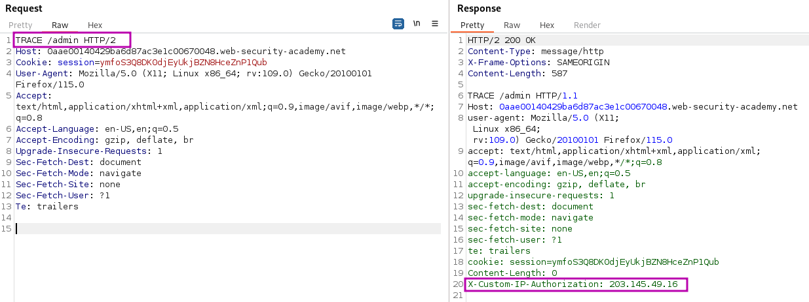
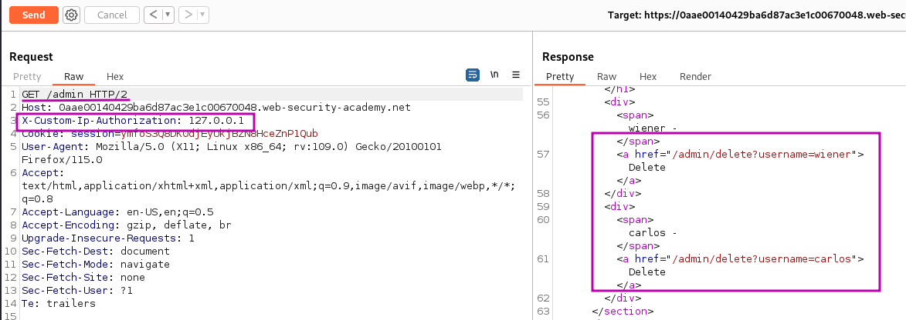
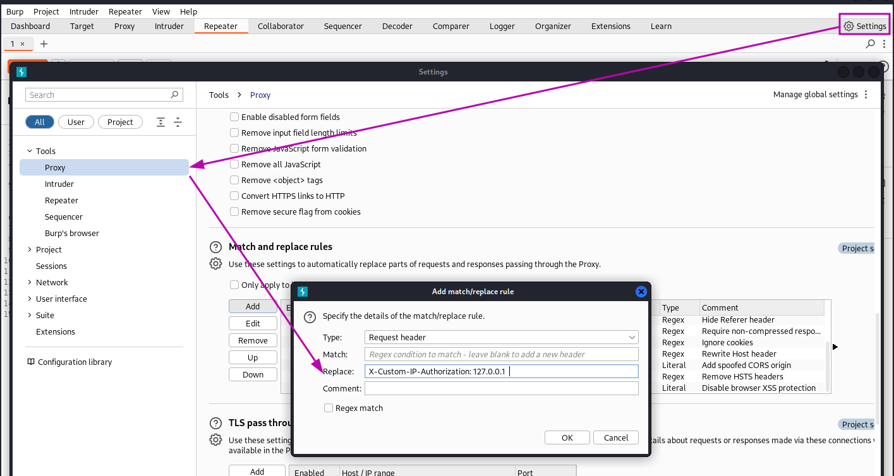

# Authentication bypass via information disclosure

### Goal - 

Access the admin interface and delete the user `carlos`.


### Vulnerability / Concept

This lab demonstrates a vulnerability in the jwt category.

This lab uses a JWT-based mechanism for handling sessions. It uses a robust RSA key pair to sign and verify tokens. However, due to implementation flaws, this mechanism is vulnerable to algorithm confusion attacks.

The vulnerability exists because the application fails to properly validate, sanitize, or secure the user-controlled input that reaches a sensitive operation. The specific attack surface and exploitation technique depend on the exact vulnerability type demonstrated in this lab.

### Recon / Initial Analysis

1. Analyze the application's functionality and identify user-controlled inputs
2. Use Burp Suite to intercept and modify requests
3. Test for the specific jwt vulnerability
4. Identify the injection point and context
5. Craft an appropriate payload

### Analysis/Exploitation -

After browsing around a bit and logging in with the known credentials, nothing too interesting appears. Time to check the requests in Burp. Nothing too interesting there either.

The admin endpoint in some previous labs was found under `/admin`. But to avoid using this knowledge, I can use multiple means of content discovery. Burp Professional comes with such functionality and several good free tools allow for content discovery as well.

The one I use here is [ffuf](https://github.com/ffuf/ffuf) together with the great wordlists provided by [SecLists](https://github.com/danielmiessler/SecLists):

```html
ffuf -w /usr/share/seclists/Discovery/Web-Content/directory-list-2.3-small.txt -u https://0aeb000b03ce98ffc09d247e001c00a4.web-security-academy.net/FUZZ
```



### Visiting the endpoint

On visiting this admin page it shows this message:



**It only allows local users, which is using the localhost(**`127.0.0.1`**) IP address.**


💡 A common way of propagating originating IPs to a web server (used in proxy or load balancing scenarios) is the `X-Forwarded-For` header. This, however, does not work here (and the lab description states it is a custom header anyway).



Two HTTP methods can be used to obtain additional information, `OPTIONS` and `TRACE`. The latter produces an interesting result:



Notice that the `X-Custom-IP-Authorization` header, containing my IP address, was automatically appended to the request. This is used to determine whether or not the request came from the `localhost` IP address.                 



Now that I know the header, accessing the admin interface becomes easy. I need to ensure the custom header is sent with each request so I add a `Match and Replace` rule to always add this new header to requests.

I use `127.0.0.1` as the content to trick the application to believe that the request originated from `localhost`.



Now just reload the page in the browser, access the admin panel and delete user `carlos` to solve the lab:

### Why It Works

The vulnerability exists because the application processes user-controlled input without adequate security validation. In this specific lab, the attack succeeds because:

- The application trusts the user input without proper server-side validation
- The input reaches a sensitive operation (database query, HTML rendering, system command, etc.) without sanitization
- The security boundary that should protect the operation is missing or incorrectly implemented
- The specific payload used exploits the exact weakness in the application's input handling

The PortSwigger lab description confirms this: "This lab uses a JWT-based mechanism for handling sessions. It uses a robust RSA key pair to sign and verify tokens. However, due to implementation flaws, this mechanism is vulnerable to algorithm conf"

### Attack Flow

**Attack Flow:**

```
Attacker Input (payload in request)
        ↓
Application Functionality (processes user input)
        ↓
Server Processing (no validation/sanitization)
        ↓
Injection Point (input reaches sensitive operation)
        ↓
Exploitation (payload executes as intended)
        ↓
Lab Objective Achieved
```

### Real-World Impact

An attacker could forge admin tokens for full administrative access, impersonate any user, bypass authentication entirely, escalate privileges by modifying role claims, or bypass token expiration.

### Detection / Testing Methodology

1. Identify JWT usage (check cookies, Authorization headers)
2. Decode the JWT to examine header (alg, kid) and payload (sub, role)
3. Test if the signature is verified (modify payload, resubmit)
4. Test if the algorithm can be changed (RS256 to HS256, none)
5. Look for exposed public keys (JWKS endpoints)
6. Check if jwk/jku/kid header parameters are processed
7. Test if weak signing keys can be brute-forced

### Remediation

- Pin the JWT algorithm to a single expected value (e.g., RS256 only)
- Never accept 'alg: none' or unsigned tokens
- Use a well-maintained JWT library that prevents algorithm confusion
- Do not process user-controlled jwk, jku, or kid header parameters
- Use strong, random signing keys (256-bit minimum)
- Implement server-side session revocation despite JWT statelessness

### Key Takeaways

- This lab demonstrates a jwt vulnerability in a real-world scenario.
- The vulnerability occurs because user input reaches a sensitive operation without proper validation.
- The PortSwigger lab confirms: "This lab uses a JWT-based mechanism for handling sessions. It uses a robust RSA key pair to sign and"
- Burp Suite is essential for identifying and exploiting this vulnerability.
- The remediation for this specific vulnerability involves: - Pin the JWT algorithm to a single expected value (e.g., RS256 only)
