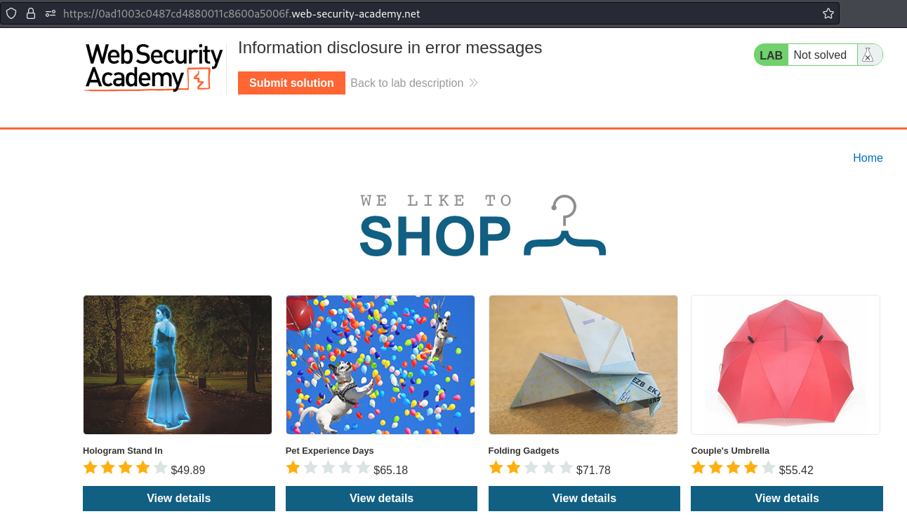
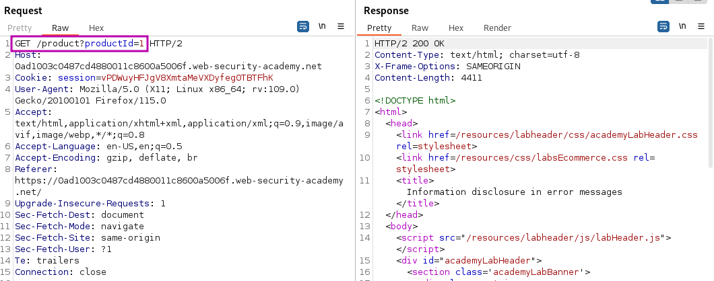
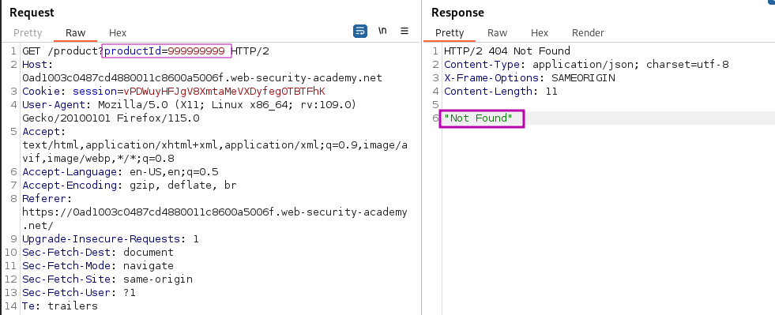
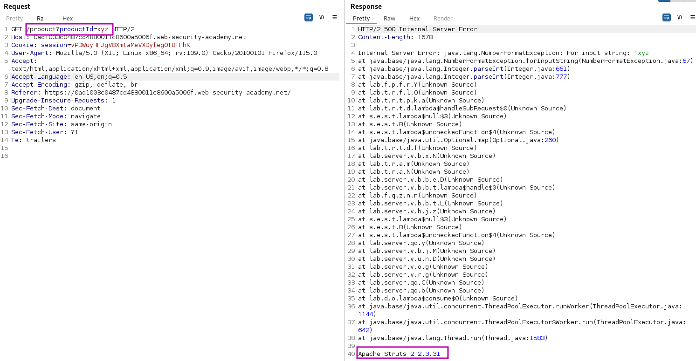
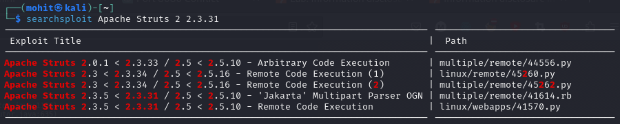

# Information disclosure in error messages

### Goal - 

Obtain and submit the version number of this framework.


### Vulnerability / Concept

This lab demonstrates a vulnerability in the information disclosure category.

This lab discloses sensitive information via its version control history. To solve the lab, obtain the password for the administrator user then log in and delete the user carlos.

The vulnerability exists because the application fails to properly validate, sanitize, or secure the user-controlled input that reaches a sensitive operation. The specific attack surface and exploitation technique depend on the exact vulnerability type demonstrated in this lab.

### Recon / Initial Analysis

Based on the lab's objective and the PortSwigger solution:

1. Analyze the application's functionality to identify the attack surface
2. Open the lab and browse to /.git to reveal the lab's Git version control data.
                    
                    
                        
                            Download a copy of this en
3. Use Burp Suite Proxy to intercept and analyze requests
4. Identify the specific vulnerability type by testing user-controlled input
5. Determine the appropriate exploitation technique for this lab

### Analysis/Exploitation -

Here, we can view the details of each products. **Let’s click on the **`View details`** button**



It Send the `GET` request to `/product`with parameter `productId=1` 



**What happens when I modify it?**

Use a productId that does not exist:



It gives an error “Not Found” and handle it properly and do not reveal anything interesting.

Change the value of the `productId` parameter to a non-integer data type, such as a string:



- Web application uses vulnerable version of : `Apache Struts 2 2.3.31`

**In **`searchsploit`**(An offline version of Exploit-DB), we can see that it’s vulnerable to Remote Code Execution(RCE)!**



### Why It Works

The vulnerability exists because the application processes user-controlled input without adequate security validation. In this specific lab, the attack succeeds because:

- The application trusts the user input without proper server-side validation
- The input reaches a sensitive operation (database query, HTML rendering, system command, etc.) without sanitization
- The security boundary that should protect the operation is missing or incorrectly implemented
- The specific payload used exploits the exact weakness in the application's input handling

The PortSwigger lab description confirms this: "This lab discloses sensitive information via its version control history. To solve the lab, obtain the password for the administrator user then log in and delete the user carlos."

### Attack Flow

**Attack Flow:**

```
Attacker Input (payload in request)
        ↓
Application Functionality (processes user input)
        ↓
Server Processing (no validation/sanitization)
        ↓
Injection Point (input reaches sensitive operation)
        ↓
Exploitation (payload executes as intended)
        ↓
Lab Objective Achieved
```

### Real-World Impact

An attacker could discover internal application structure, source code, database credentials, API keys, configuration files, version information (for CVE exploitation), or bypass authentication using disclosed information.

### Detection / Testing Methodology

1. Check for verbose error messages (submit malformed input, access non-existent resources)
2. Look for debug pages and endpoints (/debug, /admin, /console)
3. Search for backup files (.bak, .old, .swp, ~)
4. Check version control history (.git, .svn)
5. Examine HTTP response headers for version information
6. Test for path traversal to access configuration files
7. Check if stack traces are displayed

### Remediation

- Disable verbose error messages in production (use generic error pages)
- Remove debug pages and endpoints before deployment
- Do not expose backup files, source code, or version control history
- Implement proper access control on all endpoints
- Use a WAF to detect information disclosure patterns
- Regularly audit the application for exposed data

### Key Takeaways

- This lab demonstrates a information disclosure vulnerability in a real-world scenario.
- The vulnerability occurs because user input reaches a sensitive operation without proper validation.
- The PortSwigger lab confirms: "This lab discloses sensitive information via its version control history. To solve the lab, obtain t"
- Burp Suite is essential for identifying and exploiting this vulnerability.
- The remediation for this specific vulnerability involves: - Disable verbose error messages in production (use generic error pages)
