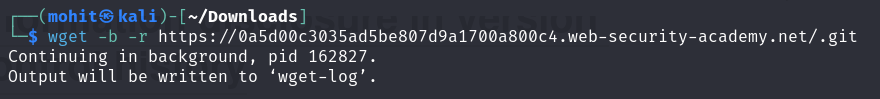
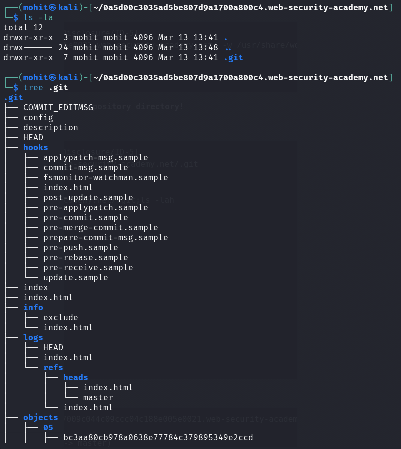
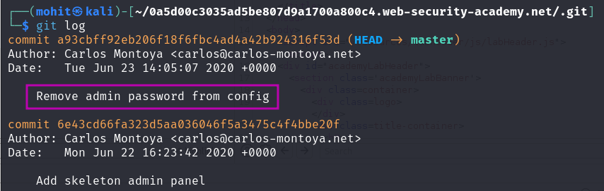
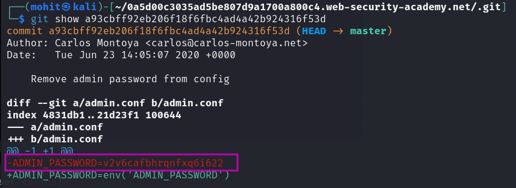

# Information disclosure in version control history

### Goal - 

Obtain the password for the `administrator` user then log in and delete the user `carlos`.

### Analysis/Exploitation -

Let’s enumerate hidden directories via `ffuf`

```bash
ffuf -w /usr/share/seclists/Discovery/Web-Content/dirsearch.txt -u https://0a5d00c3035ad5be807d9a1700a800c4.web-security-academy.net/FUZZ
```

In here, we found a `/.git` directory! Which is the a GitHub repository directory!

Let’s download all the files via `wget`!

```bash
wget -b -r https://0a5d00c3035ad5be807d9a1700a800c4.web-security-academy.net/.git
```



go to that directory and list all files inside it



**Now, we can use **`git`** to view all the commit logs!**



Log revealing that password was removed so now **print that commit:**



Found `administrator` password: `v2v6cafbhrqnfxq6i622`

**login as **`administrator`** and delete user **`carlos`**!**

## PortSwigger Lab

**Official lab:** Information disclosure in version control history

**PortSwigger:** https://portswigger.net/web-security/information-disclosure/exploiting/lab-infoleak-in-version-control-history
