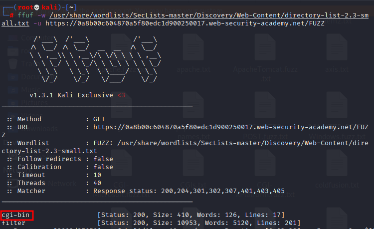
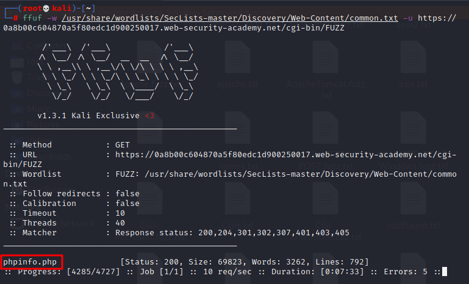
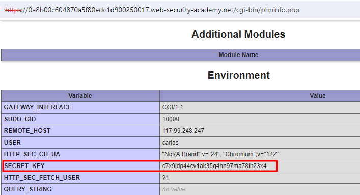

# Information disclosure on debug page

### Goal - 

Obtain and submit the `SECRET_KEY` environment variable.


### Vulnerability / Concept

This lab demonstrates a vulnerability in the information disclosure category.

This lab contains a debug page that discloses sensitive information about the application. To solve the lab, obtain and submit the SECRET_KEY environment variable.

The vulnerability exists because the application fails to properly validate, sanitize, or secure the user-controlled input that reaches a sensitive operation. The specific attack surface and exploitation technique depend on the exact vulnerability type demonstrated in this lab.

### Recon / Initial Analysis

Based on the lab's objective and the PortSwigger solution:

1. Analyze the application's functionality to identify the attack surface
2. With Burp running, browse to the home page.
                    
                    
                        Go to the &quot;Target&quot; &gt; &quot;Site Map&quot; tab. Right-click on the top-level e
3. Use Burp Suite Proxy to intercept and analyze requests
4. Identify the specific vulnerability type by testing user-controlled input
5. Determine the appropriate exploitation technique for this lab

### Analysis/Exploitation -

### Using free tools

When I try to avoid using features from Burp Professional, several good free tools allow for content discovery. The one I use here is [ffuf](https://github.com/ffuf/ffuf) together with the great wordlists provided by [SecLists](https://github.com/danielmiessler/SecLists).

First, I search for common directories within the web root of the application with

```bash
ffuf -w /usr/share/wordlists/SecLists-master/Discovery/Web-Content/directory-list-2.3-small.txt -u https://0aeb000b03ce98ffc09d247e001c00a4.web-security-academy.net/FUZZ
```



I can now search within this directory for common files with

```bash
ffuf -w /usr/share/wordlists/SecLists/Discovery-content/Web-Content/common.txt  -u https://0aeb000b03ce98ffc09d247e001c00a4.web-security-academy.net/cgi-bin/FUZZ
```



### Using Burp Professional

Go to the "Target" > "Site Map" tab. Right-click on the top-level entry for the lab and select "Engagement tools" > "Find comments". Notice that the home page contains an HTML comment that contains a link called "Debug". This points to `/cgi-bin/phpinfo.php`.

or Use the default options and start the content discovery. Burp quickly shows the `phpinfo.php` file in the site map:

Opening this file in the browser and scrolling through the content shows the answer:



### Why It Works

The vulnerability exists because the application processes user-controlled input without adequate security validation. In this specific lab, the attack succeeds because:

- The application trusts the user input without proper server-side validation
- The input reaches a sensitive operation (database query, HTML rendering, system command, etc.) without sanitization
- The security boundary that should protect the operation is missing or incorrectly implemented
- The specific payload used exploits the exact weakness in the application's input handling

The PortSwigger lab description confirms this: "This lab contains a debug page that discloses sensitive information about the application. To solve the lab, obtain and submit the SECRET_KEY environment variable."

### Attack Flow

**Attack Flow:**

```
Attacker Input (payload in request)
        ↓
Application Functionality (processes user input)
        ↓
Server Processing (no validation/sanitization)
        ↓
Injection Point (input reaches sensitive operation)
        ↓
Exploitation (payload executes as intended)
        ↓
Lab Objective Achieved
```

### Real-World Impact

An attacker could discover internal application structure, source code, database credentials, API keys, configuration files, version information (for CVE exploitation), or bypass authentication using disclosed information.

### Detection / Testing Methodology

1. Check for verbose error messages (submit malformed input, access non-existent resources)
2. Look for debug pages and endpoints (/debug, /admin, /console)
3. Search for backup files (.bak, .old, .swp, ~)
4. Check version control history (.git, .svn)
5. Examine HTTP response headers for version information
6. Test for path traversal to access configuration files
7. Check if stack traces are displayed

### Remediation

- Disable verbose error messages in production (use generic error pages)
- Remove debug pages and endpoints before deployment
- Do not expose backup files, source code, or version control history
- Implement proper access control on all endpoints
- Use a WAF to detect information disclosure patterns
- Regularly audit the application for exposed data

### Key Takeaways

- This lab demonstrates a information disclosure vulnerability in a real-world scenario.
- The vulnerability occurs because user input reaches a sensitive operation without proper validation.
- The PortSwigger lab confirms: "This lab contains a debug page that discloses sensitive information about the application. To solve "
- Burp Suite is essential for identifying and exploiting this vulnerability.
- The remediation for this specific vulnerability involves: - Disable verbose error messages in production (use generic error pages)
