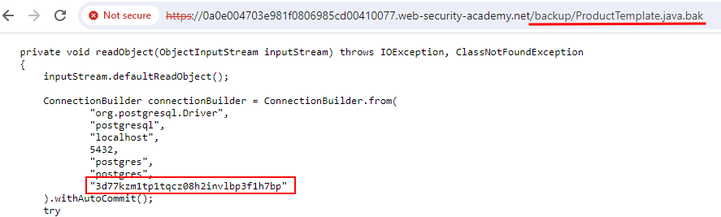

# Source code disclosure via backup files

### Goal - 

Identify and submit the database password, which is hard-coded in the leaked source code.

### Analysis/Exploitation -

When analyzing a web page, one of the first steps is always to check for the existence of a `robots.txt` file.


💡 It is a file that requests search engine crawlers to either include or exclude certain parts of the site from their index. Sometimes, interesting locations are revealed.It is up to the crawler whether they obey these wishes or ignore them.


In this case, it points straight to the subdirectory `/backup` 


💡 (other means to discover it would be tools like Burp Content Discovery, Ffuf, gobuster, wfuzz, ...)


Checking the directory shows a backup file for some Java code:

In the code, the credentials for the Postgres database connections can be found:

