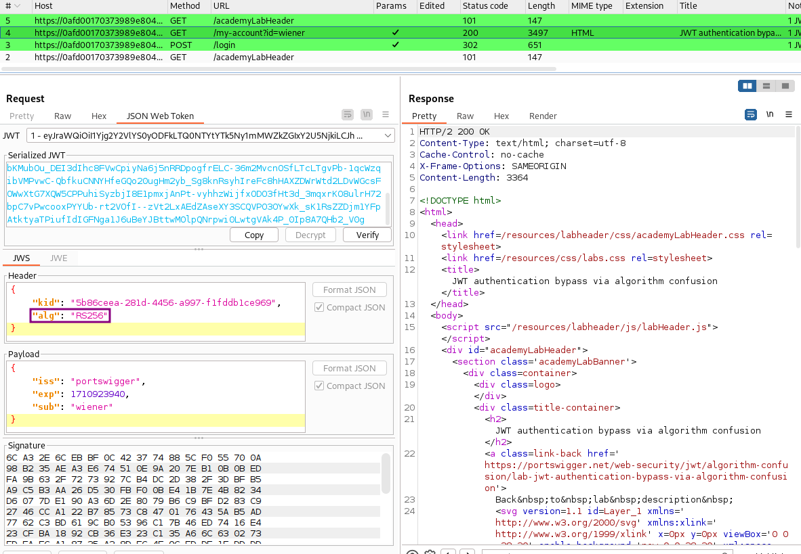
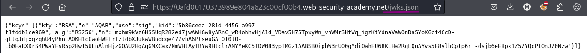
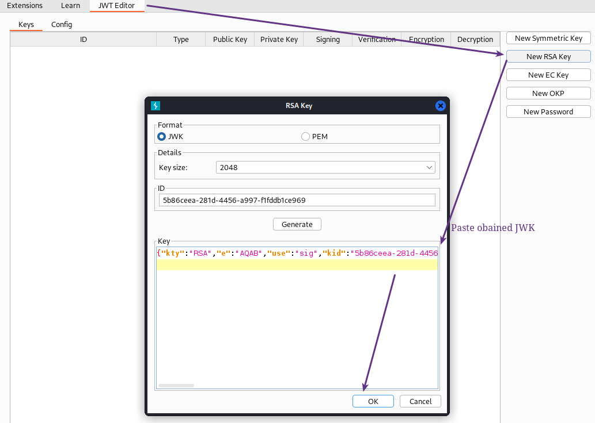
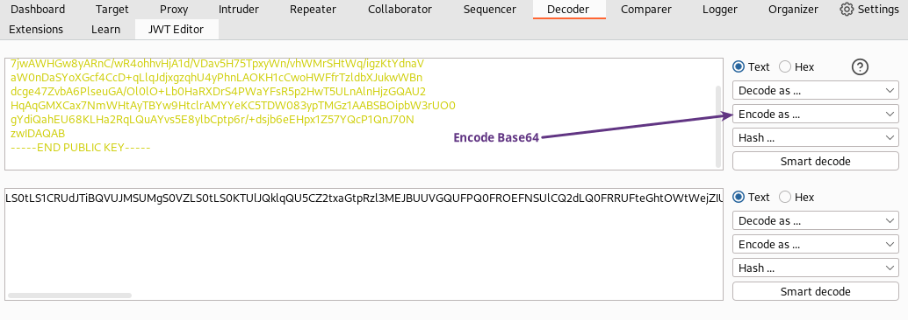
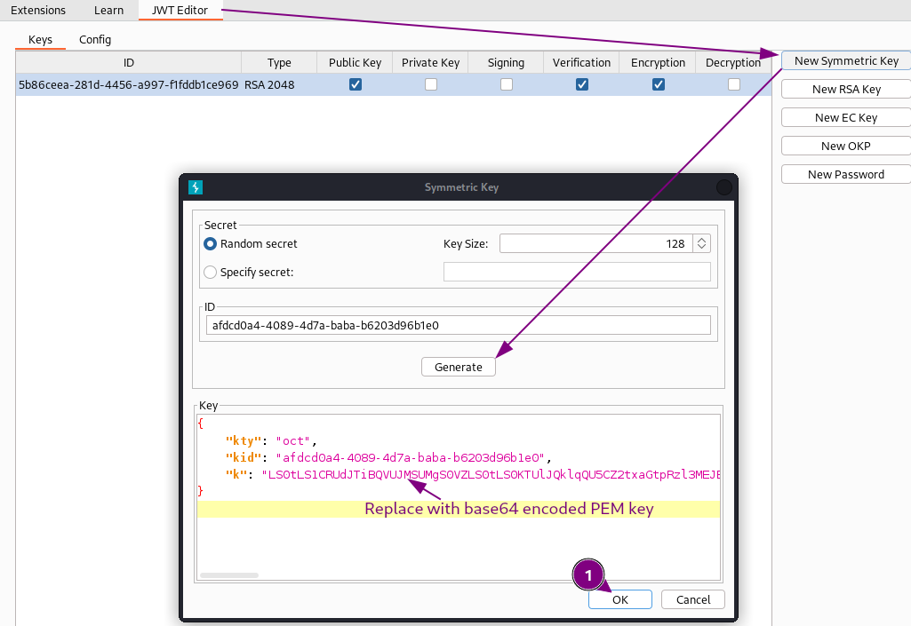
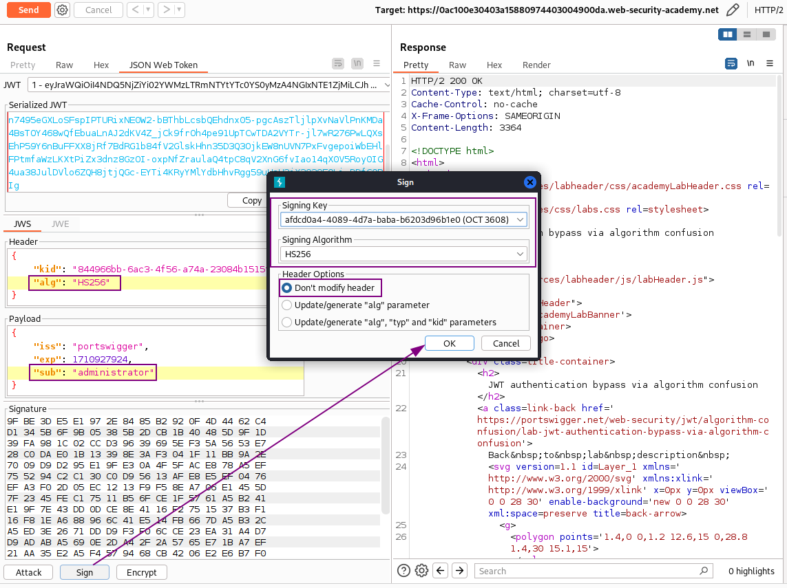
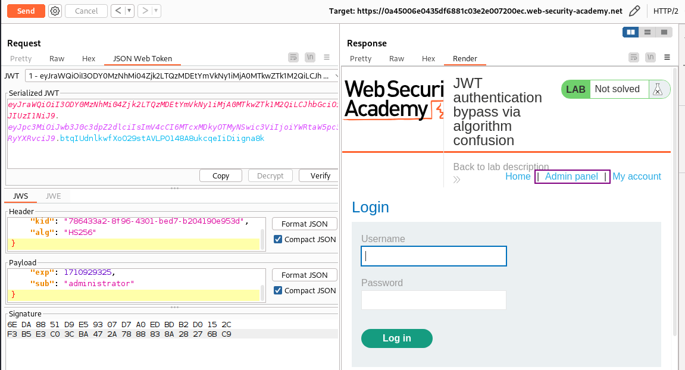
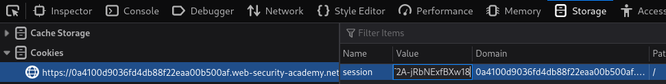

# JWT authentication bypass via algorithm confusion

## Goal - 

first obtain the server's public key. This is exposed via a standard endpoint. Use this key to sign a modified session token that gives you access to the admin panel at `/admin`, then delete the user `carlos`.
        

## Analysis/Exploitation -

**Login as user **`wiener`**:**

In the header's `alg`, it's using an algorithm called RS256(RSA + SHA-256), which is an asymmetric algorithm. (Private key & public key)

**In the lab's background, it said:**


It uses a robust RSA key pair to sign and verify tokens. However, due to implementation flaws, this mechanism is vulnerable to algorithm confusion attacks.

To exploit algorithm confusion attacks, we need to 

1. Obtain the server's public key. 
1. Convert the public key to a suitable format and **Generate a malicious signing key**
1. Modify and sign the JWT using the server's public key as the secret key. 


### 1. Obtain the server's public key:

Servers sometimes expose their public keys as JSON Web Key (JWK) objects via a standard endpoint mapped to `/jwks.json` or `/.well-known/jwks.json`, for example. These may be stored in an array of JWKs called `keys`. This is known as a JWK Set.

**Found JWK Set in** `/jwks.json`**.**

### 2. Convert the public key to a suitable format and **Generate a malicious signing key**

Although the server may expose their public key in JWK format, when verifying the signature of a token, it will use its own copy of the key from its local filesystem or database. This may be stored in a different format.

In order for the attack to work, the version of the key that you use to sign the JWT must be identical to the server's local copy. In addition to being in the same format, every single byte must match, including any non-printing characters.

Let's assume that we need the key in **X.509 PEM format**. You can convert a JWK to a PEM using the [JWT Editor](https://portswigger.net/bappstore/26aaa5ded2f74beea19e2ed8345a93dd) extension in Burp as follows:

**Go to JWT Editor Keys tab, and click New RSA Key:In the dialog, paste the JWK that you obtained earlier:**

Right-click on the entry for the key created, then select **Copy Public Key as PEM**.

Use the **Decoder** tab to Base64 encode this PEM key, then copy the resulting string.

Go back to the JWT Editor Keys tab and click New Symmetric Key, In the dialog click Generate to generate a new key in JWK format:

Replace the generated value for the `k` parameter with a Base64-encoded PEM key that you just copied then **Save the key:**

### Modify and sign the JWT

Send the post-login `GET /my-account?id=wiener` request to Burp Repeater, then remove id parameter   

- In the header of the JWT, change the value of the `alg` parameter to `HS256`:
- In the payload, change the value of the `sub` claim to `administrator`:
- Finally, at the bottom of the tab, click Sign, then select the symmetric key that you generated in the previous section:

Now, the modified token is signed using the server's public key as the secret key.

send a GET request to `/my-account`:

Copy the JWT and update session cookie in the browser**, then refresh the page:**

go to the admin panel and delete user `carlos`
