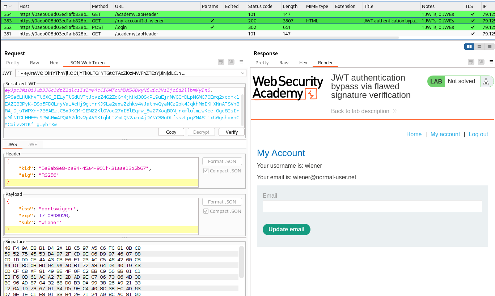
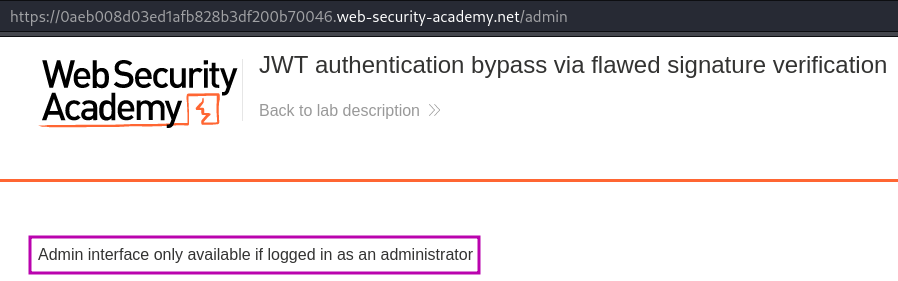
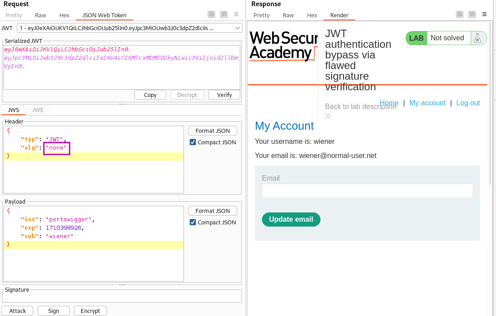
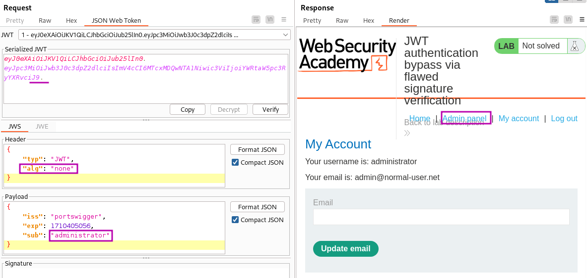
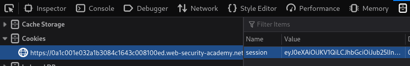
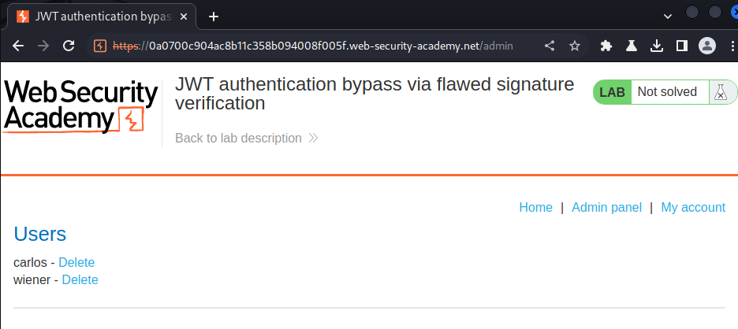

# JWT authentication bypass via flawed signature verification

### Goal - 

Modify your session token to gain access to the admin panel at `/admin`, then delete the user `carlos`.

### Analysis/Exploitation -

**Login as user **`wiener`**:**

Burp Proxy notifies me that the response contains a JWT and highlight it.

When I try to access the `/admin` page as user `wiener`, I am greeted by the message `Admin interface only available if logged in as an administrator`.

**in the lab’s background, it said:**


The server is insecurely configured to accept unsigned JWTs.

To check Does the website trust the algorithm specified in the token? and **Accepting tokens with no signature**

**Change the header’s **`alg`**(algorithm) to **`none`**:**



💡 remove the signature from the JWT, but remember to leave the trailing dot after the payload.

We are still logged-in as wiener, This confirms that the backend trusts and uses the algorithm provided in the token to provide access to authenticated content.

**let’s change the payload’s **`sub`** to **`administrator`**:**so that we get authenticated as administrator

**copy and paste the newly modified JWT  to our session cookie:**

Refresh the page, go to admin panel and delete user carlos


