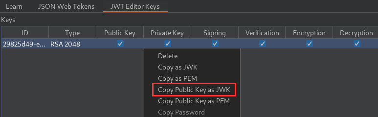
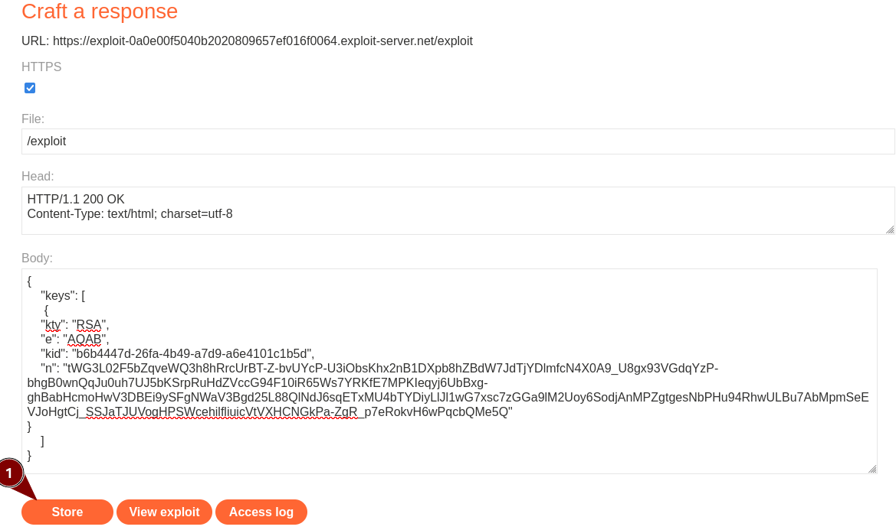
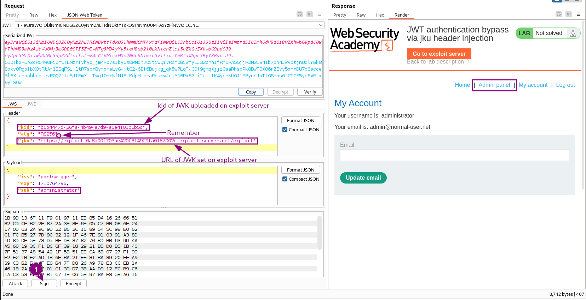

# JWT authentication bypass via jku header injection

## Goal - 

Forge a JWT that gives you access to the admin panel at `/admin`, then delete the user `carlos`.

## Analysis/Exploitation -

**Login as user **`wiener`**:**


In the header’s `alg`, it tells that **it’s using RS256(RSA + SHA-256) algorithm.**

**In the lab’s background, it said:**


The server supports the jku(JWK Set URL) parameter in the JWT header. However, it fails to check whether the provided URL belongs to a trusted domain before fetching the key.



### <span style="color: #337EA9">Upload a malicious JWK Set of </span><span style="color: #337EA9">**new generated RSA key pair:**</span>




**Copy the new generated Public Key as JWK and paste in Body** **section of exploit server** into the `keys` array of JWK Set as follows:                  

```perl
{
    "keys": [
    <<PASTE PUBLIC key as JWK>>
    ]
}
```

**then **`Store`** in the exploit server:**



### <span style="color: #337EA9">Modify and sign the JWT</span>

Send the post-login `GET /my-account?id=wiener` request to Burp Repeater, then remove id parameter    

- In the header of the JWT, replace the current value of the `kid` parameter with the `kid` of the JWK that you uploaded to the exploit server.
Add a new `jku` parameter to the header of the JWT. Set its value to the URL of your JWK Set on the exploit server.


💡 Remember all parameter end with comma , except last one

- In the payload, change the value of the `sub` claim to `administrator`.
- At the bottom of the tab, click **Sign**, then select the RSA key that you generated. Make sure that the **Don't modify header** option is selected, then click **OK**.



Copy the JWT and update session cookie in the browser**, then refresh the page:**

go to the admin panel and delete user `carlos`

