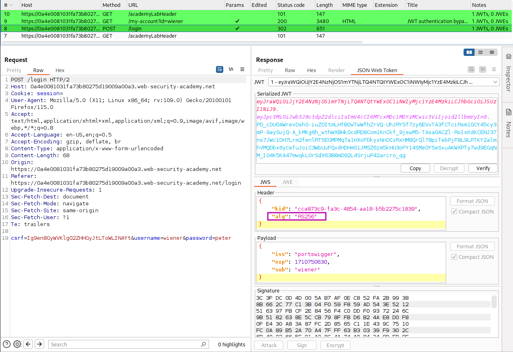
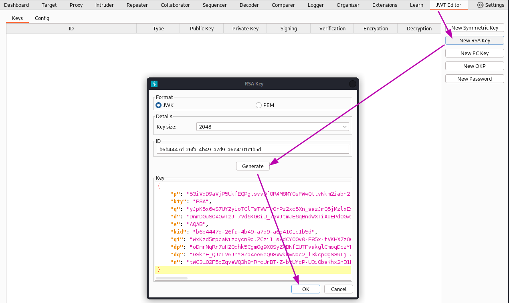
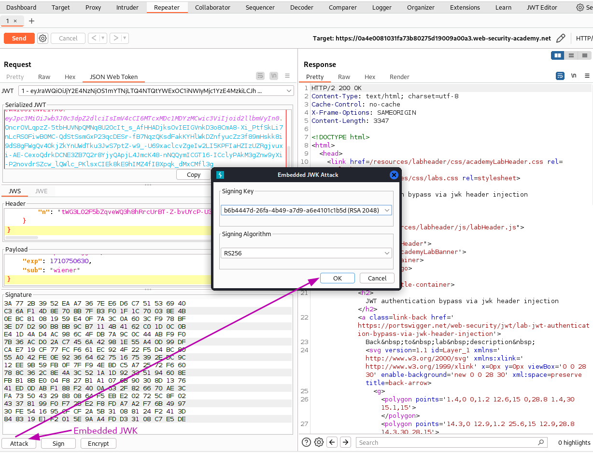
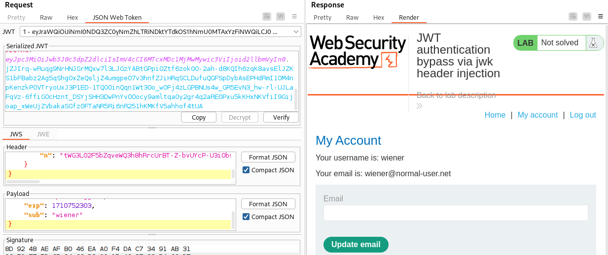
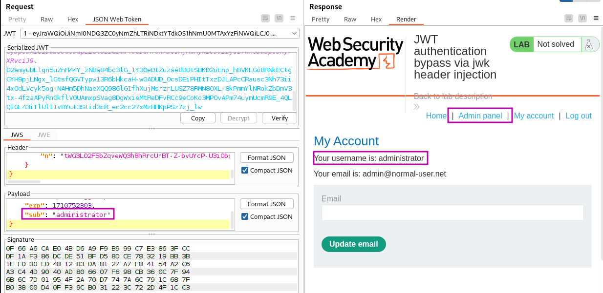

# JWT authentication bypass via jwk header injection

## Goal - 

Modify and sign a JWT that gives you access to the admin panel at `/admin`, then delete the user `carlos`.

## Analysis/Exploitation -

**Login as user **`wiener`**:**

In the header’s `alg`, it tells that **it’s using RS256(RSA + SHA-256) algorithm.**

**In the lab’s background, it said:**


The server supports the jwk(JSON Web Key) parameter in the JWT header. This is sometimes used to embed the correct verification key directly in the token. However, it fails to check whether the provided key came from a trusted source.


To exploit that, we can sign a modified JWT using our own RSA private key, then embedding the matching public key in the `jwk` header.

Generate a new RSA key pair:

Embedding the matching public key in the `jwk` header:

Send the post-login `GET /my-account?id=wiener` request to Burp Repeater, then remove id parameter                  


💡 If the request contains an invalid or no JWT as the session cookie, the application redirects to the `/login` page.


I send the request and the response contains my account page, confirming that the signature verification on the backend used the RSA public key information I injected in the JWT header.

Change the `sub` value of the token to `administrator`, perform the `Attack -> Embedd JWK` option again

Copy the JWT and update session cookie in the browser**, and refresh the page:**

go to the admin panel and delete user `carlos`

## PortSwigger Lab

**Official lab:** JWT authentication bypass via jwk header injection

**PortSwigger:** https://portswigger.net/web-security/jwt/lab-jwt-authentication-bypass-via-jwk-header-injection
