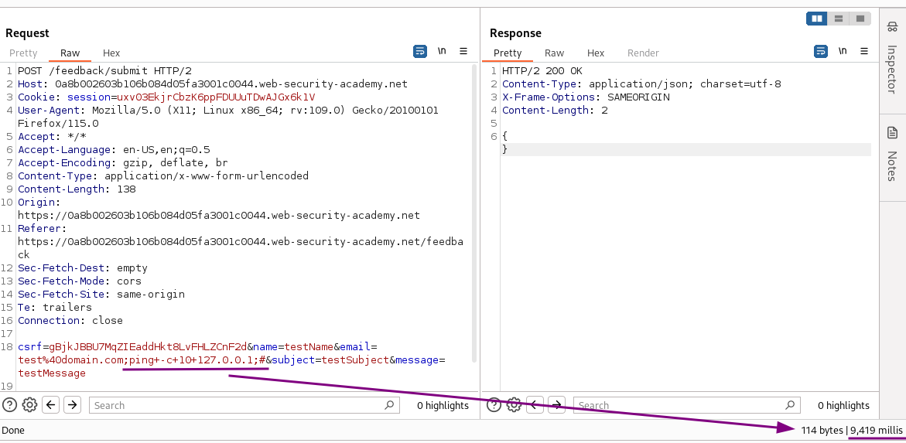
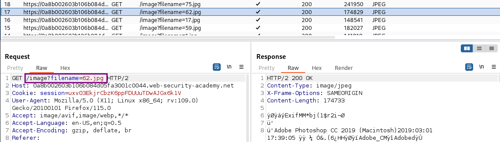
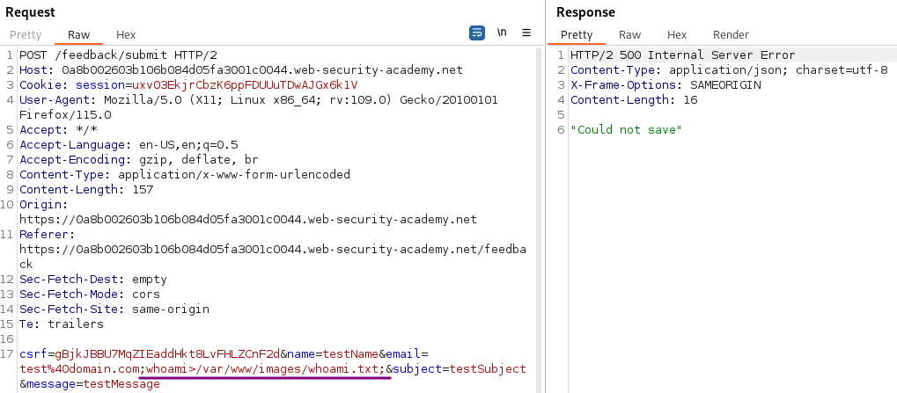
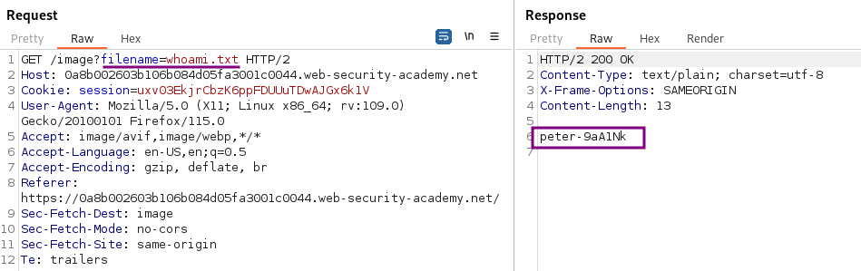

# Blind OS command injection with output redirection

### Goal - 

Exploit the blind command injection and redirect the output from the whoami command to the /var/www/images

### Analysis/Exploitation 


💡 You can redirect the output from the injected command into a file within the web root that you can access then retrieve using the browser. 
For example, if the application serves static resources from the filesystem location `/var/www/static`, then you can submit the following input:

```bash
& whoami > /var/www/static/whoami.txt &
```

The `>` character sends the output from the `whoami` command to the specified file. You can then use the browser to fetch `https://vulnerable-website.com/whoami.txt` to retrieve the file, and view the output from the injected command.



In the previous lab, we found that the `email` parameter is vulnerable to blind OS command injection:



Now, instead of triggering a time delay, we can also **redirect the command’s output to a file, and stored it to where we can access.**

In the home page, we can see there are some product images:

Typically you’ll **stored the output to a static file**, like `images`.As we can see, **they are at **`/image`**.**



To redirect command’s output to a file, we can put it to `/var/www/image/<filename>`.since it is mentionted in lab description that Writeable folder is at `/var/www/images/`


**Note: **In Linux, web root is usually located in <span style="color: #E03E1B">**/var/www/**</span>.

The command to execute is `whoami > /var/www/images/whoami.txt `to write the file. Inject it into the email argument. And as in the previous lab, commenting out the remainder results in a `200 OK`, while not doing so results in `500 Internal Server Error`. Both ways work though.



**Access the file**

Now the file is in `/var/www/images`, but the path to it within the application is unknown and perhaps not even accessible directly. But I can utilize the way the application includes its images with a GET request to `/image?filename=`





💡 **summary
**

  1. Find & Confirm blind command injection
-email field
  1. Check location from where application serves static resources, here images 
  1. Redirect output to file at that static location
  1. Check if file was created by accessing it



## PortSwigger Lab

**Official lab:** Blind OS command injection with output redirection

**PortSwigger:** https://portswigger.net/web-security/os-command-injection/lab-blind-output-redirection
