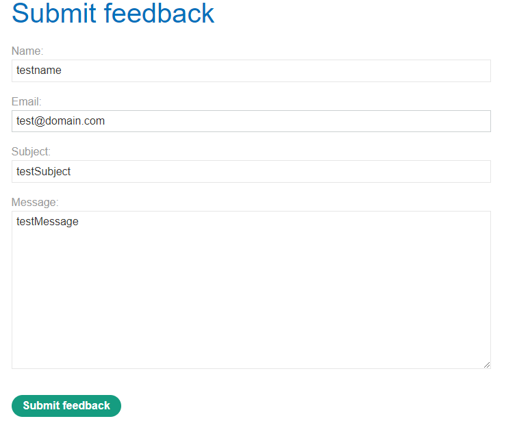
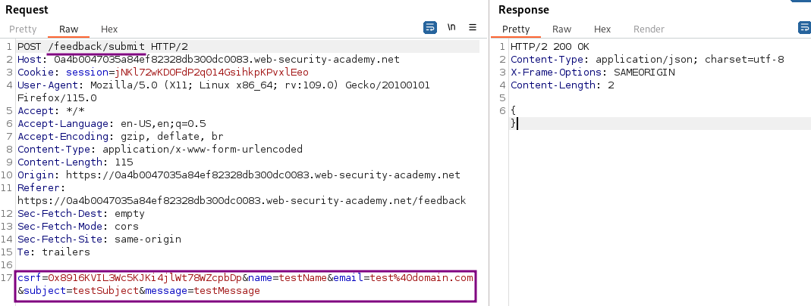
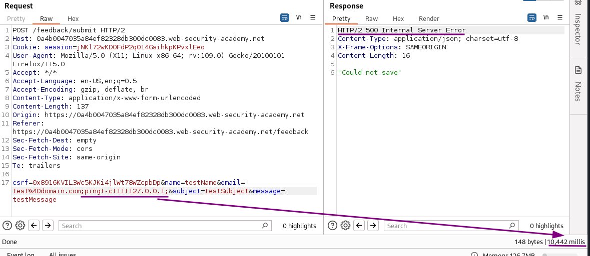
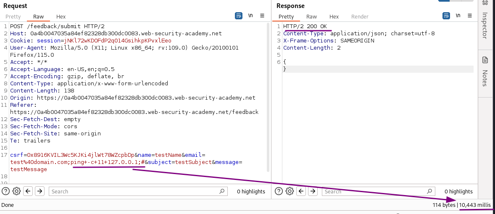

# Blind OS command injection with time delays

### Goal - 

Exploit the blind OS command injection vulnerability to cause a 10 second delay.

### Vulnerability / Concept

This lab demonstrates a web security vulnerability that can be exploited to compromise the application's security. The vulnerability allows an attacker to bypass security controls and perform unauthorized actions.

The core issue is a failure in the application's security architecture — either insufficient input validation, broken access controls, improper trust boundaries, or insecure handling of user-supplied data. Understanding the root cause is essential for both exploitation and remediation.

### Recon / Initial Analysis

1. Identify the attack surface — what user-controlled inputs exist (URL parameters, form fields, headers, cookies)
2. Analyze the application's behavior with unexpected input
3. Map the request flow and identify trust boundaries
4. Test for error messages that reveal implementation details
5. Compare authenticated vs unauthenticated behavior
6. Use Burp Suite Proxy to capture and analyze all requests
7. Check for hidden parameters using Burp Intruder or Param Miner

### Analysis/Exploitation 


💡 blind OS command injection works the same but it does not return the output from the command within its HTTP response. So how do we know that if there exists a blind OS command injection.Blind vulnerabilities can still be exploited, but different techniques are required, one technique is with time delay. An OS command that can take some time to execute will be perfect to test it.


As always I start with checking the website. Any type of user input is always worth investigating. Here, I come across a feedback form:

When we clicked the `Submit feedback` button, **it’ll send a POST request to **`/feedback/submit`**, with parameter **`csrf`**, **`name`**, **`email`**, **`subject`**, and **`message`**.**

Looking at the request in Burp, I see a possible complication, a csrf token.

Fortunately, requesting the feedback page multiple times always contains the same token, and even sending the POST request with the feedback repeatedly with Burp Repeater does result in `200 OK` responses. This means that the csrf-token is neither generated uniquely for each form nor expires on usage.


💡 As common with blind injections, the success of the injection must be inferred by a difference in behaviour. This could be a multitude of things:

  - Different behaviour of the application based on whether the command was successful or not (e.g. an error message)
  - Timing differences
  - Out-of-band activities that allow us to catch actions performed on the system (e.g. DNS requests)

The lab description and goal is time based, so I skip straight to that part.

There are multiple ways to introduce time delays on a command prompt, most of which are dependent on the operating system used (e.g. `sleep` in bash or `timeout` in Windows cmd). But there is one command that is available on almost any system that can be abused to cause delays: `ping`

By default, `ping` send one request immediately, followed by one additional request per second until the specified number is reached.

**Please note**: the `-c` parameter is very important here. On Windows, `ping` defaults to four requests and this default could be used to infer the delay. But on Linux,  `ping` defaults to *forever*, so it would never stop (until perhaps some timeout hits). Some other systems exit on the first returned packet. So while it is possible in some circumstances to use the default behaviour (namely: on Windows targets), it is better to just use the `-c` parameter that is supported on all major implementations.



**Forge a payload**

To cause a 10 seconds delay, ping needs to send 11 requests. **My guess for best parameter would be email,** as this will likely be supplied as individual command line argument. I want to execute the ping regardless of the result status of the command before (which is likely some failure as some arguments may be missing), therefore I enclose the ping command with `;`:

I notice that I forgot to add a `#` to comment out whatever might be there on the line. While I receive a `500 Internal server error` on this request, if I add the `#` I receive a `200 OK`. So there might be also some type of error based injection possible at the box.

### Why It Works

The vulnerability exists because the application fails to properly validate, sanitize, or authorize user input. The broken trust boundary allows an attacker to manipulate the application's behavior by injecting unexpected data that the server processes without adequate security checks.

### Real-World Impact

An attacker could exploit this vulnerability to:
- Access sensitive data belonging to other users
- Bypass authentication or authorization controls
- Perform unauthorized actions on behalf of legitimate users
- Potentially achieve remote code execution on the server
- Compromise the integrity or availability of the application

### Remediation

- Implement proper server-side input validation for all user-controlled data
- Use parameterized queries and prepared statements
- Enforce server-side authorization checks on every request
- Follow the principle of least privilege
- Implement security headers (CSP, X-Frame-Options, X-Content-Type-Options)
- Use a Web Application Firewall (WAF) as defense-in-depth
- Regularly test for vulnerabilities using automated scanners and manual testing

### Key Takeaways

- Never trust user-controlled input — validate and sanitize everything server-side.
- Security controls must be enforced server-side, not client-side.
- Understanding the vulnerability's root cause is essential for proper remediation.
- Burp Suite is essential for identifying and exploiting web vulnerabilities.
- Defense in depth — use multiple layers of protection, not just one.
