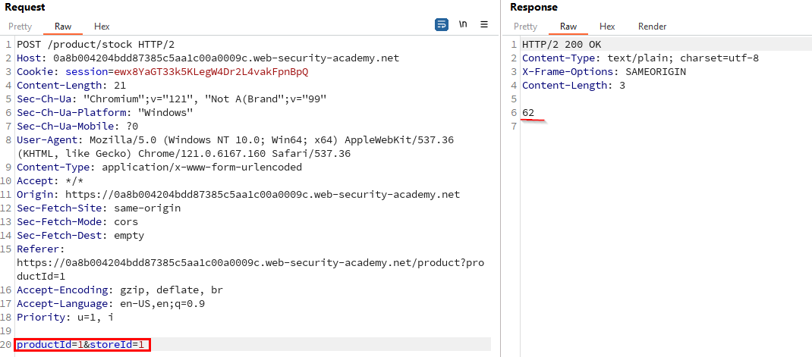
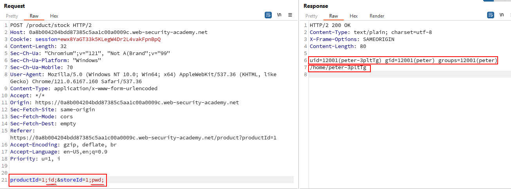
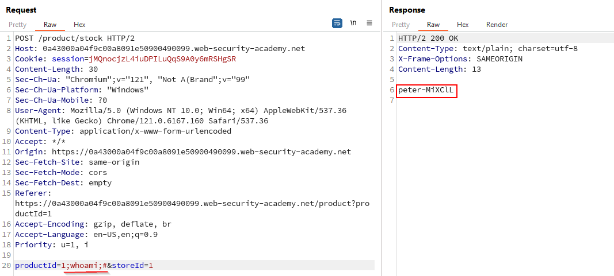

# OS command injection, simple case

### Goal - 

Exploit command injection to execute whoami command.

### Analysis/Exploitation 

As usual, the first step is to browse around a bit. Upon viewing view details of an product we get detail information about that product and we can see upon visiting a specific product a parameter named **productId **is being set. Well this is where we can try to preform command injection and i did but no luck because it fetches information by using an API which restrict all special characters. But as there is another functionality which allows us check for availability of stocks.

Let’s click the `Check stock` button, and intercept the request via Burp Suite

When we clicked that button, it’ll send a POST request to `/product/stock`, with parameter `productId=1` and `storeId=1`.



As we have two parameters, I try to inject both with different commands. This way, I can find out which parameter is injectable and in which order they are executed.


💡 The script call might look something like this (likely not the exact syntax, but the general idea is the same):

```bash
echo system("someScript.sh $_REQUEST['productID'] $_REQUEST['storeId']")
```

In this case, the parameters are used as arguments for the script and the output is directly echoed back into the HTML.

There are multiple ways to execute multiple commands in one line in a shell, separating the individual commands with for example `&`, `&&`, `|`, `||`, `;`. All behave slightly differently. On Unix systems, my favorite is `;` as it completely separates the commands without side effects based on return conditions or execution order. In some conditions `&` is better as it backgrounds the command before my injection and runs my code without waiting for the other command to finish. Still, my favourite remains `;`.

<span style="color: #E03E1B">**NOTE :**</span>** when using **`&`**, it must be URLencoded**





From the response, it can be seen that both parameters are injectable, and they are executed in the order productId first, storeId second.

**Let’s execute **`whoami`** command**

comment out the remainder of the line after the `whoami` to avoid the error message of the second parameter:



### Why It Works

The exploit succeeds because this lab contains an os command injection vulnerability in the product stock checker.

The official solution confirms: Use Burp Suite to intercept and modify a request that checks the stock level. Modify the storeID parameter, giving it the value 1|whoami. Observe that

The root cause is a failure in the application's security architecture specific to this os command injection scenario — the server does not properly validate or secure the user-controlled input that reaches the vulnerable operation.

### Key Takeaways

- This lab contains OS command, demonstrating how os command injection vulnerabilities manifest in real applications.
- The vulnerability is exploitable because user input reaches a sensitive operation without adequate server-side validation.
- PortSwigger confirms: "This lab contains an OS command injection vulnerability in the product stock checker."
- Use parameterized command APIs instead of shell string concatenation.
