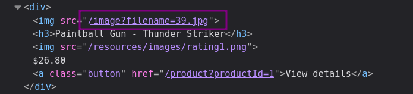
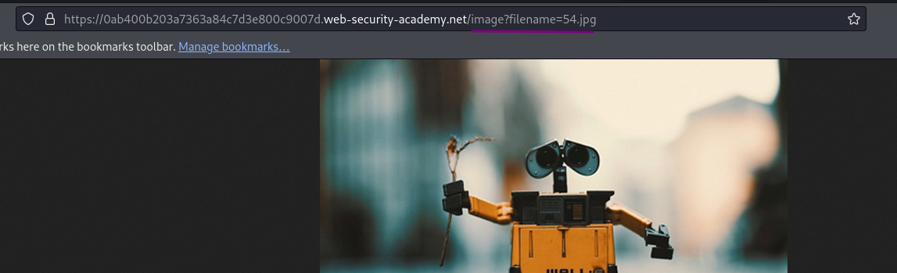
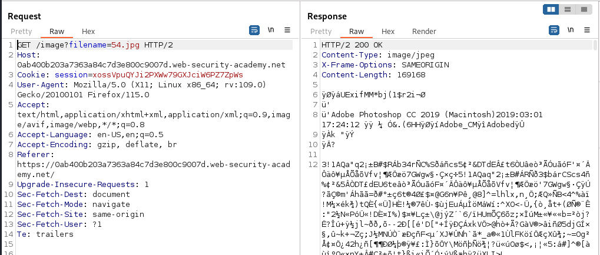
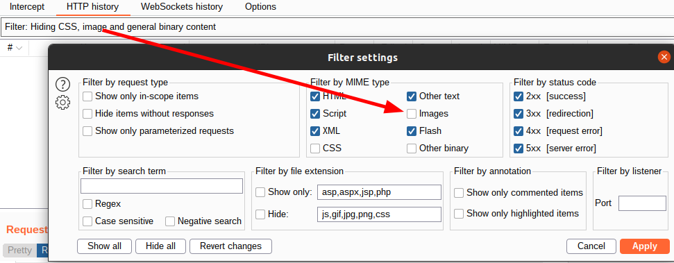
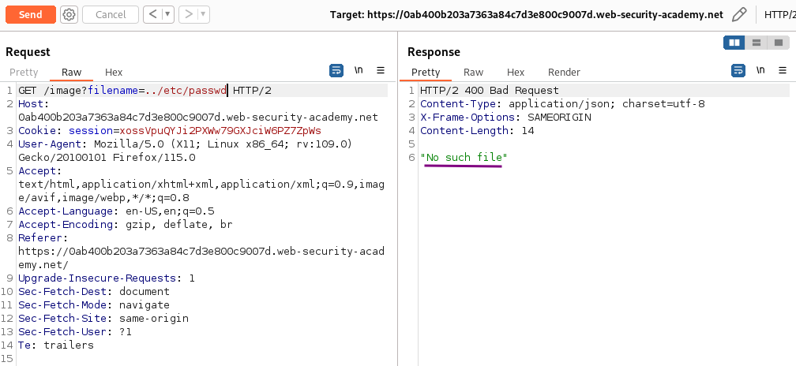
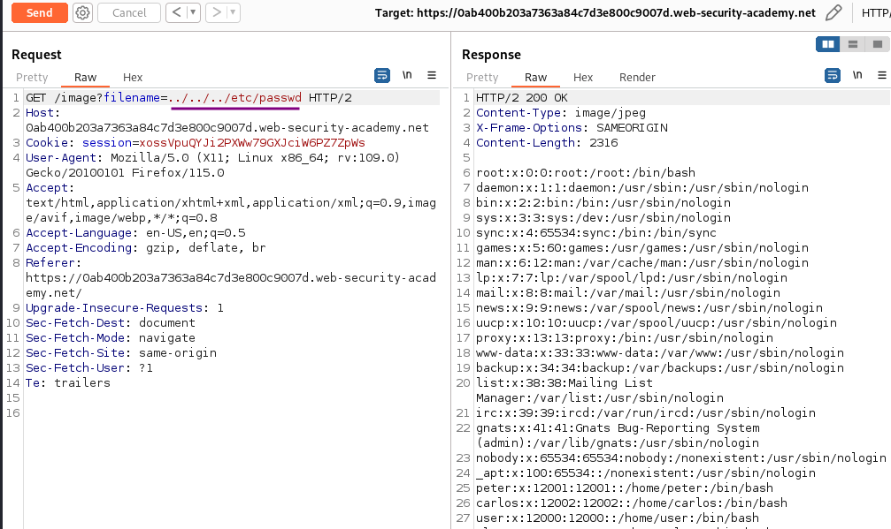

# File path traversal, simple case

### Goal - 

Retrieve the contents of the `/etc/passwd` file.

### Analysis/Exploitation 

When checking the source of the page, The product images are given as explicit file names in URL arguments to `/image`:

Calling this URL directly in the browser (e.g. `https://ac301f701f93c15d803e3c72008500ed.web-security-academy.net/image?filename=39.jpg`) will display just the image.

or open any image in new tab

**Intercept the request via Burp Suite and send to repeater:**

If you don't see it in the `HTTP history`, check if images are filtered out in the filter bar (by default it is hidden):

**use the **`../`** to move up a directory level and try to retrieve **`/etc/passwd`** file?**

**When we move up 1 directory level, it outputs **`No such file`**. Let’s move up more directory levels until we retrieved the **`/etc/passwd`** file!**

**When we move up 3 directory levels, it sucessfully retrieved the **`/etc/passwd`**’s content!!**


💡 Start by using `/etc/passwd` as filename and adding some `../` to the beginning. With `../../etc/passwd` it gives a `"No such file"` error, but once I go three levels up, this changes and we get file content


### Why It Works

The exploit succeeds because this lab contains a path traversal vulnerability in the display of product images.

The official solution confirms: Use Burp Suite to intercept and modify a request that fetches a product image. Modify the filename parameter, giving it the value: ../../../etc/passwd

The root cause is a failure in the application's security architecture specific to this file path traversal scenario — the server does not properly validate or secure the user-controlled input that reaches the vulnerable operation.

### Key Takeaways

- This lab contains path traversal vulnerability, demonstrating how file path traversal vulnerabilities manifest in real applications.
- The vulnerability is exploitable because user input reaches a sensitive operation without adequate server-side validation.
- PortSwigger confirms: "This lab contains a path traversal vulnerability in the display of product images."
- Canonicalize file paths and validate they stay within the expected directory.

## PortSwigger Lab

**Official lab:** File path traversal, simple case

**PortSwigger:** https://portswigger.net/web-security/file-path-traversal/lab-simple
