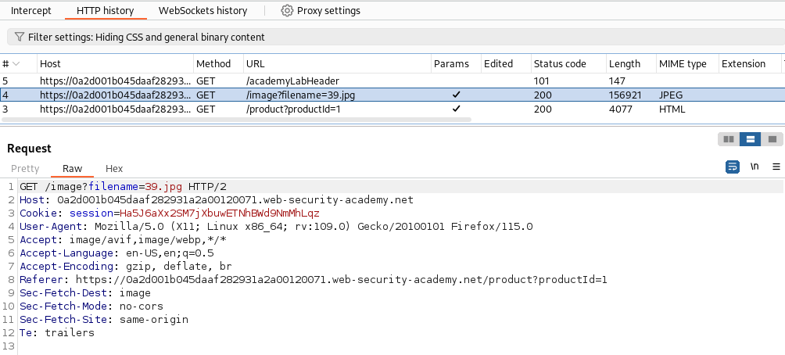
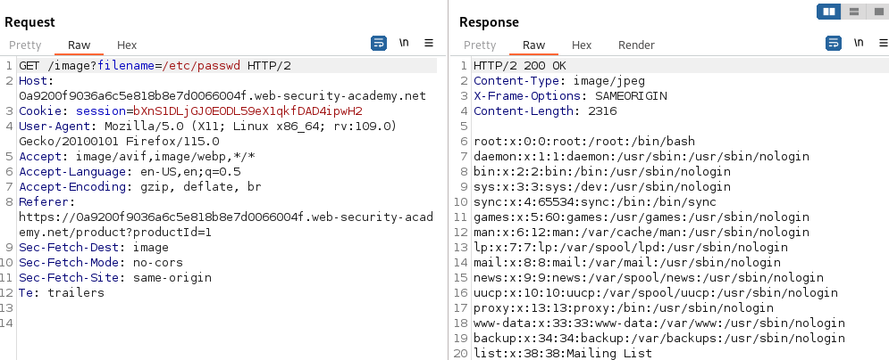

# File path traversal, traversal sequences blocked with absolute path bypass

### Goal - 

Retrieve the contents of the `/etc/passwd` file.

### Analysis/Exploitation 

open any product or open any image in new tab

apply above filter to see image request and sent it to repeater

This time however, the application blocks traversal sequences,requesting `../../../etc/passwd` does not lead to any file,If the webserver's default working directory is assumed when no path is explicitly given.

The application prepends this default working directory to the requested filename before trying to access the file (e.g. something like `'/var/html/www/' + $_REQUEST["filename"]`, the hardcoded first part could be interpreted as 'default working directory').Providing an absolute path could be the solution to exploit the path traversal vulnerability.

To bypass this, we can just provide the absolute path of the `/etc/passwd`:

### Why It Works

The exploit succeeds because this lab contains a path traversal vulnerability in the display of product images.

The official solution confirms: Use Burp Suite to intercept and modify a request that fetches a product image. Modify the filename parameter, giving it the value: ..%252f..%252f..%25

The root cause is a failure in the application's security architecture specific to this file path traversal scenario — the server does not properly validate or secure the user-controlled input that reaches the vulnerable operation.

### Key Takeaways

- This lab contains path traversal vulnerability, demonstrating how file path traversal vulnerabilities manifest in real applications.
- The vulnerability is exploitable because user input reaches a sensitive operation without adequate server-side validation.
- PortSwigger confirms: "This lab contains a path traversal vulnerability in the display of product images."
- Canonicalize file paths and validate they stay within the expected directory.

## PortSwigger Lab

**Official lab:** File path traversal, traversal sequences blocked with absolute path bypass

**PortSwigger:** https://portswigger.net/web-security/file-path-traversal/lab-absolute-path-bypass
