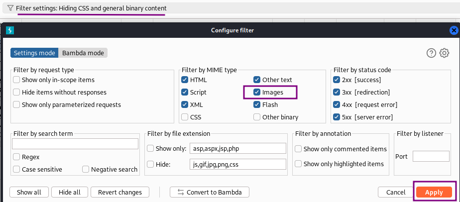
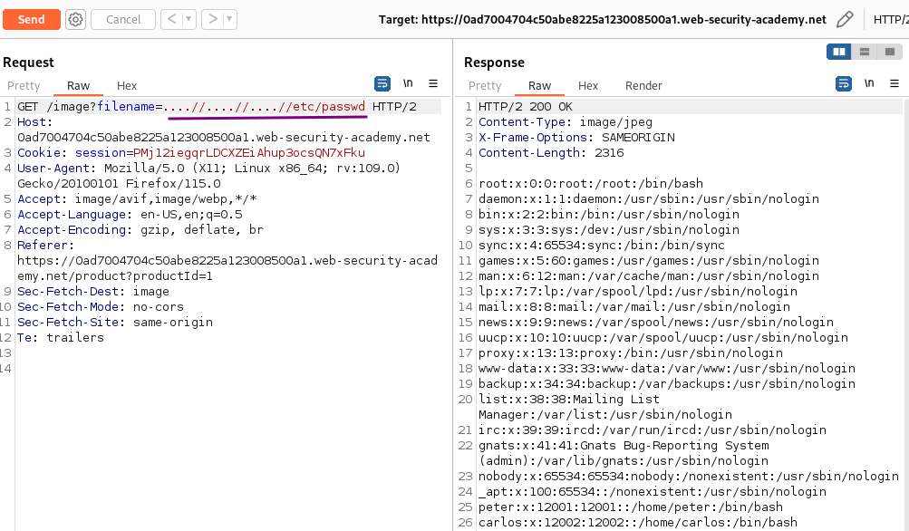

# File path traversal, traversal sequences stripped non-recursively

### Goal - 

Retrieve the contents of the `/etc/passwd` file.

### Analysis/Exploitation 

open any product or open any image in new tab

apply above filter to see image request and sent it to repeater

As written in the lab description, using simple path traversal sequences like `../` does not lead to an actual path traversal. If the sequences are stripped from the user input in a naive way, it just removes all occurrences of `../` from the filename.

An input of `../../../etc/passwd` will therefore become the relative path `etc/passwd` which does not exist. Using `..//etc/passwd` in an attempt to create an absolute `/etc/passwd` does not find any file either.

But if just literal `../` sequences are removed, we simply need to provide a string that represents a path traversal string after the removal. Therefore `....//` will become `../` (the first two dots and the second slash remain after `../` is removed). `..././` works as well.


💡 To obtain a result of `../../../etc/passwd`, I request the image file  `....//....//....//etc/passwd`:
The application strips path traversal sequences from the user-supplied filename before using it. **To bypass that, we use nested traversal sequences, like **`....//`**:**


