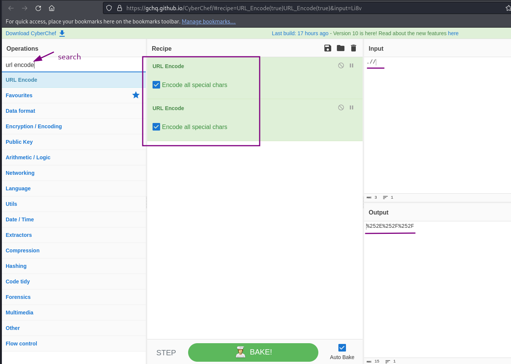
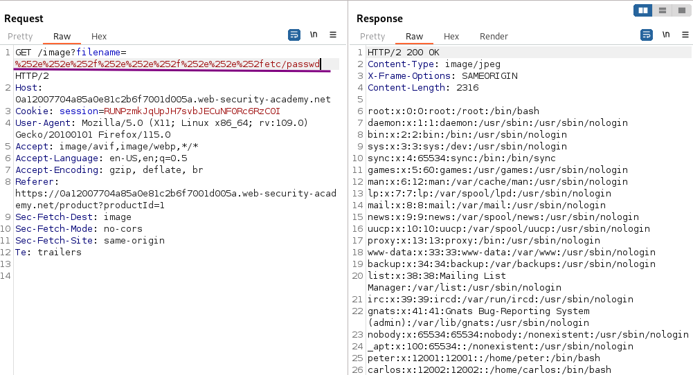
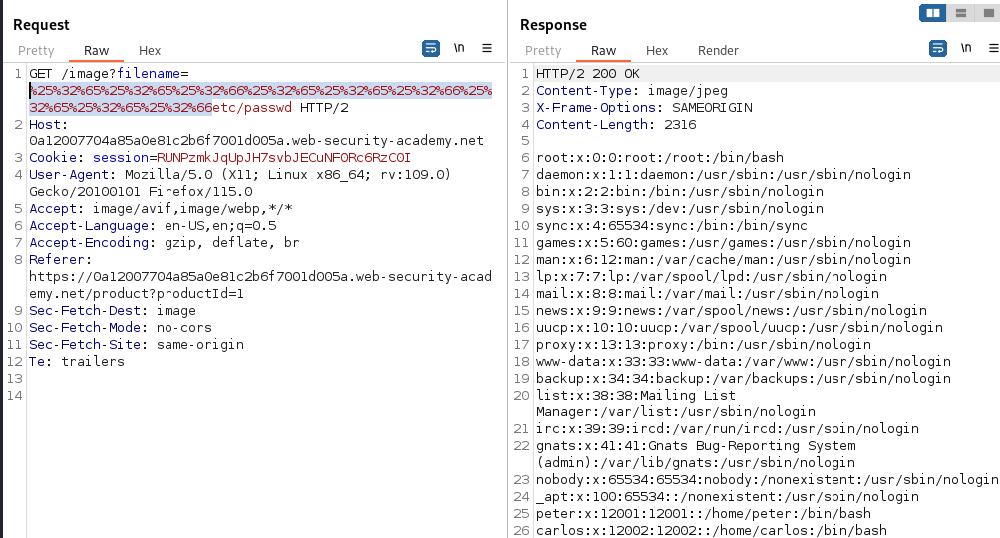

# File path traversal, traversal sequences stripped with superfluous URL-decode

### Goal - 

Retrieve the contents of the `/etc/passwd` file.


### Vulnerability / Concept

This lab demonstrates a web security vulnerability that can be exploited to compromise the application's security. The vulnerability allows an attacker to bypass security controls and perform unauthorized actions.

The core issue is a failure in the application's security architecture — either insufficient input validation, broken access controls, improper trust boundaries, or insecure handling of user-supplied data. Understanding the root cause is essential for both exploitation and remediation.

### Recon / Initial Analysis

1. Identify the attack surface — what user-controlled inputs exist (URL parameters, form fields, headers, cookies)
2. Analyze the application's behavior with unexpected input
3. Map the request flow and identify trust boundaries
4. Test for error messages that reveal implementation details
5. Compare authenticated vs unauthenticated behavior
6. Use Burp Suite Proxy to capture and analyze all requests
7. Check for hidden parameters using Burp Intruder or Param Miner

### Analysis/Exploitation 

open any product or open any image in new tab


apply above filter to see image request and sent it to repeater


The lab description mentions that the application removes path traversal sequences first, then URLdecodes the remaining.

URL encoding is a means to ensure data is within the character range that is allowed in URLs, regardless of the actual value of the data. It is usually used for data that either contains characters
 that have a special meaning within URLs (e.g. `&`) or is non-printable data. But of course, it can be used for any printable ASCII characters.

In the case of characters within the normal ASCII range, the character is represented by a `%`, followed by its ASCII value in hex. The characters required for a path traversal and their encodings are:

```text
. --> %2e
/ --> %2f
```

### Accessing /etc/passwd

One level of URLdecoding is usually done by the server itself upon receiving the request. Therefore just encoding `../` as `%2e%2e%2f` will not be enough. The server performs the URLdecoding and passes `../` to the application, which filters it out. So URLencode the encoded string again before sending.

For this, we need to  also encode the `%` character itself:

```text
. --> %2e
/ --> %2f
% --> %25
```

One possible string would be `%252e%252e%252f`. The server decodes each `%25` to `%`, the strings `2e` and `2f `by themselves have no special meaning and will be treated as literal characters. The application, therefore, receives the sequence `%2e%2e%2f`, strips path traversal components (which are not there at this point), then URLdecodes it to `../`

**Now, we can use **`%252E%252E%252F`** as **`../`**:**

or we can **use **[**CyberChef**](https://gchq.github.io/CyberChef/)** to do URL encoding:**



Therefore A valid filename for the path traversal for `../../../etc/passwd`is  `%252e%252e%252f%252e%252e%252f%252e%252e%252fetc/passwd`



### An alternative payload

Of course, when using Burp Repeater it is much easier to just type the `../../../` part in, than select it and `right-click -> Convert Selection -> URL -> URL encode all characters` twice.

This also encodes the `2 5 e f` characters from the first conversion, leading to a filename of `%25%32%65%25%32%65%25%32%66%25%32%65%25%32%65%25%32%66%25%32%65%25%32%65%25%32%66etc/passwd`, which is also perfectly fine here:



### Why It Works

The vulnerability exists because the application fails to properly validate, sanitize, or authorize user input. The broken trust boundary allows an attacker to manipulate the application's behavior by injecting unexpected data that the server processes without adequate security checks.

### Real-World Impact

An attacker could exploit this vulnerability to:
- Access sensitive data belonging to other users
- Bypass authentication or authorization controls
- Perform unauthorized actions on behalf of legitimate users
- Potentially achieve remote code execution on the server
- Compromise the integrity or availability of the application

### Remediation

- Implement proper server-side input validation for all user-controlled data
- Use parameterized queries and prepared statements
- Enforce server-side authorization checks on every request
- Follow the principle of least privilege
- Implement security headers (CSP, X-Frame-Options, X-Content-Type-Options)
- Use a Web Application Firewall (WAF) as defense-in-depth
- Regularly test for vulnerabilities using automated scanners and manual testing

### Key Takeaways

- Never trust user-controlled input — validate and sanitize everything server-side.
- Security controls must be enforced server-side, not client-side.
- Understanding the vulnerability's root cause is essential for proper remediation.
- Burp Suite is essential for identifying and exploiting web vulnerabilities.
- Defense in depth — use multiple layers of protection, not just one.
