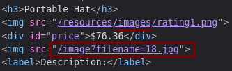
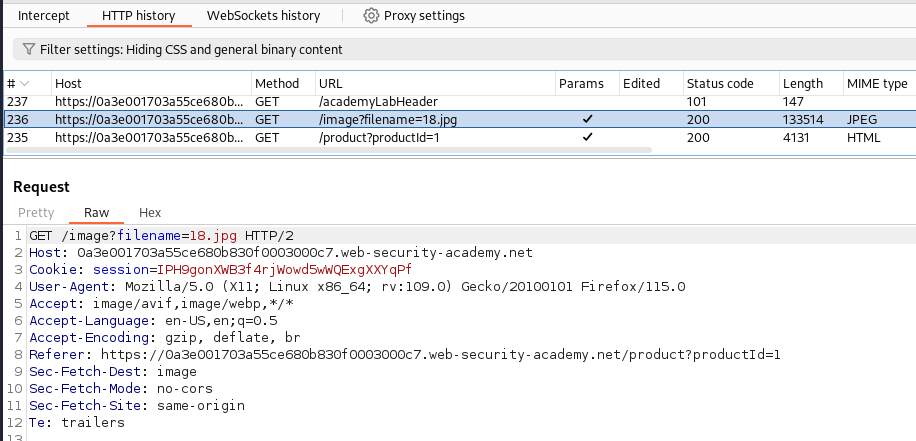
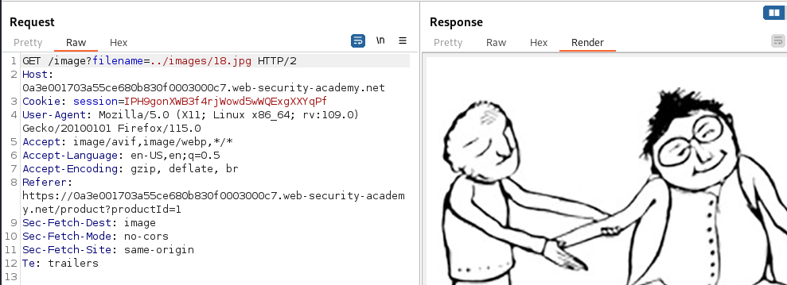
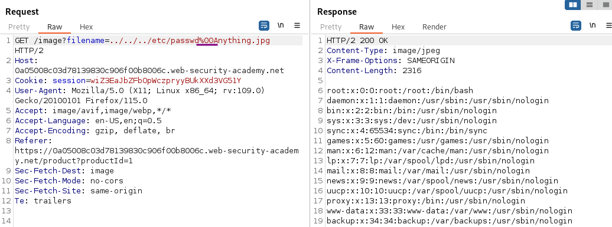

# File path traversal, validation of file extension with null byte bypass

### Goal - 

Retrieve the contents of the `/etc/passwd` file.

### Vulnerability / Concept

This lab demonstrates a web security vulnerability that can be exploited to compromise the application's security. The vulnerability allows an attacker to bypass security controls and perform unauthorized actions.

The core issue is a failure in the application's security architecture — either insufficient input validation, broken access controls, improper trust boundaries, or insecure handling of user-supplied data. Understanding the root cause is essential for both exploitation and remediation.

### Recon / Initial Analysis

1. Identify the attack surface — what user-controlled inputs exist (URL parameters, form fields, headers, cookies)
2. Analyze the application's behavior with unexpected input
3. Map the request flow and identify trust boundaries
4. Test for error messages that reveal implementation details
5. Compare authenticated vs unauthenticated behavior
6. Use Burp Suite Proxy to capture and analyze all requests
7. Check for hidden parameters using Burp Intruder or Param Miner

### Analysis/Exploitation 

Analyze how the filenames for the images are provided. Here, the absolute path is provided in the HTML:

The rating image just above uses the `images` directory. Guessing that the product images might be in the same directory, try whether path traversal sequences are possible:

Use Burp Suite to intercept and modify a request that fetches a product image.

And indeed, I can back out and return to the images directory. It confirms  path traversal sequences are possible:

**In the lab background, it said:**


The application validates that the supplied filename ends with the expected file extension.


This check may be done by simply comparing the last 4 characters of the filename with the string literal `.jpg`. Any type of such string comparison may be vulnerable to an ancient issue: null termination of strings.


💡 **Some background**

A lot of low-level software like operating systems are written in C. In that language, strings are defined as sequences of characters that are followed by a null byte (a full byte of all zeros in binary, or %00 in URLencoding). There was no way of checking the length of a string but iterating over it until a null byte was found.

As long as the null byte was found within the reserved memory area, the length of the string was found. For example, if within a 10-character range the content is `ABCD%00`, then the string is `ABCD` with a length of 4. The amount of memory used is always one byte more than the usable length to account for the null byte.

This leads to a wonderful amount of bugs and vulnerabilities. If the developer does not account for this additional byte it can result in reading or writing over the reserved space, leading to all kinds of undesired consequences, like application crashes (best case) or arbitrary code execution (best case for attackers).

A lot of low-level functionality is still based on C, so terminates a string at the first null byte found. If all components of a system agree on the same behaviour, this does not pose an issue (besides the inherent issues of null termination).

But if components treat strings differently, then this different behaviour can be exploited.

For example, a lot of more modern languages have dedicated string types and do neither require nor use null termination for their strings. In this case, I want to access a file, so at some point, the request will be passed from the application to the operating system



### The malicious payload

I need to construct a string that fulfils these requirements:

- Succeeds the filename check in the application, in this case ending in `.jpg`
- Contains a null byte **(**`%00`**) **so that the operating system will not process the full filename
- Result filename must reference `/etc/passwd`

Above I already established that basic path traversal is possible. So a valid filename that fulfils the requirements would be `../../../etc/passwd%00Anything.jpg`

### Why It Works

The vulnerability exists because the application fails to properly validate, sanitize, or authorize user input. The broken trust boundary allows an attacker to manipulate the application's behavior by injecting unexpected data that the server processes without adequate security checks.

### Real-World Impact

An attacker could exploit this vulnerability to:
- Access sensitive data belonging to other users
- Bypass authentication or authorization controls
- Perform unauthorized actions on behalf of legitimate users
- Potentially achieve remote code execution on the server
- Compromise the integrity or availability of the application

### Remediation

- Implement proper server-side input validation for all user-controlled data
- Use parameterized queries and prepared statements
- Enforce server-side authorization checks on every request
- Follow the principle of least privilege
- Implement security headers (CSP, X-Frame-Options, X-Content-Type-Options)
- Use a Web Application Firewall (WAF) as defense-in-depth
- Regularly test for vulnerabilities using automated scanners and manual testing

### Key Takeaways

- Never trust user-controlled input — validate and sanitize everything server-side.
- Security controls must be enforced server-side, not client-side.
- Understanding the vulnerability's root cause is essential for proper remediation.
- Burp Suite is essential for identifying and exploiting web vulnerabilities.
- Defense in depth — use multiple layers of protection, not just one.
