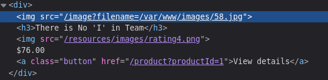
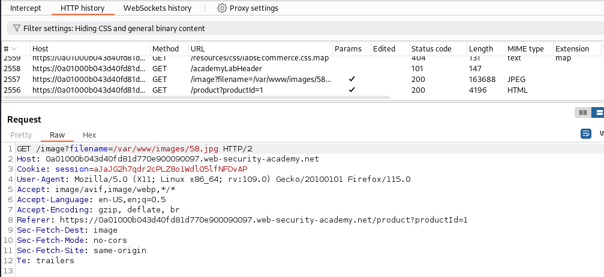
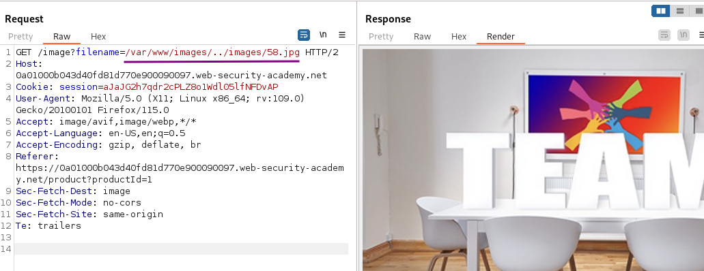
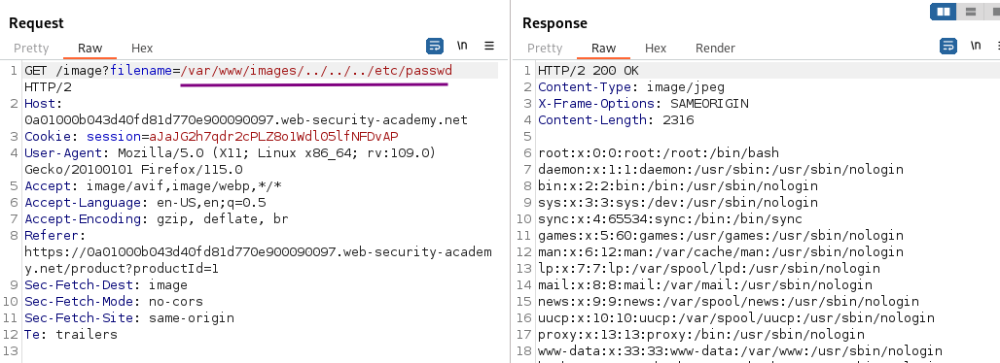

# File path traversal, validation of start of path

### Goal - 

Retrieve the contents of the `/etc/passwd` file.

### Vulnerability / Concept

This lab demonstrates a web security vulnerability that can be exploited to compromise the application's security. The vulnerability allows an attacker to bypass security controls and perform unauthorized actions.

The core issue is a failure in the application's security architecture — either insufficient input validation, broken access controls, improper trust boundaries, or insecure handling of user-supplied data. Understanding the root cause is essential for both exploitation and remediation.

### Recon / Initial Analysis

1. Identify the attack surface — what user-controlled inputs exist (URL parameters, form fields, headers, cookies)
2. Analyze the application's behavior with unexpected input
3. Map the request flow and identify trust boundaries
4. Test for error messages that reveal implementation details
5. Compare authenticated vs unauthenticated behavior
6. Use Burp Suite Proxy to capture and analyze all requests
7. Check for hidden parameters using Burp Intruder or Param Miner

### Analysis/Exploitation 

Analyze how the filenames for the images are provided. Here, the absolute path is provided in the HTML:

open any product or open any image in new tab

If you don't see it in the HTTP history, check if images are filtered out in the filter bar (by default it is hidden): apply above filter to see image request and sent it to repeater

The application checks that the path starts with the expected values, in this case, the absolute path `/var/www/images`, so neither different absolute paths (`/etc/passwd`) nor relative paths (`../../../etc/passwd`) are possible.

What I do not know is if this check is done with the path provided in the request or with the canonical path. The canonical path is always a direct, absolute and unique path from the root to the fileFor example, the path `/var/www/images/30.jpg` is both absolute and canonical. The path `/var/www/images/../images/30.jpg` is still absolute but not canonical as it is not a unique identifier. I can simply leave some parts out (the `../images/`) and still identify the same file

Here ../ will move up a directory to /var/www and then adds /images/58.jpg to it

Therefore I can reference any file on the file system when I use a non-canonical path, as long as it is absolute and starts with `/var/www/images/`.

Referencing the `/etc/passwd` file

### Why It Works

The vulnerability exists because the application fails to properly validate, sanitize, or authorize user input. The broken trust boundary allows an attacker to manipulate the application's behavior by injecting unexpected data that the server processes without adequate security checks.

### Real-World Impact

An attacker could exploit this vulnerability to:
- Access sensitive data belonging to other users
- Bypass authentication or authorization controls
- Perform unauthorized actions on behalf of legitimate users
- Potentially achieve remote code execution on the server
- Compromise the integrity or availability of the application

### Remediation

- Implement proper server-side input validation for all user-controlled data
- Use parameterized queries and prepared statements
- Enforce server-side authorization checks on every request
- Follow the principle of least privilege
- Implement security headers (CSP, X-Frame-Options, X-Content-Type-Options)
- Use a Web Application Firewall (WAF) as defense-in-depth
- Regularly test for vulnerabilities using automated scanners and manual testing

### Key Takeaways

- Never trust user-controlled input — validate and sanitize everything server-side.
- Security controls must be enforced server-side, not client-side.
- Understanding the vulnerability's root cause is essential for proper remediation.
- Burp Suite is essential for identifying and exploiting web vulnerabilities.
- Defense in depth — use multiple layers of protection, not just one.
