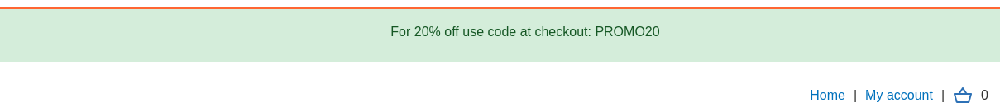
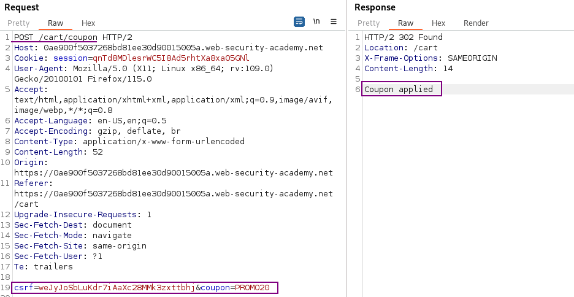
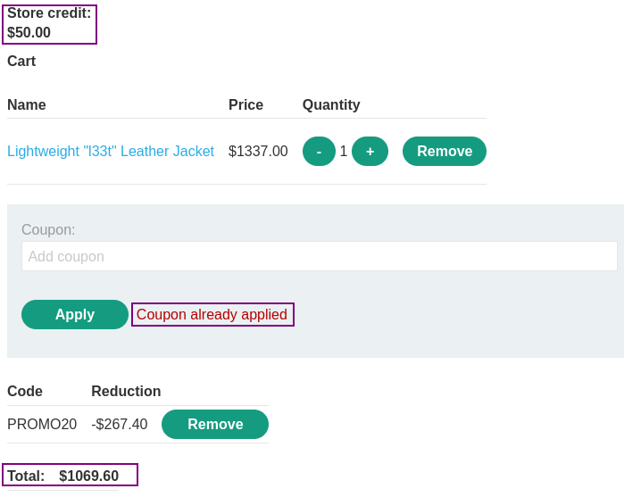

# Limit overrun race conditions        

### Goal - 

 Purchase a **Lightweight L33t Leather Jacket**.

### Analysis/Exploitation -

In home page, we can see that the promotion code `PROMO20` for 20% off, and we can purchase some items.

**Login as user** `wiener`**:**

Now, let's try to purchase the "Lightweight L33t Leather Jacket":

**Apply the coupon code** `PROMO20`**:**

When we clicked the "Apply" button, it'll send a POST request to `/cart/coupon`, with parameter `csrf` and `coupon`.

We still do not have enough store credit for this purchase after applying coupon.

If we try to apply the coupon again, it show an error message **"Coupon already applied"**:

In our case, the race window is the time of checking the coupon has been applied or not.

**To exploit this limit overruns race condition:**

1. Remove the applied coupon first
1. Then send the `/cart/coupon` POST request to Burp Suite's Repeater 30 times 
1. Add those tabs to group
1. Select "Send group in parallel"
1. After that, send the requests in parallel

The coupon reduced the original price a lot more! Therefore, the application's apply coupon function is indeed vulnerable to limit overruns race condition!

Now Place the order to solve the lab

### Why It Works

The exploit succeeds because this lab's purchasing flow contains a race condition that enables you to purchase items for an unintended price.

The root cause is a failure in the application's security architecture specific to this race conditions scenario — the server does not properly validate or secure the user-controlled input that reaches the vulnerable operation.

### Key Takeaways

- This lab contains race condition that enables you to purchase items for an unintended price, demonstrating how race conditions vulnerabilities manifest in real applications.
- The vulnerability is exploitable because user input reaches a sensitive operation without adequate server-side validation.
- PortSwigger confirms: "This lab's purchasing flow contains a race condition that enables you to purchase items for an unint"
- Database transactions and locking prevent race condition exploitation.
